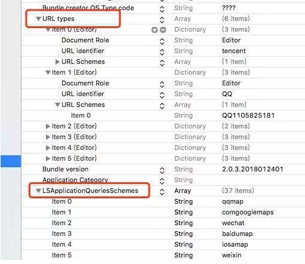
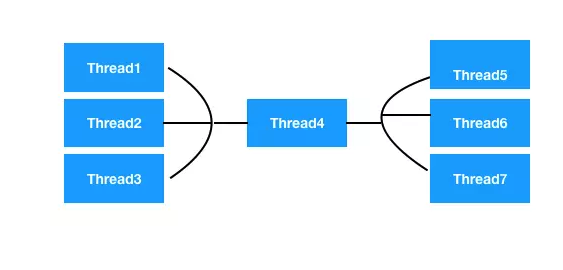

## 进程


### 1.进程是什么

> 引自维基百科进程（英语：**process**），是计算机中已运行程序的实体。进程为曾经是分时系统的基本运作单位。在面向进程设计的系统（如早期的UNIX，Linux 2.4及更早的版本）中，进程是程序的基本执行实体；在面向线程设计的系统（如当代多数操作系统、Linux 2.6及更新的版本）中，进程本身不是基本运行单位，而是线程的容器。
> 程序本身只是指令、数据及其组织形式的描述，进程才是程序（那些指令和数据）的真正运行实例。
> 若干进程有可能与同一个程序相关系，且每个进程皆可以 **同步（循序）** 或 **异步（平行）**的方式独立运行。现代计算机系统可在同一段时间内以进程的形式将多个程序加载到内存中，并借由时间共享（或称**时分复用**），以在一个处理器上表现出**同时（平行性**）运行的感觉。
> 同样的，使用多线程技术（多线程即每一个线程都代表一个进程内的一个独立执行上下文）的操作系统或计算机架构，同样程序的平行线程，可在多**CPU**主机或网络上真正同时运行（在不同的**CPU**上）。


在 **iOS** 系统中，一个 **APP** 的运行实体代表一个进程。 一个进程有独立的  _内存空间、系统资源、端口_  等。 在进程中可以生成多个线程、这些线程可以共享进程中的资源。
打个比方，**CPU**好比是一个工厂，进程是一个车间，线程是车间里面的工人。车间的空间是工人们共享的，比如许多房间是每个工人都可以进出的。这象征一个进程的内存空间是共享的，每个线程都可以使用这些共享内存。

<br>

### 2.进程间通信

搜集了一下资料，**iOS**大概有8种进程间的通信方式，可能不全，后续补充。
**iOS**系统是相对封闭的系统，**App**各自在各自的沙盒（**sandbox**）中运行，每个App都只能读取**iPhone**上**iOS**系统为该应用程序程序创建的文件夹**AppData**下的内容，不能随意跨越自己的沙盒去访问别的**App**沙盒中的内容。 所以**iOS**的系统中进行**App**间通信的方式也比较固定，常见的**App**间通信方式以及使用场景总结如下。

#### 1、Port (local socket)
* 上层封装为`NSMachPort : Foundation`层 
* 中层封装为`CFMachPort ：Core Foundation`层 
* 下层封装为`Mach Ports : Mach`内核层（**线程、进程都可使用它进行通信**）

一个**App1**在本地的端口**port1234**进行**TCP**的**bind**和**listen**，另外一个**App2**在同一个端口**port1234**发起**TCP**的**connect**连接，这样就可以建立正常的**TCP**连接，进行**TCP**通信了，那么就想传什么数据就可以传什么数据了。但是有一个限制，就是要求两个**App**进程都在活跃状态，而没有被后台杀死。 _尴尬的一点是iOS系统会给每个**TCP**在后台**600**秒的网络通信时间，**600**秒后**APP**会进入休眠状态_ 。

<br/>

#### 2、URL Scheme
这个是**iOS App**通信最常用到的通信方式，**App1**通过**openURL**的方法跳转到**App2**，并且在**URL**中带上想要的参数，有点类似**http**的**get**请求那样进行参数传递。这种方式是使用最多的最常见的，使用方法也很简单只需要源**App1**在**info.plist**中配置**LSApplicationQueriesSchemes**，指定目标**App2**的**scheme**；然后在目标**App2**的**info.plist**中配置好**URL types**，表示该**App**接受何种**URL Scheme**的唤起。




典型的使用场景就是各开放平台**SDK**的分享功能，如分享到微信朋友圈微博等，或者是支付场景。比如从滴滴打车结束行程跳转到微信进行支付。

#### 3、Keychain

**iOS**系统的**Keychain**是一个安全的存储容器，它本质上就是一个**sqllite**数据库，它的位置存储在`/private/var/Keychains/keychain-2.db`，不过它所保存的所有数据都是经过加密的，可以用来为不同的**App**保存敏感信息，比如用户名，密码等。**iOS**系统自己也用**Keychain**来保存**VPN**凭证和**Wi-Fi**密码。它是独立于每个**App**的沙盒之外的，所以即使**App**被删除之后，**Keychain**里面的信息依然存在。
基于安全和独立于**App**沙盒的两个特性，**Keychain**主要用于给**App**保存登录和身份凭证等敏感信息，这样只要用户登录过，即使用户删除了**App**重新安装也不需要重新登录。
那**Keychain**用于**App**间通信的一个典型场景也和**App**的登录相关，就是统一账户登录平台。使用同一个账号平台的多个**App**，只要其中一个**App**用户进行了登录，其他**app**就可以实现自动登录不需要用户多次输入账号和密码。一般开放平台都会提供登录**SDK**，在这个**SDK**内部就可以把登录相关的信息都写到**Keychain**中，这样如果多个**App**都集成了这个**SDK**，那么就可以实现统一账户登录了。
**Keychain**的使用比较简单，使用**iOS**系统提供的类**KeychainItemWrapper**，并通过`Keychain access groups`就可以在应用之间共享**Keychain**中的数据的数据了。


```
import Security 
// MARK: - 保存和读取UUID 
class func saveUUIDToKeyChain() 
{ 
	var keychainItem = KeychainItemWrapper(account: "Identfier", service: "AppName", accessGroup: nil) 
	var string = (keychainItem[(kSecAttrGeneric as! Any)] as! String) 
	if (string == "") || !string { 
	keychainItem[(kSecAttrGeneric as! Any)] = self.getUUIDString() 
	}
}

class func readUUIDFromKeyChain() -> String { 
	var keychainItemm = KeychainItemWrapper(account: "Identfier", service: "AppName", accessGroup: nil) 
	var UUID = (keychainItemm[(kSecAttrGeneric as! Any)] as! String) 
	return UUID 
} 
	
class func getUUIDString() -> String { 
	var uuidRef = CFUUIDCreate(kCFAllocatorDefault) 
	var strRef = CFUUIDCreateString(kCFAllocatorDefault, uuidRef) 
	var uuidString = (strRef as! String).replacingOccurrencesOf("-", withString: "") 
	CFRelease(strRef) 
	CFRelease(uuidRef) 
	return uuidString 
}

```

#### 4、UIPasteboard

顾名思义， **UIPasteboard**是剪切板功能，因为**iOS**的原生控件**UITextView**，**UITextField** 、**UIWebView**，我们在使用时如果长按，就会出现**复制、剪切、选中、全选、粘贴等**功能，这个就是利用了系统剪切板功能来实现的。而每一个**App**都可以去访问系统剪切板，所以就能够通过系统剪贴板进行**App**间的数据传输了。


```
//创建系统剪贴板 
let pasteboard = UIPasteboard.general 
//往剪贴板写入淘口令 
pasteboard.string = "复制这条信息￥rkUy0Mz97CV￥后打开👉手淘👈" 
//淘宝从后台切到前台，读取淘口令进行展示 
let alert = UIAlertView.init(title: "淘口令", 
										message: "发现一个宝贝，口令是rkUy0Mz97CV", 
										delegate: self, 
										cancelButtonTitle: "取消", 
										otherButtonTitles: "查看") 
alert.show() 


```

**UIPasteboard**典型的使用场景就是淘宝跟微信/**QQ**的链接分享。由于腾讯和阿里的公司战略，腾讯在微信和**QQ**中都屏蔽了淘宝的链接。那如果淘宝用户想通过**QQ**或者微信跟好友分享某个淘宝商品，怎么办呢？ 阿里的工程师就巧妙的利用剪贴板实现了这个功能。首先淘宝**App**中将链接自定义成淘口令，引导用户进行复制，并去**QQ**好友对话中粘贴。然后**QQ**好友收到消息后再打开自己的淘宝**App**，淘宝**App**每次从后台切到前台时，就会检查系统剪切板中是否有淘口令，如果有淘口令就进行解析并跳转到对于的商品页面。

微信好友把淘口令复制到淘宝中，就可以打开好友分享的淘宝链接了。
	
	
#### 5、UIDocumentInteractionController
	

**UIDocumentInteractionController**主要是用来实现同设备上**App**之间的共享文档，以及文档预览、打印、发邮件和复制等功能。它的使用非常简单.
首先通过调用它唯一的类方法`interactionControllerWithURL:`，并传入一个**URL(NSURL)**，为你想要共享的文件来初始化一个实例对象。然后**UIDocumentInteractionControllerDelegate**，然后显示菜单和预览窗口。


```
let url = Bundle.main.url(forResource: "test", withExtension: "pdf")
if url != nil { 
	let documentInteractionController = UIDocumentInteractionController.init(url: url!) 
	documentInteractionController.delegate = self 
	documentInteractionController.presentOpenInMenu(from: self.view.bounds, in: self.view, animated: true) 
}


```

#### 6、AirDrop

> 引自维基百科**AirDrop**是苹果公司的**MacOS**和**iOS**操作系统中的一个随建即连网络，自*Mac OS X Lion（Mac OS X 10.7）*和*iOS 7*起引入，允许在支持的麦金塔计算机和**iOS**设备上传输文件，无需透过邮件或大容量存储设备。
> 在*OS X Yosemite（OS X 10.10）*之前，*OS X* 中的隔空投送协议不同于iOS的隔空投送协议，因此不能互相传输[2]。但是，*OS X Yosemite*或更新版本支持**iOS**的隔空投送协议（使用**Wi-Fi**和蓝牙），这适用于一台**Mac**与一台**iOS**设备以及两台**2012**年或更新版本的**Mac**计算机之间的传输。[3][4]使用旧隔空投送协议（只使用**Wi-Fi**）的旧模式在两台**2012**年或更早的**Mac**计算机之间传输也是可行的。[4]
> 隔空投送所容纳的文件大小没有限制。苹果用户报告称隔空投送能传输小于10GB的视频文件。


**iOS**并没有直接提供**AirDrop**的实现接口，但是使用**UIActivityViewController**的方法唤起**AirDrop**，进行数据交互。


#### 7、UIActivityViewController


**UIActivityViewController**类是一个标准的**ViewController**，提供了几项标准的服务，比如复制项目至剪贴板，把内容分享至社交网站，以及通过**Messages**发送数据等等。在*iOS 7 SDK*中，**UIActivityViewController**类提供了内置的**AirDrop**功能。
如果你有一些数据一批对象需要通过**AirDrop**进行分享，你所需要的是通过对象数组初始化**UIActivityViewController**，并展示在屏幕上：


```
UIActivityViewController *controller = [[UIActivityViewController alloc] 										initWithActivityItems:objectsToShare 
										applicationActivities:nil];
[self presentViewController:controller animated:YES completion:nil]; 


```

#### 8、App Groups

**App Group**用于同一个开发团队开发的**App**之间，包括**App**和**Extension**之间共享同一份读写空间，进行数据共享。同一个团队开发的多个应用之间如果能直接数据共享，大大提高用户体验。
[App Group 配置](https://www.jianshu.com/p/94d4106b9298)

## 线程
### 1. 线程是什么

> 引自维基百科线程（英语：**thread**）是操作系统能够进行运算调度的最小单位。它被包含在进程之中，是进程中的实际运作单位。
> 一条线程指的是进程中一个单一顺序的控制流，一个进程中可以并发多个线程，每条线程并行执行不同的任务。在*Unix System V*及SunOS中也被称为轻量进程（*lightweight processes*），但轻量进程更多指内核线程（*kernel thread*），而把用户线程（*user thread*）称为线程。*


讲线程就不能不提任务，任务是什么的，通俗的说任务就是就一件事情或一段代码，线程其实就是去执行这件事情。

线程（**thread**），指的是一个独立的代码执行路径，也就是说线程是代码执行路径的最小分支。在 **iOS** 中，线程的底层实现是基于 **POSIX threads API** 的，也就是我们常说的 **pthreads** ；


### 2. 超线程技术

> 引自维基百科超线程（*HT, Hyper-Threading*）超线程技术就是利用特殊的硬件指令，把一个物理内核模拟成两个逻辑内核，让单个处理器都能使用线程级并行计算，进而兼容多线程操作系统和软件，减少了**CPU**的闲置时间，提高了**CPU**的运行速度。 采用超线程即是可在同一时间里，应用程序可以使用芯片的不同部分。
> 引自知乎超线程这个东西并不是开了就一定比不开的好。因为每个**CPU**核心里**ALU**，**FPU**这些运算单元的数量是有限的，而超线程的目的之一就是在一个线程用运算单元少的情况下，让另外一个线程跑起来，不让运算单元闲着。但是如果当一个线程整数，浮点运算各种多，当前核心运算单元没多少空闲了，这时候你再塞进了一个线程，这下子资源就紧张了。两线程就会互相抢资源，拖慢对方速度。至于，超线程可以解决一个线程**cache miss**，另外一个可以顶上，但是如果两个线程都**miss**了，那就只有都在等了。这个还是没有**GPU**里一个**SM**里很多**warp**，超多线程同时跑来得有效果。所以，如果你的程序是单线程，关了超线程，免得别人抢你资源，如果是多线程，每个线程运算不大，超线程比较有用。


### 3. 线程间通信
**线程间通信的表现为：**

* 一个线程传递数据给另一个线程；
* 在一个线程中执行完特定任务后，转到另一个线程继续执行任务。


下面主要是介绍__其他线程执行耗时任务，在主线程进行UI的刷新__，也是业务中比较常用的一种。


#### 1、NSThread线程间通信

**NSThread是用Swift语言里的Thread**

**NSThread**这套方案是经过苹果封装后，并且完全面向对象的。所以你可以直接操控线程对象，非常直观和方便。不过它的生命周期还是需要我们手动管理，所以实际上使用也比较少，使用频率较多的是**GCD**以及**NSOperation**。
当然，**NSThread**还可以用来做线程间通讯，比如下载图片并展示为例，将下载耗时操作放在子线程，下载完成后再切换回主线程在**UI**界面对图片进行展示


```
func onThread() { 
	let urlStr = "http://tupian.aladd.net/2015/7/2941.jpg" 	
	self.performSelector(inBackground: #selector(downloadImg(_:)), with: urlStr) 
} 

@objc func downloadImg(_ urlStr: String) { 
	//打印当前线程 
	print("下载图片线程", Thread.current) 
	//获取图片链接 
	guard let url = URL.init(string: urlStr) else {return} 
	//下载图片二进制数据 
	guard let data = try? Data.init(contentsOf: url) 
	else {
		return
	} 
	//设置图片 
	guard let img = UIImage.init(data: data) else {return}
	//回到主线程刷新UI 
	self.performSelector(onMainThread: #selector(downloadFinished(_:)), 
								with: img,
								waitUntilDone: false) 
}
	 
@objc func downloadFinished(_ img: UIImage) { 
		//打印当前线程 
		print("刷新UI线程", Thread.current) 
}


```


```
下载图片线程 <NSThread: 0x1c4464a00>{number = 5, name = (null)} 
刷新UI线程 <NSThread: 0x1c007a400>{number = 1, name = main}
```

有的小伙伴应该会有疑问，为什么执行的**NSObject**的方法实现的线程，怎么变成了**NSThread**的线程呢。 其实这个方法是**NSObject**对**NSThread**的封装，方便快速实现线程的方法，下个断点验证下看看。

#### 2、GCD线程间通信


**GCD（Grand Central Dispatch）** 伟大的中央调度系统，是苹果为多核并行运算提出的 **C** 语言并发技术框架。 

**GCD**会自动利用更多的**CPU**内核。 会自动管理线程的生命周期（**创建线程，调度任务，销毁线程等**）。 程序员只需要告诉**GCD**想要如何执行什么任务，不需要编写任何线程管理代码。


```
func onThread() {
    let urlStr = "http://tupian.aladd.net/2015/7/2941.jpg"

    let dsp = DispatchQueue.init(label: "com.jk.thread")
    dsp.async {
        self.downloadImg(urlStr)
    }
}

@objc func downloadImg(_ urlStr: String) {
    //打印当前线程
    print("下载图片线程", Thread.current)
    
    //获取图片链接
    guard let url = URL.init(string: urlStr) else {return}
    //下载图片二进制数据
    guard let data = try? Data.init(contentsOf: url) else {return}
    //设置图片
    guard let img = UIImage.init(data: data) else {return}
    
    //回到主线程刷新UI
    DispatchQueue.main.async {
        self.downloadFinished(img)
    }
}

@objc func downloadFinished(_ img: UIImage) {
    //打印当前线程
    print("刷新UI线程", Thread.current)
}

```


```
下载图片线程 <NSThread: 0x1c426b9c0>{number = 4, name = (null)} 
刷新UI线程 <NSThread: 0x1c0263140>{number = 1, name = main}
```


#### 3、NSOperation线程间通信

**NSOperation是用Swift语言里的Operation**

**NSOperation**是苹果推荐使用的并发技术，它提供了一些用**GCD**不是很好实现的功能。相比**GCD**，**NSOperation**的使用更加简单。**NSOperation**是一个抽象类，也就是说它并不能直接使用，而是应该使用它的子类。**Swift**里面可以使用**BlockOperation**和自定义继承自**Operation**的子类。
**NSOperation**的使用常常是配合**NSOperationQueue**来进行的。只要是使用**NSOperation**的子类创建的实例就能添加到**NSOperationQueue**操作队列之中，一旦添加到队列，操作就会自动异步执行（**注意是异步**）。如果没有添加到队列，而是使用**start**方法，则会在当前线程执行。


```
func onThread() {
    let urlStr = "http://tupian.aladd.net/2015/7/2941.jpg"

    let que = OperationQueue.init()
    que.addOperation {
        self.downloadImg(urlStr)
    }
}

@objc func downloadImg(_ urlStr: String) {
    //打印当前线程
    print("下载图片线程", Thread.current)
    
    //获取图片链接
    guard let url = URL.init(string: urlStr) else {return}
    //下载图片二进制数据
    guard let data = try? Data.init(contentsOf: url) else {return}
    //设置图片
    guard let img = UIImage.init(data: data) else {return}
    
    //回到主线程刷新UI
    OperationQueue.main.addOperation {
        self.downloadFinished(img)
    }
}

@objc func downloadFinished(_ img: UIImage) {
    //打印当前线程
    print("刷新UI线程", Thread.current)
}


```


```
下载图片线程 <NSThread: 0x1c4271d80>{number = 3, name = (null)}
刷新UI线程 <NSThread: 0x1c006cac0>{number = 1, name = main}
```


## 4. 线程池

> 线程池（英语：*thread pool*）：一种线程使用模式。 线程过多会带来调度开销，进而影响缓存局部性和整体性能。 而线程池维护着多个线程，等待着监督管理者分配可并发执行的任务。 这避免了在处理短时间任务时创建与销毁线程的代价。


线程池的执行流程如： 


* 首先，启动若干数量的线程，并让这些线程处于睡眠状态 
* 其次，当客户端有新的请求时，线程池会唤醒某一个睡眠线程，让它来处理客户端的请求 
* 最后，当请求处理完毕，线程又处于睡眠状态

_所以在并发的时候，同时能有多少线程在跑是有线程池的线程缓存数量决定的。_


### 1、GCD

**GCD**有一个底层线程池，这个池中存放的是一个个的线程。之所以称为“**池**”，很容易理解出这个“**池**”中的线程是可以重用的，当一段时间后这个线程没有被调用的话，这个线程就会被销毁。池是系统自动来维护，不需要我们手动来维护。

那**GCD**底层线程池的缓存数到底有多少个的，写段代码跑一下看看。


```
@IBAction func onThread() {
    let dsp = DispatchQueue.init(label: "com.jk.thread", attributes: .concurrent)
    for i in 0..<10000 {
        dsp.async {
            //打印当前线程
            print("\(i)当前线程", Thread.current)
            //耗时任务
            Thread.sleep(forTimeInterval: 5)
        }
    }
}

```

这段代码是生成了一个并发队列，**for**循环**10000**次，执行异步任务，相当于会生成**10000**条线程，由于异步执行任务，会立即执行而且不会等待任务的结束，所以在生成线程的时候，线程打印就立即执行了。从打印的结果来看，一次打印总共有**64**行，从而可以得出**GCD**的线程池缓存数量是**64**条。 当然如果想实现更多线程的并发执行的话，可以使用开源的**YYDispatchQueuePool**。

### 2、NSOperation


**NSOperationQueue**提供了一套类似于线程池的机制，通过它可以更加方便的进行多线程的并发操作，构造一个线程池并添加任务对象到线程池中，线程池会分配线程，调用任务对象的**main**方法执行任务。
下面写段代码，分配**maxConcurrentOperationCount**为3个，看看效果


```
@IBAction func onThread() {
    let opq = OperationQueue.init()
    opq.maxConcurrentOperationCount = 3
    for i in 0..<10 {
        opq.addOperation({
            //打印当前线程
            print("\(i)当前线程", Thread.current)
            //耗时任务
            Thread.sleep(forTimeInterval: 5)
        })
    }
}

```


```
1当前线程 <NSThread: 0x1c0274a80>{number = 4, name = (null)} 
0当前线程 <NSThread: 0x1c4673900>{number = 6, name = (null)} 
2当前线程 <NSThread: 0x1c4674040>{number = 7, name = (null)}
```

可以看到，规定线程池缓存为**3**个，一次就打印**3**个线程，当这**3**个线程回收到线程池里，又会再打印3个，当然 _如果其中一个线程先执行完，他就会先被回收_。

**NSOperationQueue**一次能够并发执行多少线程呢，跑一下下面代码


```
@IBAction func onThread() {
    let opq = OperationQueue.init()
    opq.maxConcurrentOperationCount = 300
    for i in 0..<100 {
        opq.addOperation({
            //打印当前线程
            print("\(i)当前线程", Thread.current)
            //耗时任务
            Thread.sleep(forTimeInterval: 5)
        })
    }
}


```
可以看到也是**64**个，也就是 _NSOperationQueue多了可以操作线程数量的接口，但是最大的线程并发数量还是**64**个_ 。


## 多线程同步


### 1、多线程同步是什么

> 引自百度百科同步就是协同步调，按预定的先后次序进行运行。可理解为线程**A**和**B**一块配合，**A**执行到一定程度时要依靠B的某个结果，于是停下来，示意**B**运行；**B**依言执行，再将结果给**A**；**A**再继续操作。


线程同步其实是对于并发队列说的，串行队列的任务是依次执行的，本身就是同步的。




### 2、多线程同步用途


**结果传递**：A执行到一定程度时要依靠B的某个结果，于是停下来，示意B运行；B依言执行，再将结果给A；A再继续操作。例子，小明、小李有三个西瓜，这个三个西瓜可以同时切开（并发），全部切完之后放到冰箱里冰好（同步），小明、小李吃冰西瓜（并发）。

**资源竞争**：是指多个线程同时访问一个资源时可能存在竞争问题提供的解决方案，使多个线程可以对同一个资源进行操作，比如线程A为数组M添加了一个数据，线程B可以接收到添加数据后的数组M。线程同步就是线程之间相互的通信。例子，购买火车票，多个窗口卖票（并发），票卖出去之后要把库存减掉（同步），多个窗口出票成功（并发）。


### 3、多线程同步实现


多线程同步实现的方式:

* **@synchronized**
* **NSLock**
* **NSRecursiveLock**
* **NSCondition**
* **NSConditionLock**
* **pthread_mutex**
* **dispatch_semaphore**
* **dispatch_barrier_async**
* **OSSpinLock**
* **atomic(property)**
* **set/get**

[Details](./Lock/Lock.md)


