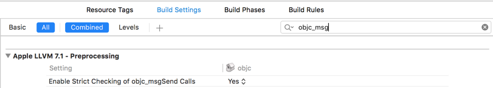
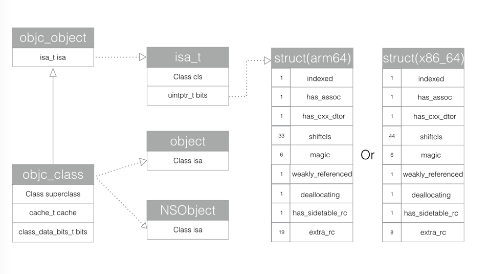

## 1. 通过 Objective-C 源代码

一般情况开发者只需要编写 **OC** 代码即可，**Runtime** 系统自动在幕后把我们写的源代码在编译阶段转换成运行时代码，在运行时确定对应的数据结构和调用具体哪个方法。

## 2. 通过 Foundation 框架的 NSObject 类定义的方法


在**OC**的世界中，除了**NSProxy**类以外，所有的类都是**NSObject**的子类。在**Foundation**框架下，**NSObject**和**NSProxy**两个基类，定义了类层次结构中该类下方所有类的公共接口和行为。**NSProxy**是专门用于实现代理对象的类，这个类暂时本篇文章不提。这两个类都遵循了**NSObject**协议。在**NSObject**协议中，声明了所有**OC**对象的公共方法。
在**NSObject**协议中，有以下**5**个方法，是可以从**Runtime**中获取信息，让对象进行自我检查。


```
- (Class)class OBJC_SWIFT_UNAVAILABLE("use 'anObject.dynamicType' instead");
- (BOOL)isKindOfClass:(Class)aClass;
- (BOOL)isMemberOfClass:(Class)aClass;
- (BOOL)conformsToProtocol:(Protocol *)aProtocol;
- (BOOL)respondsToSelector:(SEL)aSelector;
```

`-class`方法返回对象的类；

`-isKindOfClass:` 和 `-isMemberOfClass:` 方法检查对象是否存在于指定的类的继承体系中(是否是其子类或者父类或者当前类的成员变量)；

`-respondsToSelector:` 检查对象能否响应指定的消息；

`-conformsToProtocol:`检查对象是否实现了指定协议类的方法；


在**NSObject**的类中还定义了一个方法


```
- (IMP)methodForSelector:(SEL)aSelector;
```

这个方法会返回指定方法实现的地址**IMP**。
以上这些方法会在本篇文章中详细分析具体实现。


## 3. 通过对 Runtime 库函数的直接调用


关于库函数可以在[Objective-C Runtime Reference](https://developer.apple.com/library/mac/documentation/Cocoa/Reference/ObjCRuntimeRef/index.html)中查看 **Runtime** 函数的详细文档。

关于这一点，其实还有一个小插曲。当我们导入了**objc/Runtime.h**和**objc/message.h**两个头文件之后，我们查找到了**Runtime**的函数之后，代码打完，发现没有代码提示了，那些函数里面的参数和描述都没有了。对于熟悉**Runtime**的开发者来说，这并没有什么难的，因为参数早已铭记于胸。但是对于新手来说，这是相当不友好的。而且，如果是从**iOS6**开始开发的同学，依稀可能能感受到，关于**Runtime**的具体实现的官方文档越来越少了？可能还怀疑是不是错觉。其实从**Xcode5**开始，苹果就不建议我们手动调用**Runtime**的**API**，也同样希望我们不要知道具体底层实现。所以**IDE**上面默认代了一个参数，禁止了**Runtime**的代码提示，源码和文档方面也删除了一些解释。
具体设置如下:




如果发现导入了两个库文件之后，仍然没有代码提示，就需要把这里的设置改成**NO**，即可。


## 二. NSObject起源


由上面一章节，我们知道了与**Runtime**交互有3种方式，前两种方式都与**NSObject**有关，那我们就从**NSObject**基类开始说起。


**NSObject**的定义如下


```
typedef struct objc_class *Class;

@interface NSObject <NSObject> {
    Class isa  OBJC_ISA_AVAILABILITY;
}
```

在**Objc2.0**之前，**objc_class**源码如下：


```
struct objc_class {
    Class isa  OBJC_ISA_AVAILABILITY;

#if !__OBJC2__
    Class super_class                                        OBJC2_UNAVAILABLE;
    const char *name                                         OBJC2_UNAVAILABLE;
    long version                                             OBJC2_UNAVAILABLE;
    long info                                                OBJC2_UNAVAILABLE;
    long instance_size                                       OBJC2_UNAVAILABLE;
    struct objc_ivar_list *ivars                             OBJC2_UNAVAILABLE;
    struct objc_method_list **methodLists                    OBJC2_UNAVAILABLE;
    struct objc_cache *cache                                 OBJC2_UNAVAILABLE;
    struct objc_protocol_list *protocols                     OBJC2_UNAVAILABLE;
#endif

} OBJC2_UNAVAILABLE;
```

在这里可以看到，在一个类中，有超类的指针，类名，版本的信息。
`ivars`是`objc_ivar_list`成员变量列表的指针；`methodLists`是指向`objc_method_list`指针的指针。`*methodLists`是指向方法列表的指针。这里如果动态修改`*methodLists`的值来添加成员方法，这也是**Category**实现的原理，同样解释了**Category**不能添加属性的原因。


然后在2006年苹果发布**Objc 2.0**之后，**objc_class**的定义就变成下面这个样子了。


```
typedef struct objc_class *Class;
typedef struct objc_object *id;

@interface Object { 
    Class isa; 
}

@interface NSObject <NSObject> {
    Class isa  OBJC_ISA_AVAILABILITY;
}

struct objc_object {
private:
    isa_t isa;
}

struct objc_class : objc_object {
    // Class ISA;
    Class superclass;
    cache_t cache;             // formerly cache pointer and vtable
    class_data_bits_t bits;    // class_rw_t * plus custom rr/alloc flags
}

union isa_t 
{
    isa_t() { }
    isa_t(uintptr_t value) : bits(value) { }
    Class cls;
    uintptr_t bits;
}
```




从上述源码中，我们可以看到，**Objective-C** 对象都是 **C** 语言结构体实现的，在**objc2.0**中，所有的对象都会包含一个**isa_t**类型的结构体。

**objc_object**被源码**typedef**成了**id**类型，这也就是我们平时遇到的**id**类型。这个结构体中就只包含了一个**isa_t**类型的结构体。这个结构体在下面会详细分析。
**objc_class**继承于**objc_object**。所以在**objc_class**中也会包含**isa_t**类型的结构体**isa**。至此，可以得出结论：**Objective-C** 中类也是一个对象。在**objc_class**中，除了**isa**之外，还有**3**个成员变量，一个是父类的指针，一个是方法缓存，最后一个这个类的实例方法链表。
**object**类和**NSObject**类里面分别都包含一个**objc_class**类型的**isa**。
上图的左半边类的关系描述完了，接着先从**isa**来说起。
当一个对象的实例方法被调用的时候，会通过**isa**找到相应的类，然后在该类的**class_data_bits_t**中去查找方法。**class_data_bits_t**是指向了类对象的数据区域。在该数据区域内查找相应方法的对应实现。
但是在我们调用类方法的时候，类对象的**isa**里面是什么呢？这里为了和对象查找方法的机制一致，遂引入了元类(**meta-class**)的概念。

关于元类，更多具体可以研究这篇文章[What is a meta-class in Objective-C?](http://www.cocoawithlove.com/2010/01/what-is-meta-class-in-objective-c.html)

在引入元类之后，类对象和对象查找方法的机制就完全统一了。

对象的实例方法调用时，通过对象的 **isa** 在类中获取方法的实现。

类对象的类方法调用时，通过类的 **isa** 在元类中获取方法的实现。

**meta-class**之所以重要，是因为它存储着一个类的所有类方法。每个类都会有一个单独的meta-class，因为每个类的类方法基本不可能完全相同。

对应关系的图如下图，下图很好的描述了对象，类，元类之间的关系:


图中实线是 **super_class**指针，虚线是**isa**指针。
* **Root class** (**class**)其实就是**NSObject**，**NSObject**是没有超类的，所以**Root class(class)**的**superclass**指向**nil**。
* 每个**Class**都有一个**isa**指针指向唯一的**Meta class**
* **Root class(meta)**的**superclass**指向**Root class(class)**，也就是**NSObject**，形成一个回路。
* 每个**Meta class**的**isa**指针都指向**Root class (meta)**。
我们其实应该明白，类对象和元类对象是唯一的，对象是可以在运行时创建无数个的。而在**main**方法执行之前，从 **dyld**到**runtime**这期间，类对象和元类对象在这期间被创建。具体可看sunnyxx这篇[iOS 程序 main 函数之前发生了什么](http://blog.sunnyxx.com/2014/08/30/objc-pre-main/)


（1）**isa_t**结构体的具体实现


接下来我们就该研究研究**isa**的具体实现了。**objc_object**里面的**isa**是**isa_t**类型。通过查看源码，我们可以知道**isa_t**是一个**union**联合体。


```
struct objc_object {
private:
    isa_t isa;
public:
    // initIsa() should be used to init the isa of new objects only.
    // If this object already has an isa, use changeIsa() for correctness.
    // initInstanceIsa(): objects with no custom RR/AWZ
    void initIsa(Class cls /*indexed=false*/);
    void initInstanceIsa(Class cls, bool hasCxxDtor);
private:
    void initIsa(Class newCls, bool indexed, bool hasCxxDtor);
｝
```

那就从`initIsa`方法开始研究。下面以**arm64**为例。


```
inline void
objc_object::initInstanceIsa(Class cls, bool hasCxxDtor)
{
    initIsa(cls, true, hasCxxDtor);
}

inline void
objc_object::initIsa(Class cls, bool indexed, bool hasCxxDtor)
{
    if (!indexed) {
        isa.cls = cls;
    } else {
        isa.bits = ISA_MAGIC_VALUE;
        isa.has_cxx_dtor = hasCxxDtor;
        isa.shiftcls = (uintptr_t)cls >> 3;
    }
}
```

`initIsa`第二个参数传入了一个**true**，所以**initIsa**就会执行**else**里面的语句。


```
# if __arm64__
#   define ISA_MASK        0x0000000ffffffff8ULL
#   define ISA_MAGIC_MASK  0x000003f000000001ULL
#   define ISA_MAGIC_VALUE 0x000001a000000001ULL
    struct {
        uintptr_t indexed           : 1;
        uintptr_t has_assoc         : 1;
        uintptr_t has_cxx_dtor      : 1;
        uintptr_t shiftcls          : 33; // MACH_VM_MAX_ADDRESS 0x1000000000
        uintptr_t magic             : 6;
        uintptr_t weakly_referenced : 1;
        uintptr_t deallocating      : 1;
        uintptr_t has_sidetable_rc  : 1;
        uintptr_t extra_rc          : 19;
#       define RC_ONE   (1ULL<<45)
#       define RC_HALF  (1ULL<<18)
    };

# elif __x86_64__
#   define ISA_MASK        0x00007ffffffffff8ULL
#   define ISA_MAGIC_MASK  0x001f800000000001ULL
#   define ISA_MAGIC_VALUE 0x001d800000000001ULL
    struct {
        uintptr_t indexed           : 1;
        uintptr_t has_assoc         : 1;
        uintptr_t has_cxx_dtor      : 1;
        uintptr_t shiftcls          : 44; // MACH_VM_MAX_ADDRESS 0x7fffffe00000
        uintptr_t magic             : 6;
        uintptr_t weakly_referenced : 1;
        uintptr_t deallocating      : 1;
        uintptr_t has_sidetable_rc  : 1;
        uintptr_t extra_rc          : 8;
#       define RC_ONE   (1ULL<<56)
#       define RC_HALF  (1ULL<<7)
    };
```


`ISA_MAGIC_VALUE = 0x000001a000000001ULL`转换成二进制是`11010000000000000000000000000000000000001`，结构如下图：


关于参数的说明：

第一位**index**，代表是否开启**isa**指针优化。`index = 1`，代表开启`isa`指针优化。
在2013年9月，苹果推出了**iPhone5s**，与此同时，**iPhone5s**配备了首个采用**64**位架构的**A7**双核处理器，为了节省内存和提高执行效率，苹果提出了**Tagged Pointer**的概念。对于**64**位程序，引入**Tagged Pointer**后，相关逻辑能减少一半的内存占用，以及**3**倍的访问速度提升，**100**倍的创建、销毁速度提升。
在**WWDC2013**的**《Session 404 Advanced in Objective-C》**视频中，苹果介绍了 **Tagged Pointer**。**Tagged Pointer** 的存在主要是为了节省内存。我们知道，对象的指针大小一般是与机器字长有关，在**32**位系统中，一个指针的大小是**32**位（**4字节**），而在**64**位系统中，一个指针的大小将是**64**位（**8字节**）。
假设我们要存储一个**NSNumber**对象，其值是一个整数。正常情况下，如果这个整数只是一个**NSInteger**的普通变量，那么它所占用的内存是与**CPU**的位数有关，在**32**位**CPU**下占**4**个字节，在**64**位**CPU**下是占**8**个字节的。而指针类型的大小通常也是与**CPU**位数相关，一个指针所占用的内存在**32**位**CPU**下为**4**个字节，在**64**位**CPU**下也是**8**个字节。如果没有**Tagged Pointer**对象，从**32**位机器迁移到**64**位机器中后，虽然逻辑没有任何变化，但这种**NSNumber**、**NSDate**一类的对象所占用的内存会翻倍。如下图所示：


苹果提出了**Tagged Pointer**对象。由于**NSNumber**、**NSDate**一类的变量本身的值需要占用的内存大小常常不需要**8**个字节，拿整数来说，**4**个字节所能表示的有符号整数就可以达到**20**多亿（注：**2^31=2147483648**，另外**1**位作为符号位)，对于绝大多数情况都是可以处理的。所以，引入了**Tagged Pointer**对象之后，64位**CPU**下**NSNumber**的内存图变成了以下这样：


关于[Tagged Pointer](http://www.infoq.com/cn/articles/deep-understanding-of-tagged-pointer/)技术详细的，可以看上面链接那个文章。

`has_assoc`

对象含有或者曾经含有关联引用，没有关联引用的可以更快地释放内存

`has_cxx_dtor`

表示该对象是否有 **C++** 或者 **Objc** 的析构器

`shiftcls`

类的指针。**arm64**架构中有**33**位可以存储类指针。


源码中`isa.shiftcls = (uintptr_t)cls >> 3`;
将当前地址右移三位的主要原因是用于将 **Class** 指针中无用的后三位清除减小内存的消耗，因为类的指针要按照字节**（8 bits）**对齐内存，其指针后三位都是没有意义的 **0**。具体可以看[从 NSObject 的初始化了解 isa](https://github.com/Draveness/analyze/blob/master/contents/objc/%E4%BB%8E%20NSObject%20%E7%9A%84%E5%88%9D%E5%A7%8B%E5%8C%96%E4%BA%86%E8%A7%A3%20isa.md#shiftcls)这篇文章里面的**shiftcls**分析。

**magic**

判断对象是否初始化完成，在**arm64**中**0x16**是调试器判断当前对象是真的对象还是没有初始化的空间。

**weakly_referenced**

对象被指向或者曾经指向一个 **ARC** 的弱变量，没有弱引用的对象可以更快释放

**deallocating**

对象是否正在释放内存

**has_sidetable_rc**

判断该对象的引用计数是否过大，如果过大则需要其他散列表来进行存储。

**extra_rc**

存放该对象的引用计数值减一后的结果。对象的引用计数超过 **1**，会存在这个这个里面，如果引用计数为 **10**，**extra_rc**的值就为 **9**。

**ISA_MAGIC_MASK** 和 **ISA_MASK** 分别是通过掩码的方式获取**MAGIC**值 和 **isa**类指针。


```
inline Class 
objc_object::ISA() 
{
    assert(!isTaggedPointer()); 
    return (Class)(isa.bits & ISA_MASK);
}
```

