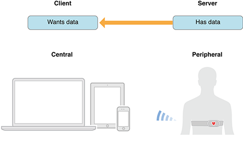
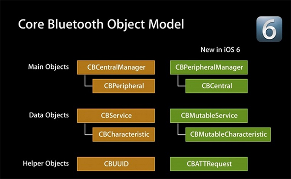
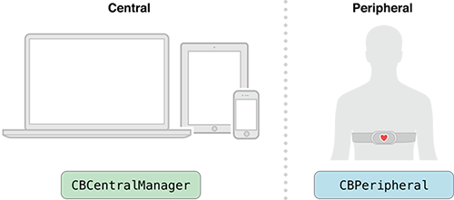
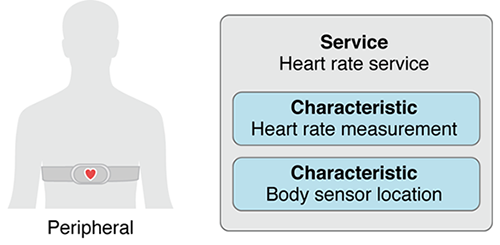
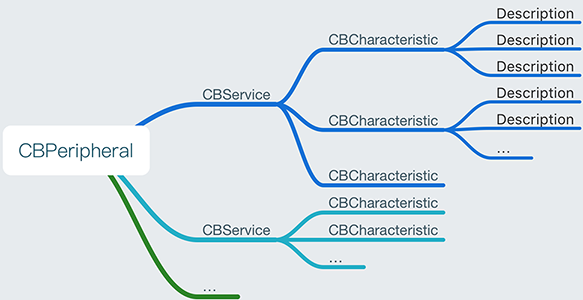
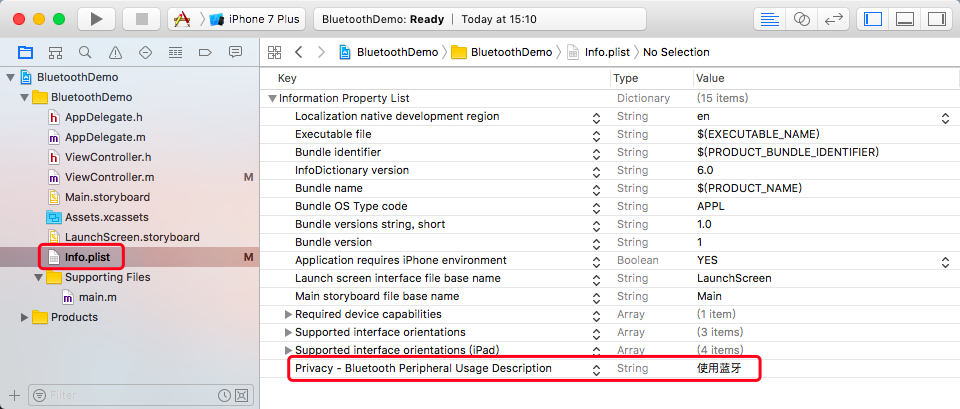
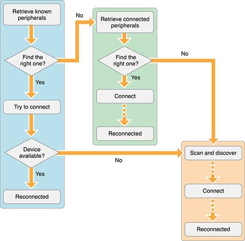
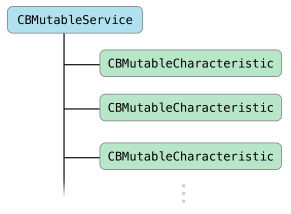

#  Bluetooth 蓝牙

## 1. iBeacon

### 1.1 简介

​	手机信号在室内经常很弱，**iBeacon**是一项通过蓝牙进行室内精确定位的技术，当移动设备靠近**iBeacon**基站时，设备感应到**iBeacon**信号可用于数据传输。**iBeacon**信号能精确定位用户的位置，为手持智能手机的用户提供基于位置的相关信息。

### 1.2 应用场景

​	**iBeacon**技术做到的是以**廉价硬件**通过**低功耗蓝牙**的方式向网络内的移动设备捕捉和推送信息。零售商店、体育场、学校、停车场...

### 1.3 苹果的自主格式中的四种资讯

​	**iBeacon**使用的是**BLE**技术，具体而言，利用的是**BLE**中名为**“通告帧”（Advertising）**的广播帧。通告帧是定期发送的帧，只要是支持**BLE**的设备就可以接收到。**iBeacon**通过在这种通告帧的有效负载部分嵌入苹果自主格式的数据来实现。**iBeacon**的数据主要由四种资讯构成：

* **UUID** (通用唯一标识符)：**UUID**是规定为**ISO/IEC11578:1996标准**的128位标识符。

* **Major**

* **Minor**

  **Major和Minor由iBeacon发布者自行设定，都是16位的标识符**。比如，连锁店可以在Major中写入区域资讯，可在**Minor**中写入个别店铺的ID等。另外，在家电中嵌入**iBeacon**功能时，可以用**Major**表示产品型号，用**Minor**表示错误代码，用来向外部通知故障。

* **Measured Power**
  **Measured Power**是**iBeacon**模块与接收器之间相距1m时的参考接收信号强度**（RSSI：Received Signal Strength Indicator）**。接收器根据该参考**RSSI**与接收信号的强度来推算发送模块与接收器的距离。将距离简单分为3级，有意思的是，苹果在iOS中并不仔细推断距离，而只采用**贴近（Immediate）、1m以内（Near）、1m以上（Far）**三种距离状态。距离在**1m以内**时，**RSSI**值基本上成比例减少，而距离在**1m**以上时，由于反射波的影响等，**RSSI**不减少而是上下波动。也就是说，相距**1m**以上时无法推断距离，因此就简单判定为**Far**。
  **iOS7**对接收到的**iBeacon**信号进行解释后，向等待**iBeacon**资讯的所有应用软件发送**UUID**、**Major**、**Minor**及靠近程度。发送的靠近程度资讯是**Immediate**、**Near**、**Far**中的一种。

   接收资讯的应用软件先确认**UUID**，如果确认是发送给自己的资讯，则再根据**Major**、**Minor**的组合进行处理。

### 1.4 电力消耗

​	低功耗蓝牙相比于传统蓝牙在功耗和效率方面有显著提高，在**16**个不同的**iBeacon**厂商的一项研究报告称，电池的寿命在1到24个月的范围之内。苹果公司，用一枚纽扣电池提供了1~3个月的生活，设置了100ms的广告频率，这样如果电池提供时间增加到2~3年就相当于广告频率增到到900ms。
​	在部署**ibeacon**启用手机**app**时，手机电池的消耗是一个必须要考虑的因素。最新的报告显示附近有**ibeacon**时，旧的手机会消耗更多的电量，然而新一点的手机在同样的环境下则更加高效。除了浏览手机消耗的时间，扫描附近的浏览量和信标数依然是电池消耗很重要的因素，正如**Aislelabs**指出的报告一样。在后续的报告中，**Aislelabs**发现了苹果5s，苹果5c和老版的苹果4s在电池消耗方面的一个大幅的改善。在10个**ibeacons**的周围，苹果4s每小时消耗了11%的电量而苹果5s则每小时比它少消耗5%的电量。一个高效节能的**ibeacon**应用程序需要考虑这些方面去保持应用的响应性和电池消耗之间的平衡。

## 2. iOS 蓝牙

### 2.1 常见简称

**MFi：make for ipad ,iphone, itouch 专们为苹果设备制作的设备，开发使用 ExternalAccessory 框架。**认证流程挺复杂的，而且对公司的资质要求较高，详见 iOS - MFi 认证。

**BLE：buletouch low energy**，蓝牙 4.0 设备因为低耗电，所以也叫做 **BLE**，开发使用 **CoreBluetooth** 框架。

**GATT Profile（Generic Attribute Profile）**：**GATT** 配置文件是一个通用规范，用于在 **BLE** 链路上发送和接收被称为 **“属性”（Attribute）**的数据块。目前所有的 **BLE** 应用都基于 **GATT**。
1. 定义两个 **BLE** 设备通过叫做 **Service** 和 **Characteristic** 的东西进行通信。中心设备和外设需要双向通信的话，唯一的方式就是建立 **GATT** 连接。
2. **GATT** 连接是独占的。基于 **GATT** 连接的方式的，只能是一个外设连接一个中心设备。
3.  配置文件是设备如何在特定的应用程序中工作的规格说明，一个设备可以实现多个配置文件。

**GAP（Generic Access Profile）**：用来控制设备连接和广播，**GAP** 使你的设备被其他设备可见，并决定了你的设备是否可以或者怎样与合同设备进行交互。
1) **GATT** 连接，必需先经过 **GAP** 协议。
2) **GAP** 给设备定义了若干角色，主要两个：**外围设备（Peripheral）和中心设备（Central）**。
3) 在 **GAP** 中外围设备通过两种方式向外广播数据：**Advertising Data Payload（广播数据）**和 **Scan Response Data Payload（扫描回复）**。

**Profile：**并不是实际存在于 **BLE** 外设上的，它只是一个被 Bluetooth SIG（一个以制定蓝牙规范，以推动蓝牙技术为宗旨的跨国组织）或者外设设计者预先定义的 Service 的集合。

**Service：**服务，是把数据分成一个个的独立逻辑项，它包含一个或者多个 **Characteristic**。每个 **Service** 有一个 **UUID** 唯一标识。**UUID** 有 **16 bit** 的，或者 **128 bit** 的。**16 bit** 的 **UUID** 是官方通过认证的，需要花钱购买，**128 bit** 是自定义的，可以自己设置。每个外设会有很多服务，每个服务中包含很多字段，这些字段的权限一般分为读 **read**，写 **write**，通知 **notiy** 几种，就是我们连接设备后具体需要操作的内容。

**Characteristic：**特征，**GATT** 事务中的最低界别，**Characteristic** 是最小的逻辑数据单元，当然它可能包含一个组关联的数据，例如加速度计的 **X/Y/Z** 三轴值。与 **Service** 类似，每个 **Characteristic** 用 **16 bit** 或者 **128 bit** 的 **UUID** 唯一标识。每个设备会提供服务和特征，类似于服务端的 **API**，但是机构不同。

**Description：**每个 **Characteristic** 可以对应一个或多个 **Description** 用户描述 **Characteristic** 的信息或属性。

**Peripheral、Central：**外设和中心，发起连接的是 **Central**，被连接的设备为 **Peripheral**。

### 2.2 工作模式

蓝牙通信中，首先需要提到的就是 **central** 和 **peripheral** 两个概念。这是设备在通信过程中扮演的两种角色。直译过来就是**[中心]**和 **[周边（可以理解为外设）]**。iOS 设备既可以作为 **central**，也可以作为 **peripheral**，这主要取决于通信需求。

例如在和心率监测仪通信的过程中，监测仪作为 **peripheral**，**iOS** 设备作为 **central**。**区分的方式即是这两个角色的重要特点：提供数据的是谁，谁就是 peripheral；需要数据的是谁，谁就是 central**。就像是 **client** 和 **server** 之间的关系一样。




#### 发现 **peripheral**

1. 在 **BLE** 中，最常见的就是广播。实际上，**peripheral** 在不停的发送广播，希望被 **central** 找到。广播的信息中包含它的名字等信息。如果是一个温度调节器，那么广播的信息应该还会包含当前温度什么的。那么 **central** 的作用则是去 **scan**，找到需要连接的 **peripheral**，连接后便可进行通信了。

2. 当 **central** 成功连上 **peripheral** 后，它便可以获取 **peripheral** 提供的所有 **service** 和 **characteristic**。通过对 **characteristic** 的数据进行读写，便可以实现 **central** 和 **peripheral** 的通信。

<u>**CoreBluetooth** 框架的核心其实是两个东西，**central** 和 **peripheral**, 对应他们分别有一组相关的 **API** 和类。</u>

这两组 **API** 分别对应不同的业务场景，如下图，左侧叫做中心模式，就是以你的手机（App）作为中心，连接其他的外设的场景。而右侧称为外设模式，使用手机作为外设连接其他中心设备操作的场景。



#### iOS 设备（App）作为 central

* 当 **central** 和 **peripheral** 通信时，绝大部分操作都在 **central** 这边。此时，**central** 被描述为 **CBCentralManager**，这个类提供了扫描、寻找、连接 **peripheral**（被描述为 **CBPeripheral**）的方法。

* 下图标示了 **central** 和 **peripheral** 在 **Core Bluetooth** 中的表示方式：


当你操作 **peripheral** 的时候，实际上是在和它的 **service** 和 **characteristic** 打交道，这两个分别由 **CBService** 和 **CBCharacteristic** 表示。

#### 中心模式（CBCentralManager）流程

  1. 建立中心角色

  2. 扫描外设（**discover**）

  3. 连接外设（**connect**）

  4. 扫描外设中的服务和特征（**discover**）

     * 获取外设的 **services**
     * 获取外设的 **Characteristics**，获取 **Characteristics** 的值，获取 **Characteristics** 的
         **Descriptor** 和 **Descriptor** 的值

 5. 与外设做数据交互（**explore and interact**）

 6. 订阅 **Characteristic** 的通知

 7. 断开连接（**disconnect**)

#### 外设模式（CBPeripheralManager）流程

1. 启动一个 **Peripheral** 管理对象
2. 设置本地 **Peripheral** 服务、特性、描述、权限等等
3. 设置 **Peripheral** 发送广播
4. 设置处理订阅、取消订阅、读 **characteristic**、写 **characteristic** 的委托方法

#### 服务、特征和特征的属性

* 一个 **peripheral** 包含一个或多个 **service**，或提供关于信号强度的信息。**service** 是数据和相关行为的集合。例如，一个心率监测仪的数据就可能是心率数据。

* 一个 **peripheral** 包含一个或多个 **service**，或提供关于信号强度的信息。**service** 是数据和相关行为的集合。例如，一个心率监测仪的数据就可能是心率数据。



* 每个 characteristic 属性分为这么几种：读，写，通知这么几种方式。


``` objective-c
    // 特征的定义枚举
    typedef NS_OPTIONS(NSUInteger, CBCharacteristicProperties) {
        CBCharacteristicPropertyBroadcast                                             = 0x01,    // 广播
        CBCharacteristicPropertyRead                                                  = 0x02,    // 读
        CBCharacteristicPropertyWriteWithoutResponse                                  = 0x04,    // 写
        CBCharacteristicPropertyWrite                                                 = 0x08,
        CBCharacteristicPropertyNotify                                                = 0x10,    // 通知
        CBCharacteristicPropertyIndicate                                              = 0x20,
        CBCharacteristicPropertyAuthenticatedSignedWrites                             = 0x40,
        CBCharacteristicPropertyExtendedProperties                                    = 0x80,
        CBCharacteristicPropertyNotifyEncryptionRequired NS_ENUM_AVAILABLE(NA, 6_0)   = 0x100,
        CBCharacteristicPropertyIndicateEncryptionRequired NS_ENUM_AVAILABLE(NA, 6_0) = 0x200
    };
```

#### 外设、服务、特征间的关系




一个 **CBPeripheral**（蓝牙设备） 有一个或者多个 **CBService**（服务），而每一个 **CBService** 有一个或者多个 **CBCharacteristic**（特征），通过可写的 **CBCharacteristic** 发送数据，而每一个 **CBCharacteristic** 有一个或者多个 **Description** 用于描述 **characteristic** 的信息或属性。

### 2.3 设备状态

##### 蓝牙设备状态

* 待机状态（standby）：设备没有传输和发送数据，并且没有连接到任何设备。
* 广播状态（Advertiser）：周期性广播状态。
* 扫描状态（Scanner）：主动寻找正在广播的设备。
* 发起链接状态（Initiator）：主动向扫描设备发起连接。
* 主设备（Master）：作为主设备连接到其他设备。
* 从设备（Slave）：作为从设备连接到其他设备。

##### 五种工作状态

* 准备（standby）
* 广播（advertising）
* 监听扫描（Scanning）
* 发起连接（Initiating）
* 已连接（Connected）

### 2.4 蓝牙和版本的使用限制

蓝牙 2.0：越狱设备

蓝牙 4.0：iOS 6 以上

MFi 认证设备：无限制

### 2.5 设置系统使用蓝牙权限

设置系统使用蓝牙权限




### 2.6 中心模式的使用


* **中心模式的应用场景**：主设备（手机去扫描连接外设，发现外设服务和属性，操作服务和属性的应用。一般来说，外设（蓝牙设备，比如智能手环之类的东西）会由硬件工程师开发好，并定义好设备提供的服务，每个服务对于的特征，每个特征的属性（只读，只写，通知等等）。

* **蓝牙程序需要使用真机调试**。

#### 2.6.1 App 连接外设的实现

##### 步骤一： 建立中心角色

导入 **CoreBluetooth** 头文件，建立中心设备管理类，设置主设备委托。


``` Objective-c
  // 包含头文件
    #import <CoreBluetooth/CoreBluetooth.h>

    // 遵守协议
    @interface ViewController () <CBCentralManagerDelegate>

    // 中心设备管理器
    @property (nonatomic, strong) CBCentralManager *centralManager;

    - (IBAction)start:(UIButton *)sender {

        // 初始化 centralManager，nil 默认为主线程
        self.centralManager = [[CBCentralManager alloc] initWithDelegate:self queue:nil];
    }

    #pragma mark - CBCentralManagerDelegate

    // 检查 App 设备蓝牙是否可用，协议方法
    - (void)centralManagerDidUpdateState:(CBCentralManager *)central {

        // 在初始化 CBCentralManager 的时候会打开设备，只有当设备正确打开后才能使用

        switch (central.state){

            case CBManagerStatePoweredOn:        // 蓝牙已打开，开始扫描外设

                NSLog(@"蓝牙已打开，开始扫描外设");

                // 开始扫描周围的设备，自定义方法
                [self sacnNearPerpherals];

                break;

            case CBManagerStateUnsupported:

                NSLog(@"您的设备不支持蓝牙或蓝牙 4.0");

                break;

            case CBManagerStateUnauthorized:

                NSLog(@"未授权打开蓝牙");

                break;

            case CBManagerStatePoweredOff:       // 蓝牙未打开，系统会自动提示打开，所以不用自行提示

            default:
                break;
        }
    }

    // 发现外围设备，协议方法
    - (void)centralManager:(CBCentralManager *)central
     didDiscoverPeripheral:(CBPeripheral *)peripheral
         advertisementData:(NSDictionary<NSString *,id> *)advertisementData
                      RSSI:(NSNumber *)RSSI {
        /*
         * central              中心设备
         * peripheral           外围设备
         * advertisementData    特征数据
         * RSSI                 信号强度
         */

        NSMutableString *string = [NSMutableString stringWithString:@"\n\n"];
        [string appendFormat:@"NAME: %@\n"            , peripheral.name];
        [string appendFormat:@"UUID(identifier): %@\n", peripheral.identifier];
        [string appendFormat:@"RSSI: %@\n"            , RSSI];
        [string appendFormat:@"adverisement:%@\n"     , advertisementData];

        NSLog(@"发现外设 Peripheral Info:\n %@", string);

        // 连接指定的设备，自定义方法
        [self connectPeripheral:peripheral];
    }

    // 连接外设成功，协议方法
    - (void)centralManager:(CBCentralManager *)central didConnectPeripheral:(CBPeripheral *)peripheral {

        NSLog(@"%@ 连接成功", peripheral.name);

        // 停止扫描
        [central stopScan];

        // 扫描外设中的服务和特征，自定义方法
        [self discoverPeripheralServices:peripheral];
    }

    // 连接外设失败，协议方法
    - (void)centralManager:(CBCentralManager *)central
            didFailToConnectPeripheral:(CBPeripheral *)peripheral
                     error:(NSError *)error {

        NSLog(@"%@ 连接失败", peripheral.name);
    }

    // 连接外设断开，协议方法
    - (void)centralManager:(CBCentralManager *)central
            didDisconnectPeripheral:(CBPeripheral *)peripheral
                     error:(NSError *)error {

        NSLog(@"%@ 连接已断开", peripheral.name);
    }
```

##### 步骤二：扫描外设（discover）

扫描外设的方法需要放在 **centralManager** 成功打开的代理方法` - (void)centralManagerDidUpdateState:(CBCentralManager *)central` 中，因为只有设备成功打开，才能开始扫描，否则会报错。

扫描到外设后会进入代理方法 

``` Objective-C
- (void)centralManager:(CBCentralManager *)central didDiscoverPeripheral:(CBPeripheral *)peripheral advertisementData:(NSDictionary<NSString *, id> *)advertisementData RSSI:(NSNumber *)RSSI;
```


``` Objective-C
    // 开始扫描周围的设备，自定义方法
    - (void)sacnNearPerpherals {

        NSLog(@"开始扫描周围的设备");

        /*
         * 第一个参数为 Services 的 UUID（外设端的 UUID)，nil 为扫描周围所有的外设。
         * 第二参数的 CBCentralManagerScanOptionAllowDuplicatesKey 为已发现的设备是否重复扫描，YES 同一设备会多次回调。nil 时默认为 NO。
         */
        [self.centralManager scanForPeripheralsWithServices:nil
                                                    options:@{CBCentralManagerScanOptionAllowDuplicatesKey:@NO}];
    }
```

##### 步骤三：连接外设（connect）

* 对要连接的设备需要进行强引用，否则会报错。

* 一个主设备最多能连 **7** 个外设，每个外设最多只能给一个主设备连接，连接成功，失败，断开会进入各自的代理方法中。


```objective-c
    // 设备
    @property (nonatomic, strong) CBPeripheral *peripheral;

    // 连接指定的设备，自定义方法
    - (void)connectPeripheral:(CBPeripheral *)peripheral {

        NSLog(@"连接指定的设备");

        // 设置连接规则，这里设置的是 以 J 开头的设备
        if ([peripheral.name hasPrefix:@"J"]) {

            // 对要连接的设备进行强引用，否则会报错
            self.peripheral = peripheral;

            // 连接设备
            [self.centralManager connectPeripheral:peripheral options:nil];
        }
    }
```

##### 步骤四：扫描外设中的服务和特征（discover）

设备连接成功后，就可以扫描设备的服务了，同样是通过委托形式，扫描到结果后会进入委托方法。但是这个委托已经不再是主设备的委托（**CBCentralManagerDelegate**），而是外设的委托（**CBPeripheralDelegate**）,这个委托包含了主设备与外设交互的许多回调方法，包括获取 **services**，获取 **characteristics**，获取 **characteristics** 的值，获取 **characteristics** 的 **Descriptor**，和 **Descriptor**的值，写数据，读 **RSSI**，用通知的方式订阅数据等等。


```objective-c
    // 遵守协议
    @interface ViewController () <CBPeripheralDelegate>

    // 扫描外设中的服务和特征，自定义方法
    - (void)discoverPeripheralServices:(CBPeripheral *)peripheral {

        // 设置外设代理
        self.peripheral.delegate = self;

        // 开始扫描外设
        [self.peripheral discoverServices:nil];
    }

    #pragma mark - CBPeripheralDelegate

    // 扫描到外设服务，协议方法
    - (void)peripheral:(CBPeripheral *)peripheral didDiscoverServices:(NSError *)error {

        if (error) {
            NSLog(@"Discovered services for %@ with error: %@", peripheral.name, error.localizedDescription);
            return;
        }

        for (CBService *service in peripheral.services) {

            NSLog(@"扫描到外设服务：%@", service);

            // 扫描服务的特征
            [peripheral discoverCharacteristics:nil forService:service];
        }
    }

    // 扫描到服务的特征，协议方法
    - (void)peripheral:(CBPeripheral *)peripheral
            didDiscoverCharacteristicsForService:(CBService *)service
                 error:(NSError *)error {

        if (error) {
            NSLog(@"error Discovered characteristics for %@ with error: %@", service.UUID, error.localizedDescription);
            return;
        }

        for (CBCharacteristic *characteristic in service.characteristics) {

            NSLog(@"扫描到服务：%@ 的特征：%@", service.UUID, characteristic.UUID);

            // 获取特征的值
            [peripheral readValueForCharacteristic:characteristic];

            // 搜索特征的 Descriptors
            [peripheral discoverDescriptorsForCharacteristic:characteristic];

            // // 连接成功，开始配对，发送第一次校验的数据，自定义方法
            // [self writeCharacteristic:peripheral characteristic:characteristic value:self.pairAuthDatas[0]];
        }
    }

    // 获取到特征的值，协议方法
    - (void)peripheral:(CBPeripheral *)peripheral
            didUpdateValueForCharacteristic:(CBCharacteristic *)characteristic
                 error:(NSError *)error {

        // value 的类型是 NSData，具体开发时，会根据外设协议制定的方式去解析数据

        NSLog(@"获取到特征：%@ 的值：%@", characteristic.UUID, [[NSString alloc] initWithData:characteristic.value
                                                                               encoding:NSUTF8StringEncoding]);

        // if (...) {      // 第一次配对成功
        //     
        //     [self writeCharacteristic:peripheral characteristic:characteristic value:self.pairAuthDatas[1]];
        // }
        //    
        // if (...) {     // 第二次配对成功
        //        
        //     NSLog(@"正式建立的连接 -----------");
        // }
    }

    // 搜索到特征的 Descriptors，协议方法
    - (void)peripheral:(CBPeripheral *)peripheral
            didDiscoverDescriptorsForCharacteristic:(CBCharacteristic *)characteristic
                 error:(NSError *)error {

        for (CBDescriptor *descriptor in characteristic.descriptors) {

            NSLog(@"搜索到特征：%@ 的 Descriptors：%@", characteristic.UUID, descriptor.UUID);

            // 获取到 Descriptors 的值
            [peripheral readValueForDescriptor:descriptor];
        }
    }

    // 获取到 Descriptors 的值，协议方法
    - (void)peripheral:(CBPeripheral *)peripheral
            didUpdateValueForDescriptor:(CBDescriptor *)descriptor
                 error:(NSError *)error{

        // 这个 descriptor 都是对于特征的描述，一般都是字符串

        NSLog(@"获取到 Descriptors：%@ 的值：%@", descriptor.UUID, descriptor.value);
    }

    // 写数据到特征中完成，协议方法
    - (void)peripheral:(CBPeripheral *)peripheral
            didWriteValueForCharacteristic:(CBCharacteristic *)characteristic
                 error:(NSError *)error {

        NSLog(@"写数据完成到特征：%@ 中完成：%@", characteristic.UUID, characteristic.value);
    }
```

##### 步骤五：把数据写到 Characteristic 中


```objective-c
// 配对信息
    @property (nonatomic, strong) NSArray<NSData *> *pairAuthDatas;

    // 加载配对信息
    - (NSArray<NSData *> *)pairAuthDatas {

        if (_pairAuthDatas) {

            // 具体开发时，根据配对协议加载配对需要的数据
            // _pairAuthDatas = ...
        }
        return _pairAuthDatas;
    }

    // 把数据写到 Characteristic 中，自定义方法
    - (void)writeCharacteristic:(CBPeripheral *)peripheral
                 characteristic:(CBCharacteristic *)characteristic
                          value:(NSData *)value {

        NSLog(@"%lu", (unsigned long)characteristic.properties);

        // 只有 characteristic.properties 有 write 的权限才可以写

        if (characteristic.properties & CBCharacteristicPropertyWrite ||
            characteristic.properties & CBCharacteristicPropertyWriteWithoutResponse) {

            // 写入数据
            [peripheral writeValue:value forCharacteristic:characteristic type:CBCharacteristicWriteWithResponse];

        } else {
            NSLog(@"该字段不可写！");
        }
    }
```

##### 步骤六：订阅 Characteristic 的通知


```objective-c
  // 设置通知，自定义方法
    - (void)notifyCharacteristic:(CBPeripheral *)peripheral characteristic:(CBCharacteristic *)characteristic{

        // 设置通知，数据通知会进入：didUpdateValueForCharacteristic 方法

        [peripheral setNotifyValue:YES forCharacteristic:characteristic];
    }

    // 取消通知，自定义方法
    - (void)cancelNotifyCharacteristic:(CBPeripheral *)peripheral characteristic:(CBCharacteristic *)characteristic{

        [peripheral setNotifyValue:NO forCharacteristic:characteristic];
    }
```

##### 步骤七：断开连接（disconnect）


```objective-c
  // 停止扫描并断开连接，自定义方法
    - (void)disconnectPeripheral:(CBCentralManager *)centralManager peripheral:(CBPeripheral *)peripheral{

        // 停止扫描
        [centralManager stopScan];

        // 断开连接
        [centralManager cancelPeripheralConnection:peripheral];
    }
```

##### 运行效果

```
    02:38:33.336775 BluetoothDemo[776:263266] 蓝牙已打开，开始扫描外设
    02:38:33.337034 BluetoothDemo[776:263266] 开始扫描周围的设备
    02:38:33.361782 BluetoothDemo[776:263266] 发现外设 Peripheral Info:


    NAME: JHQ0228-MacBookAir
    UUID(identifier): 41E85E3E-0AF2-9992-B399-21730E2B342F
    RSSI: -54
    adverisement:{
        kCBAdvDataIsConnectable = 1;
    }
    02:38:33.362378 BluetoothDemo[776:263266] 连接指定的设备
    02:38:33.795614 BluetoothDemo[776:263266] JHQ0228-MacBookAir 连接成功
    02:38:33.951722 BluetoothDemo[776:263266] 扫描到外设服务：<CBService: 0x17406e9c0, isPrimary = YES, UUID = Device Information>
    02:38:33.952587 BluetoothDemo[776:263266] 扫描到外设服务：<CBService: 0x170078940, isPrimary = YES, UUID = Continuity>
    02:38:33.953509 BluetoothDemo[776:263266] 扫描到外设服务：<CBService: 0x170078900, isPrimary = YES, UUID = 9FA480E0-4967-4542-9390-D343DC5D04AE>
    02:38:33.956941 BluetoothDemo[776:263266] 扫描到服务：Device Information 的特征：Manufacturer Name String
    02:38:33.958529 BluetoothDemo[776:263266] 扫描到服务：Device Information 的特征：Model Number String
    02:38:33.959987 BluetoothDemo[776:263266] 扫描到服务：Continuity 的特征：Continuity
    02:38:33.961416 BluetoothDemo[776:263266] 扫描到服务：9FA480E0-4967-4542-9390-D343DC5D04AE 的特征：AF0BADB1-5B99-43CD-917A-A77BC549E3CC
    02:38:34.010710 BluetoothDemo[776:263266] 获取到特征：Manufacturer Name String 的值：Apple Inc
    02:38:34.070137 BluetoothDemo[776:263266] 获取到特征：Model Number String 的值：MacBookAir7,2
    02:38:34.130098 BluetoothDemo[776:263266] 获取到特征：Continuity 的值：(null)
    02:38:34.131258 BluetoothDemo[776:263266] 搜索到特征：Continuity 的 Descriptors：Client Characteristic Configuration
    02:38:34.190588 BluetoothDemo[776:263266] 获取到特征：AF0BADB1-5B99-43CD-917A-A77BC549E3CC 的值：
    02:38:34.191409 BluetoothDemo[776:263266] 搜索到特征：AF0BADB1-5B99-43CD-917A-A77BC549E3CC 的 Descriptors：Client Characteristic Configuration
    02:38:34.245280 BluetoothDemo[776:263266] 获取到 Descriptors：Client Characteristic Configuration 的值：1
    02:38:34.275359 BluetoothDemo[776:263266] 获取到 Descriptors：Client Characteristic Configuration 的值：0
```

#### 2.6.2 作为 Central 时的数据读写
##### 步骤一：初始化 CBCentralManager

第一步先进行初始化，可以使用 `initWithDelegate:queue:options:` 方法：


``` Objective-C
 myCentralManager = [[CBCentralManager alloc] initWithDelegate:self queue:nil options:nil];
```

上面的代码中，将 **self** 设置为代理，用于接收各种 **central** 事件。将 **queue** 设置为 **nil**，则表示直接在主线程中运行。

初始化 **central manager** 之后，设置的代理会调用 **centralManagerDidUpdateState: **方法，所以需要去遵循 **<CBCentralManagerDelegate>** 协议。这个 **did update state** 的方法，能获得当前设备是否能作为 **central**。关于这个协议的实现和其他方法，接下来会讲到，也可以先看看官方 **API**。

##### 步骤二：搜索当前可用的 peripheral

可以使用 **CBCentralManager** 的 **scanForPeripheralsWithServices:options:** 方法来扫描周围正在发出广播的 **Peripheral** 设备。


```Objective-C
    [myCentralManager scanForPeripheralsWithServices:nil options:nil];
```

第一个参数为 **nil**，表示所有周围全部可用的设备。在实际应用中，你可以传入一个 **CBUUID** 的数组（注意，这个 **UUID** 是 **service** 的 **UUID** 数组），表示只搜索当前数组包含的设备（每个 **peripheral** 的 **service** 都有唯一标识 **UUID**）。所以，如果你传入了这样一个数组，那么 **central manager** 则只会去搜素包含这些 **service UUID** 的 **Peripheral**。

**CBUUID** 是和 **peripheral** 相关的，和 **central** 本身关系不大，如果你是做的硬件对接，那么可以向硬件同事询问。

在调用 `scanForPeripheralsWithServices:options:` 方法之后，找到可用设备，系统会回调（每找到一个都会回调）`centralManager:didDiscoverPeripheral:advertisementData:RSSI:`。该方法会返回找到的 **peripheral**，所以你可以使用数组将找到的 **peripheral** 存起来。


```Objective-C
    - (void)centralManager:(CBCentralManager *)central
     didDiscoverPeripheral:(CBPeripheral *)peripheral
         advertisementData:(NSDictionary *)advertisementData
                      RSSI:(NSNumber *)RSSI {

        NSLog(@"Discovered %@", peripheral.name);
    }
```

当你找到你需要的那个 peripheral 时，可以调用 stop 方法来停止搜索。


```Objective-C
    [myCentralManager stopScan];

    NSLog(@"Scanning stopped");
```

##### 步骤三：连接 peripheral

找到你需要的 **peripheral** 之后，下一步就是调用 `connectPeripheral:options:` 方法来连接。


```Objective-C
    [myCentralManager connectPeripheral:peripheral options:nil];
```

当连接成功后，会回调方法 `centralManager:didConnectPeripheral:`。在这个方法中，你可以去记录当前的连接状态等数据。


```Objective-C
    - (void)centralManager:(CBCentralManager *)central
      didConnectPeripheral:(CBPeripheral *)peripheral {

        NSLog(@"Peripheral connected");
    }
```

不过在进行其他操作之前，你应该给已连接的这个 **peripheral** 设置代理（需要去遵循 **<CBPeripheralDelegate>** 协议），这样才能收到 **peripheral** 的回调（可以就写在上面这个方法中）。


```Objective-C
    peripheral.delegate = self;
```

注意：在连接设备之前需要对要连接的设备进行强引用，否则会报错


```Objective-C
    [CoreBluetooth] API MISUSE: Cancelling connection for unused peripheral <CBPeripheral: 0x1702e6680, 
    identifier = 41E85E3E-0AF2-9992-B399-21730E2B342F, name = MacBookAir, state = connecting>, 
    Did you forget to keep a reference to it?`
```


```Objective-C
    @property (nonatomic, strong) CBPeripheral *peripheral;

    // 对要连接的设备进行强引用
    self.peripheral = peripheral;
```

##### 步骤四：搜索 peripheral 的 service

当与 **peripheral** 成功建立连接以后，就可以通信了。第一步是先找到当前 **peripheral** 提供的 **service**，因为 **service** 广播的数据有大小限制（貌似是 **31 bytes**），所以你实际找到的 **service** 的数量可能要比它广播时候说的数量要多。调用 **CBPeripheral** 的 `discoverServices:` 方法可以找到当前 **peripheral** 的所有 **service**。


```Objective-C
    [peripheral discoverServices:nil];
```

在实际项目中，这个参数应该不是 **nil** 的，因为 **nil** 表示查找所有可用的 **Service**，但实际上，你可能只需要其中的某几个。搜索全部的操作既耗时又耗电，所以应该提供一个要搜索的 **service** 的 **UUID** 数组。

当找到特定的 **Service** 以后，会回调 **<CBPeripheralDelegate>** 的 `peripheral:didDiscoverServices:` 方法。**Core Bluetooth** 提供了 **CBService** 类来表示 **service**，找到以后，它们以数组的形式存入了当前 **peripheral** 的 **services** 属性中，你可以在当前回调中遍历这个属性。


```Objective-C
    - (void)peripheral:(CBPeripheral *)peripheral
    didDiscoverServices:(NSError *)error {

        for (CBService *service in peripheral.services) {
            NSLog(@"Discovered service %@", service);
        }
    }
```

如果是搜索的全部 **service** 的话，你可以选择在遍历的过程中，去对比 **UUID** 是不是你要找的那个。


##### 步骤五：搜索 service 的 characteristic

找到需要的 **service** 之后，下一步是找它所提供的 **characteristic**。如果搜索全部 **characteristic**，那调用 **CBPeripheral** 的 `discoverCharacteristics:forService:` 方法即可。如果是搜索当前 **service** 的 **characteristic**，那还应该传入相应的 **CBService** 对象。


```Objective-C
    NSLog(@"Discovering characteristics for service %@", interestingService);

    [peripheral discoverCharacteristics:nil forService:interestingService];
```

同样是出于节能的考虑，第一个参数在实际项目中应该是 **characteristic** 的 **UUID** 数组。也同样能在最佳实践中介绍。


```Objective-C
    - (void)peripheral:(CBPeripheral *)peripheral
    didDiscoverCharacteristicsForService:(CBService *)service
                 error:(NSError *)error {

        for (CBCharacteristic *characteristic in service.characteristics) {
            NSLog(@"Discovered characteristic %@", characteristic);
        }
    }
```

同样也可以通过添加 **UUID** 的判断来找到需要的 **characteristic**。

##### 步骤六：读取 characteristic 数据

**characteristic** 包含了 **service** 要传输的数据。例如温度设备中表达温度的 **characteristic**，就可能包含着当前温度值。这时我们就可以通过读取 **characteristic**，来得到里面的数据。

当找到 **characteristic** 之后，可以通过调用 **CBPeripheral** 的 **readValueForCharacteristic:** 方法来进行读取。


```Objective-C
 NSLog(@"Reading value for characteristic %@", interestingCharacteristic);

[peripheral readValueForCharacteristic:interestingCharacteristic];

```

当你调用上面这方法后，会回调 `peripheral:didUpdateValueForCharacteristic:error: `方法，其中包含了要读取的数据。如果读取正确，可以用以下方式来获得值：


```Objective-C
    - (void)peripheral:(CBPeripheral *)peripheral
    didUpdateValueForCharacteristic:(CBCharacteristic *)characteristic
                 error:(NSError *)error {

        NSData *data = characteristic.value;
        // parse the data as needed
    }
```

注意，不是所有 **characteristic** 的值都是可读的，你可以通过 **CBCharacteristicPropertyRead options** 来进行判断。如果你尝试读取不可读的数据，那上面的代理方法会返回相应的 **error**。

##### 步骤七：订阅 Characteristic 数据

其实使用 `readValueForCharacteristic:` 方法并不是实时的。考虑到很多实时的数据，比如心率这种，那就需要订阅 **characteristic** 了。

可以通过调用 **CBPeripheral** 的 `setNotifyValue:forCharacteristic:` 方法来实现订阅，注意第一个参数是 **YES**。


```objective-c
    [peripheral setNotifyValue:YES forCharacteristic:interestingCharacteristic];
```

如果是订阅，成功与否的回调是 `peripheral:didUpdateNotificationStateForCharacteristic:error:`，读取中的错误会以 **error** 形式传回。


```objective-c
    - (void)peripheral:(CBPeripheral *)peripheral
    didUpdateNotificationStateForCharacteristic:(CBCharacteristic *)characteristic
                 error:(NSError *)error {

        if (error) {
            NSLog(@"Error changing notification state: %@", [error localizedDescription]);
        }
    }
```

当然也不是所有 **characteristic** 都允许订阅，依然可以通过 **CBCharacteristicPropertyNoify options** 来进行判断。

当订阅成功以后，那数据便会实时的传回了，数据的回调依然和之前读取 **characteristic** 的回调相同（注意，不是订阅的那个回调）`peripheral:didUpdateValueForCharacteristic:error:`。

##### 步骤八：向 characteristic 写数据

写数据其实是一个很常见的需求，如果 **characteristic** 可写，你可以通过 **CBPeripheral** 类的 `writeValue:forCharacteristic:type:` 方法来向设备写入 **NSData** 数据。


```objective-c
    NSLog(@"Writing value for characteristic %@", interestingCharacteristic);

    [peripheral writeValue:dataToWrite forCharacteristic:interestingCharacteristic type:CBCharacteristicWriteWithResponse];
```

关于写入数据的 **type**，如上面这行代码，**type** 就是 **CBCharacteristicWriteWithResponse**，表示当写入成功时，要进行回调。更多的类型可以参考 **CBCharacteristicWriteType** 枚举。

如果写入成功后要回调，那么回调方法是 `peripheral:didWriteValueForCharacteristic:error:`。如果写入失败，那么会包含到 error 参数返回。

```objective-c
    - (void)peripheral:(CBPeripheral *)peripheral
    didWriteValueForCharacteristic:(CBCharacteristic *)characteristic
                 error:(NSError *)error {

        if (error) {
            NSLog(@"Error writing characteristic value: %@", [error localizedDescription]);
        }
    }
```

注意：**characteristic** 也可能并不支持写操作，可以通过 **CBCharacteristic** 的 **properties** 属性来判断。


```objective-c
    if (characteristic.properties & CBCharacteristicPropertyWrite ||
        characteristic.properties & CBCharacteristicPropertyWriteWithoutResponse) {

        // 写数据
        [peripheral writeValue:dataToWrite forCharacteristic:interestingCharacteristic type:CBCharacteristicWriteWithResponse];

    } else {
        NSLog(@"该字段不可写！");
    }
```

#### 2.6.3 数据读写 - 知识补充

##### CBUUID
**CBUUID** 对象是用于 **BLE** 通信中 **128** 位的唯一标示符。**peripheral** 的 **service**，**characteristic**，**characteristic descriptor** 都包含这个属性。这个类包含了一系列生成 **UUID** 的方法。

**UUID** 有 16 位的，也有 128 位的。其中 **SIG** 组织提供了一部分 **16** 位的 **UUID**，这部分 **UUID** 主要用于公共设备，例如有个用蓝牙连接的心率监测仪，如果是用的公共的 **UUID**，那么无论谁做一个 **app**，都可以进行连接，因为它的 **UUID** 是 **SIG** 官方提供的，是公开的。如果公司是要做一个只能自己的 **app** 才能连接的设备，那么就需要硬件方面自定义 **UUID**。（关于这方面，包括通信的 **GATT** 协议、广播流程等详细介绍，可以看 [iOS - GATT Profile 简介](http://www.cnblogs.com/QianChia/p/6366672.html) 这篇文章。讲得比较详细，能在很大程度上帮助我们理解 BLE 通信）。

**CBUUID** 类提供了可以将 **16** 位 **UUID** 转为 **128** 位 **UUID** 的方法。下面的代码是 **SIG** 提供的 **16** 位的心率 **service UUID** 转为 128 位 **UUID** 的方法：


```objective-c
    CBUUID *heartRateServiceUUID = [CBUUID UUIDWithString:@"180D"];
```

如果需要获取 **NSString** 形式的 **UUID**，可以访问 **CBUUID** 的 **UUIDString** 只读属性。


```objective-c
    NSString *uuidString = [CBUUID UUIDWithString:ServiceUUIDString1].UUIDString;
```

##### 设备唯一标识符

在有些时候，需要获取 **peripheral** 的唯一标示符（比如要做自动连接或绑定用户等操作），但是在搜索到 **peripheral** 之后，只能拿到 **identifier**，而且这个 **identifier** 根据连接的 **central** 不同而不同。也就是说，不同的手机连上之后，**identifier** 是不同的。虽然比较坑爹，但是这并不影响你做蓝牙自动连接。


```objective-c
    CB_EXTERN_CLASS @interface CBPeripheral : CBPeer

    // 蓝牙设备的名称
    @property(retain, readonly, nullable) NSString *name;

    // 蓝牙设备的信号强度
    @property(retain, readonly, nullable) NSNumber *RSSI NS_DEPRECATED(NA, NA, 5_0, 8_0);

    // 蓝牙设备的连接状态，枚举值
    @property(readonly) CBPeripheralState state;

    // 蓝牙设备包含的服务
    @property(retain, readonly, nullable) NSArray<CBService *> *services;

    CB_EXTERN_CLASS @interface CBPeer : NSObject <NSCopying>

    // 蓝牙设备的 UUID 标识符
    @property(readonly, nonatomic) NSUUID *identifier NS_AVAILABLE(NA, 7_0);
```

唯一标示符（并且不会变的）是设备的 **MAC** 地址，对于 **Android** 来说，轻轻松松就能拿到，但对于 **iOS**，目前这一属性还是私有的。

如果一定有这样的需求（即一定要使用 **MAC** 地址），可以和硬件工程师沟通，使用下面的某一种方式解决：

* 将 **MAC** 地址写在某一个蓝牙特征中，当我们连接蓝牙设备之后，通过某一个特征获取 **MAC** 地址。
* 将 **MAC** 地址放在蓝牙设备的广播数据当中，然后在广播的时候，将 **MAC** 地址以广播的形式发出来，在不建立连接的情况下，就能拿到 **MAC** 地址。
* 我们可以通过蓝牙设备的出厂设备或者后期手动修改蓝牙设备的 **name**，作为唯一标识。

##### 检查设备是否能作为 central

初始化 **CBCentralManager** 的时候，传入的 **self** 代理会触发回调 `centralManagerDidUpdateState:`。在该方法中可通过 `central.state` 来获得当前设备是否能作为 `central`。`state` 为 `CBManagerState` 枚举类型，具体定义如下：


```objective-c
    typedef NS_ENUM(NSInteger, CBCentralManagerState) {
        CBCentralManagerStateUnknown      = CBManagerStateUnknown,
        CBCentralManagerStateResetting    = CBManagerStateResetting,
        CBCentralManagerStateUnsupported  = CBManagerStateUnsupported,
        CBCentralManagerStateUnauthorized = CBManagerStateUnauthorized,
        CBCentralManagerStatePoweredOff   = CBManagerStatePoweredOff,
        CBCentralManagerStatePoweredOn    = CBManagerStatePoweredOn,
    } NS_DEPRECATED(NA, NA, 5_0, 10_0, "Use CBManagerState instead");

    typedef NS_ENUM(NSInteger, CBManagerState) {
        CBManagerStateUnknown = 0,
        CBManagerStateResetting,
        CBManagerStateUnsupported,
        CBManagerStateUnauthorized,
        CBManagerStatePoweredOff,
        CBManagerStatePoweredOn,
    } NS_ENUM_AVAILABLE(NA, 10_0);
```

只有当 `state == CBManagerStatePoweredOn` 时，才代表正常。

##### 检查 characteristic 访问权限
如果不检查也没事，因为无权访问会在回调中返回 **error**，但这毕竟是马后炮。如果有需要在读写之前检测，可以通过 **characteristic** 的 **properties** 属性来判断。该属性为 **CBCharacteristicProperties** 的 **NS_OPIONS**。


```objective-c
    typedef NS_OPTIONS(NSUInteger, CBCharacteristicProperties) {
        CBCharacteristicPropertyBroadcast                                               = 0x01,
        CBCharacteristicPropertyRead                                                    = 0x02,
        CBCharacteristicPropertyWriteWithoutResponse                                    = 0x04,
        CBCharacteristicPropertyWrite                                                   = 0x08,
        CBCharacteristicPropertyNotify                                                  = 0x10,
        CBCharacteristicPropertyIndicate                                                = 0x20,
        CBCharacteristicPropertyAuthenticatedSignedWrites                               = 0x40,
        CBCharacteristicPropertyExtendedProperties                                      = 0x80,
        CBCharacteristicPropertyNotifyEncryptionRequired NS_ENUM_AVAILABLE(NA, 6_0)     = 0x100,
        CBCharacteristicPropertyIndicateEncryptionRequired NS_ENUM_AVAILABLE(NA, 6_0)   = 0x200
    };
```

多个权限可以通过 `|` 和 `&` 来判断是否支持，比如判断是否支持读或写。


```objective-c
    if (characteristic.properties & (CBCharacteristicPropertyRead | CBCharacteristicPropertyWrite)) {

    }
```

##### 写入后是否回调

在写入 **characteristic** 时，可以选择是否在写入后进行回调。调用方法和枚举常量如下。


```objective-c
    [self.connectedPeripheral writeValue:data forCharacteristic:connectedCharacteristic type:CBCharacteristicWriteWithResponse];

    typedef NS_ENUM(NSInteger, CBCharacteristicWriteType) {
        CBCharacteristicWriteWithResponse = 0,
        CBCharacteristicWriteWithoutResponse,
    };
```

回调方法为


```objective-c
    - (void)peripheral:(CBPeripheral *)peripheral didWriteValueForCharacteristic:(CBCharacteristic *)characteristic error:(NSError *)error;
```

所以即使没有判断写入权限，也可以通过回调的 **error** 来判断，但这样比起写入前判断更耗资源。

#### 2.6.4 数据读写 - 最佳实践

在设备上一般都有很多地方要用到无线电通信，**Wi-Fi**、传统的蓝牙、以及使用 **BLE** 通信的 **app** 等等。这些服务都是很耗资源的，尤其是在 **iOS** 设备上。所以这里会讲解到如何正确的使用 **BLE** 以达到节能的效果。

##### 只扫描你需要的 peripheral
在调用 **CBCentralManager** 的 `scanForPeripheralsWithServices:options:` 方法时，**central** 会打开无线电去监听正在广播的 **peripheral**，并且这一过程不会自动超时。所以需要我们手动设置 **timer** 去停掉。

如果只需要连接一个 **peripheral**，那应该在 `centralManager:didConnectPeripheral:` 的回调中，用 **stopScan** 方法停止搜索。


```objective-c
    - (void)centralManager:(CBCentralManager *)central didConnectPeripheral:(CBPeripheral *)peripheral {

        // 停止搜索
        [central stopScan];

        ......
    }
```

##### 只在必要的时候设置 CBCentralManagerScanOptionAllowDuplicatesKey

**peripheral** 每秒都在发送大量的数据包，`scanForPeripheralsWithServices:options: `方法会将同一 **peripheral** 发出的多个数据包合并为一个事件，然后每找到一个 **peripheral** 都会调用 `centralManager:didDiscoverPeripheral:advertisementData:RSSI:` 方法。另外，当已发现的 **peripheral** 发送的数据包有变化时，这个代理方法同样会调用。

以上合并事件的操作是 `scanForPeripheralsWithServices:options:` 的默认行为，即未设置 **option** 参数。如果不想要默认行为，可将 option 设置为 **CBCentralManagerScanOptionAllowDuplicatesKey**。设置以后，每收到广播，就会调用上面的回调（无论广播数据是否一样）。


```objective-c
    [peripheral scanForPeripheralsWithServices:nil options:@{CBCentralManagerScanOptionAllowDuplicatesKey:@YES}];
```

关闭默认行为一般用于以下场景：根据 **peripheral** 的距离来初始化连接（根据可用信号强度 **RSSI** 来判断）。设置这个 **option** 会对电池寿命和 **app** 的性能产生不利影响，所以一定要在必要的时候，再对其进行设置。

##### 正确的搜索 service 与 characteristic

在搜索过程中，并不是所有的 **service** 和 **characteristic** 都是我们需要的，如果全部搜索，依然会造成不必要的资源浪费。假设你只需要用到 **peripheral** 提供的众多 **service** 中的两个，那么在搜索 **service** 的时候可以设置要搜索的 **service** 的 **UUID**。


```objective-c
    [peripheral discoverServices:@[firstServiceUUID, secondServiceUUID]];
```

用这种方式搜索到 **service** 以后，也可以用类似的办法来限制 **characteristic** 的搜索范围（`discoverCharacteristics:forService:`）。

##### 接收 characteristic 数据

接收 **characteristic** 数据的方式有两种：

* 在需要接收数据的时候，调用 `readValueForCharacteristic:`，这种是需要主动去接收的。
* 用 `setNotifyValue:forCharacteristic: `方法订阅，当有数据发送时，可以直接在回调中接收。

如果 **characteristic** 的数据经常变化，那么采用订阅的方式更好。

##### 适时断开连接
在不用和 **peripheral** 通信的时候，应当将连接断开，这也对节能有好处。


在以下两种情况下，连接应该被断开：
* 当 **characteristic** 不再发送数据时。（可以通过 **isNotifying** 属性来判断）
* 你已经接收到了你所需要的所有数据时。

以上两种情况，都需要先结束订阅，然后断开连接。

```objective-c
    // 结束订阅
    [peripheral setNotifyValue:NO forCharacteristic:characteristic];

    // 断开连接
    [myCentralManager cancelPeripheralConnection:peripheral];
```

注意：`cancelPeripheralConnection: `是非阻塞性的，如果在 **peripheral** 挂起的状态去尝试断开连接，那么这个断开操作可能执行，也可能不会。因为可能还有其他的 **central** 连着它，所以取消连接并不代表底层连接也断开。从 **app** 的层面来讲，在决定断开 **peripheral** 的时候，会调用 **CBCentralManagerDelegate** 的 `centralManager:didDisconnectPeripheral:error:` 方法。

##### 再次连接 peripheral

**CoreBluetooth** 提供了三种再次连接 **peripheral** 的方式：
​    调用` retrievePeripheralsWithIdentifiers:` 方法，重连已知的 **peripheral** 列表中的 **peripheral**（以前发现的，或者以前连接过的）。
调用 `retrieveConnectedPeripheralsWithServices:` 方法，重新连接当前【系统】已经连接的 **peripheral**。
调用 `scanForPeripheralsWithServices:options:` 方法，连接搜索到的 **peripheral**。
是否需要重新连接以前连接过的 **peripheral** 要取决于你的需求，下图展示了当你尝试重连时可以选择的流程：



三列代表着三种重连的方式。当然这也是你可以选择进行实现的，这三种方式也并不是都需要去实现，依然取决于你的需求。

##### 尝试连接已知的 **peripheral**

* 在第一次成功连上 **peripheral** 之后，**iOS** 设备会自动给 **peripheral** 生成一个 **identifier**（**NSUUID** 类型），这个标识符可通过 **peripheral.identifier** 来访问。这个属性由 **CBPeriperal** 的父类 **CBPeer** 提供，API 注释写着:**The unique, persistent identifier associated with the peer**.

* 因为 **iOS** 拿不到 **peripheral** 的 **MAC** 地址，所以无法唯一标识每个硬件设备，根据这个注释来看，应该 **Apple** 更希望你使用这个 **identifer** 而不是 **MAC** 地址。值得注意的是，不同的 **iOS** 连接同一个 **peripheral** 获得的 **identifier** 是不一样的。所以如果一定要获得唯一的 **MAC** 地址，可以和硬件工程师协商，让 **peripheral** 返给你。

* 当第一次连接上 **peripheral** 并且系统自动生成 **identifier** 之后，我们需要将它存下来（可以使用 **NSUserDefaults**）。在再次连接的时候，使用 `retrievePeripheralsWithIdentifiers:` 方法将之前记录的 **peripheral** 读取出来，然后我们去调用 `connectPeripheral:options:` 方法来进行重新连接。


```objective-c
  knownPeripherals = [myCentralManager retrievePeripheralsWithIdentifiers:savedIdentifiers];

  [myCentralManager connectPeripheral:knownPeripherals options:nil];

```

调用这个方法之后，会返回一个 **CBPeripheral** 的数组，包含了以前连过的 **peripheral**。如果这个数组为空，则说明没找到，那么你需要去尝试另外两种重连方式。如果这个数组有多个值，那么你应该提供一个界面让用户去选择。

如果用户选择了一个，那么可以调用 `connectPeripheral:options: `方法来进行连接，连接成功之后依然会走 `centralManager:didConnectPeripheral:` 回调。

注意，连接失败通常有一下几个原因：

* **peripheral** 与 **central** 的距离超出了连接范围。
* 有一些 **BLE** 设备的地址是周期性变化的。所以，即使 **peripheral** 就在旁边，如果它的地址已经变化，而你记录的地址已经变化了，那么也是连接不上的。如果是因为这种原因连接不上，那你需要调用 `scanForPeripheralsWithServices:options:` 方法来进行重新搜索。


##### 连接系统已经连接过的 **peripheral**

另外一种重连的方式是通过检测当前系统是否已经连上了需要的 **peripheral**（可能被其他 **app** 连接了）。调用 `retrieveConnectedPeripheralsWithServices:` 会返回一个 **CBPeripheral** 的数组。

因为当前可能不止一个 **peripheral** 连上的，所以你可以通过传入一个 **service** 的 **CBUUID** 的数组来过滤掉一些不需要的 **peripheral**。同样，这个数组有可能为空，也有可能不为空，处理方式和上一节的方式相同。找到要连接的 **peripheral** 之后，处理方式也和上一节相同。

##### 自动连接

可以在程序启动或者需要使用蓝牙的时候，判断是否需要自动连接。如果需要，则可以尝试连接已知的 **peripheral**。这个重连上一个小节刚好提到过：在上一次连接成功后，记录 **peripheral** 的 **identifier**，然后重连的时候，读取即可。


在自动连接这一块，还有一个小坑。在使用 `retrievePeripheralsWithIdentifiers:` 方法将之前记录的 **peripheral** 读取出来，然后我们去调用 `connectPeripheral:options:` 方法来进行重新连接。我之前怎么试都有问题，最后在 **CBCentralManager** 的文档上找到了这样一句话：**Pending connection attempts are also canceled automatically when peripheral is deallocated**.这句话的意思是说，在 **peripheral** 的引用释放之后，连接会自动取消。因为我在读取出来之后，接收的 **CBPeripheral** 是临时变量，没有强引用，所以出了作用域就自动释放了，从而连接也自动释放了。所以在自动连接的时候，读取出来别忘了去保存引用。


##### 连接超时

因为 **CoreBluetooth** 并未帮我们处理连接超时相关的操作，所以超时的判断还需要自己维护一个 **timer**。可以在 **start scan** 的时候启动（注意如果是自动连接，那么重连的时候也需要启动），然后在搜索到以后 **stop timer**。当然，如果超时，则看你具体的处理方式了，可以选择 **stop scan**，然后让用户手动刷新。


##### 蓝牙名称更新

在 **peripheral** 修改名字过后，**iOS** 存在搜索到蓝牙名字还未更新的问题。先来说一下出现这个问题的原因，以下是摘自 **Apple Developer Forums** 上的回答：

* **There are 2 names to consider. The advertising name and the GAP (Generic Access Profile) name.**

* **For a peripheral which iOS has never connected before, the ‘name’ property reported is the advertising name. Once it is connected, the GAP name is cached, and is reported as the peripheral’s name. GAP name is considered a “better” name due to the size restrictions on the advertising name.**

* **There is no rule that says both names must match. That depends on your use case and implementation. Some people will consider the GAP name as the fixed name, but the advertising name more of an “alias”, as it can easily be changed.**

* **If you want both names in sync, you should change the GAP name as well along with the advertised name. Implemented properly, your CB manager delegate will receive a call to `– peripheralDidUpdateName:`**

* **If you want to manually clear the cache, you need to reset the iOS device.**

大致意思是：**peripheral** 其实存在两个名字，一个 **advertising name**，一个 **GAP name**。在没有连接过时，收到的 **CBPeripheral** 的 **name** 属性是 **advertising name**（暂且把这个名字称为正确的名字，因为在升级或换名字之后，这个名字才是最新的）。一旦 **iOS** 设备和 **peripheral** 连接过，**GAP name** 就会被缓存，与此同时，**CBPeripheral** 的 **name** 属性变成 **GAP name**，所以在搜索到设备时，打印 **CBPeripheral** 的 **name**，怎么都没有变。上文给出的解释是，因为数据大小限制，**GAP name** 更优于 **advertising name**。这两个名字不要求要相同，并且，如果要清除 **GAP name** 的缓存，那么需要重置 **iOS** 设备。

下面来说一下解决方案，主要分为两种，一种是更新 **GAP name**，一种是直接拿 **advertising name**。

那就来说下怎么拿到 **advertising name** 吧。`centralManager:didDiscoverPeripheral:advertisementData:RSSI: `方法中可以通过 **advertisementData** 来拿到 **advertising name**，如下： `NSLog(@"%@", advertisementData[CBAdvertisementDataLocalNameKey]);`

然后可以选择把这个 **name** 返回外部容器来进行显示，用户也可以通过这个来进行选择。

#### 2.6.5 数据读写 - OTA 固件升级与文件传输

**OTA（Over-the-Air）：**空中传输，一般用于固件升级，网上的资料大多是怎么给手机系统升级，少部分资料是 **peripheral** 怎么接收并进行升级，唯独没有 **central** 端怎么传输的。其实文件传输很简单，只是蓝牙传输的数据大小使得这一步骤稍显复杂。

首先，文件传输，其实也是传输的数据，即 **NSData**，和普通的 **peripheral** 写入没什么区别。固件升级的文件一般是 **.bin** 文件，也有 **.zip** 的。不过这些文件，都是数据，所以首先将文件转为 **NSData**。

但是 **data** 一般很长，毕竟是文件。直接通过 `writeValue:forCharacteristic:type:` 写入的话，不会有任何回调。哪怕是错误的回调，都没有。这是因为蓝牙单次传输的数据大小是有限制的。具体的大小我不太明确，看到 **StackOverflow** 上有人给出的 **20 bytes**，我就直接用了，并没有去具体查证（不过试了试 **30 bytes**，回调数据长度错误）。既然长度是 **20**，那在每次发送成功的回调中，再进行发送就好，直到发送完成。

下面来讨论下是怎么做的吧。

1、区别普通写入与文件写入

* 分割数据并发送，每次都要记录上一次已经写入长度（偏移量 **self.otaSubDataOffset**），然后截取 **20** 个长度。需要注意的是最后一次的长度，注意不要越界了。

* 数据的发送和普通写入没什么区别。

2、当前已发送长度与发送结束的回调

* 因为 **OTA** 的写入可能需要做进度条之类的，所以最好和普通的写入回调区分开。

* 在每次写入成功中，判断是否已经发送完成（已发送的长度和总长度相比）。如果还未发送完成，则返回已发送的长度给控制器（可以通过代理实现）。如果已发送完成，则返回发送完成（可以通过代理实现）。

### 2.7 外设模式的使用
#### 2.7.1 App 作为外设被连接的实现
##### 步骤一：启动一个 Peripheral 管理对象
打开 **peripheralManager**，设置 **peripheralManager** 的委托。

``` objective-c
 // 包含头文件
    #import <CoreBluetooth/CoreBluetooth.h>

    // 遵守协议
    @interface ViewController () <CBPeripheralManagerDelegate>

    // 外设管理器
    @property (nonatomic, strong) CBPeripheralManager *peripheralManager;

    - (IBAction)start:(UIButton *)sender {

        // 初始化 centralManager，nil 默认为主线程
        self.peripheralManager = [[CBPeripheralManager alloc] initWithDelegate:self queue:nil];
    }

    #pragma mark - CBPeripheralManagerDelegate

    // 检查 App 设备蓝牙是否可用，协议方法
    - (void)peripheralManagerDidUpdateState:(CBPeripheralManager *)peripheral {

        // 在初始化 CBPeripheralManager 的时候会打开设备，只有当设备正确打开后才能使用

        switch (peripheral.state){

            case CBManagerStatePoweredOn:        // 蓝牙已打开

                NSLog(@"蓝牙已打开");

                // 添加服务
                [self addServiceToPeripheralManager];

                break;

            case CBManagerStateUnsupported:

                NSLog(@"您的设备不支持蓝牙或蓝牙 4.0");

                break;

            case CBManagerStateUnauthorized:

                NSLog(@"未授权打开蓝牙");

                break;

            case CBManagerStatePoweredOff:       // 蓝牙未打开，系统会自动提示打开，所以不用自行提示

            default:
                break;
        }
    }
```

##### 步骤二：配置本地 Peripheral，设置服务、特性、描述、权限等等

创建 **characteristics**，**characteristics** 的 **description**，创建 **service**，把 **characteristics** 添加到 **service** 中，再把 **service** 添加到 **peripheralManager** 中。

当 **peripheral** 成功打开后，才可以配置 **service** 和 **characteristics**。这里创建的 **service** 和 **characteristics** 对象是 **CBMutableCharacteristic** 和 **CBMutableService**。他们的区别就像 **NSArray** 和 **NSMutableArray** 区别类似。我们先创建 **characteristics** 和 **description**，**description** 是 **characteristics** 的描述，描述分很多种，常用的就是 **CBUUIDCharacteristicUserDescriptionString**。


```objective-c
    // 定义设备服务和特性的 UUIDString
    static NSString * const ServiceUUIDString1 = @"A77B";
    static NSString * const ServiceUUIDString2 = @"D44BC439-ABFD-45A2-B575-A77BC549E3CC";

    static NSString * const CharacteristicNotiyUUIDString = @"D44BC439-ABFD-45A2-B575-A77BC549E301";
    static NSString * const CharacteristicReadWriteUUIDString = @"D44BC439-ABFD-45A2-B575-A77BC549E302";
    static NSString * const CharacteristicReadUUIDString = @"D44BC439-ABFD-45A2-B575-A77BC549E303";

    // 配置本地 Peripheral
    - (void)addServiceToPeripheralManager {

        // 设置可以通知的 Characteristic
        /*
            properties ：CBCharacteristicPropertyNotify
            permissions：CBAttributePermissionsReadable
         */
        CBMutableCharacteristic *notiyCharacteristic = [[CBMutableCharacteristic alloc] initWithType:[CBUUID UUIDWithString:CharacteristicNotiyUUIDString]
                                                                                          properties:CBCharacteristicPropertyNotify
                                                                                               value:nil
                                                                                         permissions:CBAttributePermissionsReadable];

        // 设置可读写的 characteristics
        /*
            properties ：CBCharacteristicPropertyWrite | CBCharacteristicPropertyRead
            permissions：CBAttributePermissionsReadable | CBAttributePermissionsWriteable
         */
        CBMutableCharacteristic *readwriteCharacteristic = [[CBMutableCharacteristic alloc] initWithType:[CBUUID UUIDWithString:CharacteristicReadWriteUUIDString]
                                                                                              properties:CBCharacteristicPropertyWrite |
                                                                                                         CBCharacteristicPropertyRead
                                                                                                   value:nil
                                                                                             permissions:CBAttributePermissionsReadable |
                                                                                                         CBAttributePermissionsWriteable];

        // 设置 characteristics 的 description
        CBUUID *CBUUIDCharacteristicUserDescriptionStringUUID = [CBUUID UUIDWithString:CBUUIDCharacteristicUserDescriptionString];
        CBMutableDescriptor *readwriteCharacteristicDescription1 = [[CBMutableDescriptor alloc] initWithType:CBUUIDCharacteristicUserDescriptionStringUUID
                                                                                                       value:@"name"];
        readwriteCharacteristic.descriptors = @[readwriteCharacteristicDescription1];

        // 只读的 Characteristic
        /*
            properties ：CBCharacteristicPropertyRead
            permissions：CBAttributePermissionsReadable
         */
        CBMutableCharacteristic *readCharacteristic = [[CBMutableCharacteristic alloc] initWithType:[CBUUID UUIDWithString:CharacteristicReadUUIDString]
                                                                                         properties:CBCharacteristicPropertyRead
                                                                                              value:nil
                                                                                        permissions:CBAttributePermissionsReadable];

        // service1 初始化并加入两个 characteristics
        CBMutableService *service1 = [[CBMutableService alloc] initWithType:[CBUUID UUIDWithString:ServiceUUIDString1] primary:YES];
        service1.characteristics = @[notiyCharacteristic, readwriteCharacteristic];

        // service2 初始化并加入一个 characteristics
        CBMutableService *service2 = [[CBMutableService alloc] initWithType:[CBUUID UUIDWithString:ServiceUUIDString2] primary:YES];
        service2.characteristics = @[readCharacteristic];

        // 添加服务，添加后就会调用代理的 peripheralManager:didAddService:error: 方法
        [self.peripheralManager addService:service1];
        [self.peripheralManager addService:service2];
    }

    // 已经添加服务，协议方法
    - (void)peripheralManager:(CBPeripheralManager *)peripheral didAddService:(CBService *)service error:(nullable NSError *)error {

        NSLog(@"已经添加服务 %@", service);
    }
```

##### 步骤三：开启广播 advertising

添加发送广播后悔调用代理的 `peripheralManagerDidStartAdvertising:error:` 方法。


```objc
    // 已经添加服务，协议方法
    - (void)peripheralManager:(CBPeripheralManager *)peripheral didAddService:(CBService *)service error:(nullable NSError *)error {

        NSLog(@"已经添加服务 %@", service);

        static int serviceNum = 0;

        if (error == nil) {
            serviceNum++;
        }

        // 因为我们添加了 2 个服务，所以 2 次都添加完成后才去发送广播
        if (serviceNum == 2) {

            // 添加服务后可以在此向外界发出广播
            /*
                    @"LocalNameKey" 为在其他设备上搜索到的蓝牙设备名称
             */
            [peripheral startAdvertising:@{CBAdvertisementDataServiceUUIDsKey:@[[CBUUID UUIDWithString:ServiceUUIDString1],
                                                                                [CBUUID UUIDWithString:ServiceUUIDString2]],
                                           CBAdvertisementDataLocalNameKey:@"LocalNameKey"}];
        }
    }

    // 已经开始发送广播，协议方法
    - (void)peripheralManagerDidStartAdvertising:(CBPeripheralManager *)peripheral error:(nullable NSError *)error {

        NSLog(@"已经开始发送广播");
    }
```

##### 步骤四：设置处理订阅、取消订阅、读 characteristic、写 characteristic 的委托方法

```objective-c

      // 订阅 characteristics，协议方法
      - (void)peripheralManager:(CBPeripheralManager *)peripheral
                        central:(CBCentral *)central
              didSubscribeToCharacteristic:(CBCharacteristic *)characteristic {

          NSLog(@"订阅了 %@ 的数据", characteristic.UUID);

          // 每秒执行一次给主设备发送一个当前时间的秒数
          [self sendData:@"hello" oCharacteristic:characteristic];
      }

      // 取消订阅 characteristics，协议方法
      - (void)peripheralManager:(CBPeripheralManager *)peripheral
                        central:(CBCentral *)central
              didUnsubscribeFromCharacteristic:(CBCharacteristic *)characteristic {

          NSLog(@"取消订阅 %@ 的数据",characteristic.UUID);
      }

      // 准备好发送订阅
      - (void)peripheralManagerIsReadyToUpdateSubscribers:(CBPeripheralManager *)peripheral { 

      }

      // 收到读 characteristics 请求，协议方法
      - (void)peripheralManager:(CBPeripheralManager *)peripheral didReceiveReadRequest:(CBATTRequest *)request {

          NSLog(@"收到读 characteristics 请求");

          // 判断是否有读数据的权限
          if (request.characteristic.properties & CBCharacteristicPropertyRead) {

              NSData *data = request.characteristic.value;
              [request setValue:data];

              // 对请求作出成功响应
              [peripheral respondToRequest:request withResult:CBATTErrorSuccess];

          } else {
              [peripheral respondToRequest:request withResult:CBATTErrorWriteNotPermitted];
          }
      }

      // 收到写 characteristics 请求，协议方法
      - (void)peripheralManager:(CBPeripheralManager *)peripheral didReceiveWriteRequests:(NSArray<CBATTRequest *> *)requests {

          NSLog(@"收到写 characteristics 请求");

          CBATTRequest *request = requests[0];

          // 判断是否有写数据的权限
          if (request.characteristic.properties & CBCharacteristicPropertyWrite) {

              // 需要转换成 CBMutableCharacteristic 对象才能进行写值

              CBMutableCharacteristic *c =(CBMutableCharacteristic *)request.characteristic;
              c.value = request.value;

              [peripheral respondToRequest:request withResult:CBATTErrorSuccess];

          } else {
              [peripheral respondToRequest:request withResult:CBATTErrorWriteNotPermitted];
          }
      }

      // 发送数据，自定义方法
      - (void)sendData:(NSString *)string oCharacteristic:(CBCharacteristic *)characteristic {

          NSData *sendData = [string dataUsingEncoding:NSUTF8StringEncoding];

          // 发送
          [self.peripheralManager updateValue:sendData
                            forCharacteristic:(CBMutableCharacteristic *)characteristic
                         onSubscribedCentrals:nil];
      }
```

#### 2.7.2 作为 Peripheral 时的请求响应
##### 步骤一：初始化 CBPeripheralManager

将设备作为 **peripheral**，第一步就是初始化 **CBPeripheralManager** 对象。可以通过调用 **CBPeripheralManager** 的 `initWithDelegate:queue:options:` 方法来进行初始化：


```objective-c
myPeripheralManager = [[CBPeripheralManager alloc] initWithDelegate:self queue:nil options:nil];
```

上面的几个参数中，将 **self** 设为代理来接收相关回调，**queue** 为 **nil** 表示在主线程。

当你调用上面这方法后，便会回调 `peripheralManagerDidUpdateState:`。所以在此之前，你需要先遵循 **CBPeripheralManagerDelegate**。这个代理方法能获取当前 **iOS** 设备能否作为 **peripheral**。

##### 步骤二：配置 service 和 characteristic

 							

所以在创建 **peripheral** 的时候，也要像这种树形结构一样，将 **service** 和 **characteristic** 装进去。在此之前，我们需要做的是学会如何标识 **service** 和 **characteristic**。

* 使用 UUID 来标识 service 和 characteristic

**service** 和 **characteristic** 都通过 **128** 位的 **UUID** 来进行标识，**Core Bluetooth** 将 **UUID** 封装为了 **CBUUID** 。关于详细 **UUID** 的介绍，请参考上面的 **2.6.3 CBUUID** 讲解。

* 为自定义的 service 和 characteristic 创建 UUID

你的 **service** 或者 **characteristic** 的 **UUID** 并没有公共的 **UUID**，这时你需要创建自己的 **UUID**。
* 使用命令行的 **uuidgen** 能很容易的生成 **UUID**。首先打开终端，为你的每一个 **service** 和 **characteristic** 创建 **UUID**。在终端输入 **uuidgen** 然后回车，具体如下：

```
    $ uuidgen
    71DA3FD1-7E10-41C1-B16F-4430B506CDE7
```

* 可以通过` UUIDWithString:` 方法，将 **UUID** 生成 **CBUUID** 对象。


```objective-c
    CBUUID *myCustomServiceUUID = [CBUUID UUIDWithString:@"71DA3FD1-7E10-41C1-B16F-4430B506CDE7"];
```

##### 步骤三：构建 service 和 characteristic 树形结构

在将 **UUID** 打包为 **CBUUID** 之后，就可以创建 **CBMutableService** 和 **CBMutableCharacteristic** 并把他们组成一个树形结构了。创建 **CBMutableCharacteristic** 对象可以通过该类的 `initWithType:properties:value:permissions:`方法：


```objective-c
 myCharacteristic = [[CBMutableCharacteristic alloc] initWithType:myCharacteristicUUID
                                                          properties:CBCharacteristicPropertyRead
                                                               value:myValue 
                                                         permissions:CBAttributePermissionsReadable];
```

创建 **characteristic** 的时候，就为他设置了 **properties** 和 **permissions**。这两个属性分别定义了 **characteristic** 的可读写状态和 **central** 连接后是否能订阅。上面这种初始化方式，代表着 **characteristic** 可读。

如果给 **characteristic** 设置了 **value** 参数，那么这个 **value** 会被缓存，并且 **properties** 和 **permissions** 会自动设置为可读。如果想要 **characteristic** 可写，或者在其生命周期会改变它的值，那需要将 **value** 设置为 **nil**。这样的话，就会动态的来处理 **value** 。

现在已经成功的创建了 **characteristic**，下一步就是创建一个 **service**，并将它们构成树形结构。调用 **CBMutableService** 的 **initWithType:primary:** 方法来初始化 **service**：


```objective-c
    myService = [[CBMutableService alloc] initWithType:myServiceUUID primary:YES];
```

创建了 **service** 之后，就可以包含 **characteristic** 了：

```objective-c
    myService.characteristics = @[myCharacteristic];
```

#### 2.7.3 发布 service 和 characteristic

构建好树形结构之后，接下来便需要将这结构加入设备的数据库。这一操作 **Core Bluetooth** 已经封装好了，调用 **CBPeripheralManager** 的 `addService:` 方法即可：

  ```objective-c
      [myPeripheralManager addService:myService];
  ```

当调用以上方法时，便会回调 **CBPeripheralDelegate** 的 `peripheralManager:didAddService:error:` 回调。当有错误，或者当前 **service** 不能发布的时候，可以在这个代理中来进行检测：


```objective-c
    - (void)peripheralManager:(CBPeripheralManager *)peripheral
                didAddService:(CBService *)service
                        error:(NSError *)error {
        if (error) {
            NSLog(@"Error publishing service: %@", [error localizedDescription]);
        }
    }
```

当你发布 **service** 之后，**service** 就会缓存下来，并且无法再修改。

#### 2.7.4 广播 service

搞定发布 **service** 和 **characteristic** 之后，就可以开始给正在监听的 **central** 发广播了。可以通过调用 **CBPeripheralManager** 的 `startAdvertising:` 方法并传入字典作为参数来进行广播：


```objective-c
[myPeripheralManager startAdvertising:@{CBAdvertisementDataServiceUUIDsKey:@[myFirstService.UUID, 
                                                                                 mySecondService.UUID]}];
```
上面的代码中，**key** 只用到了 **CBAdvertisementDataServiceUUIDsKey**，对应的 **value** 是包含需要广播的 **service** 的 **CBUUID** 类型数组。除此之外，还有以下 **key**：


```objective-c
    NSString *const CBAdvertisementDataLocalNameKey;               // 在其他设备上搜索到的蓝牙设备名称
    NSString *const CBAdvertisementDataManufacturerDataKey;
    NSString *const CBAdvertisementDataServiceDataKey;
    NSString *const CBAdvertisementDataServiceUUIDsKey;            // 添加的蓝牙服务的 UUID
    NSString *const CBAdvertisementDataOverflowServiceUUIDsKey;
    NSString *const CBAdvertisementDataTxPowerLevelKey;
    NSString *const CBAdvertisementDataIsConnectable;
    NSString *const CBAdvertisementDataSolicitedServiceUUIDsKey;
```

但是只有 **CBAdvertisementDataLocalNameKey** 和 **CBAdvertisementDataServiceUUIDsKey** 才是 **peripheral Manager** 支持的。

当开始广播时，**peripheral Manager** 会回调 `peripheralManagerDidStartAdvertising:error:` 方法。如果有错或者 **service** 无法进行广播，则可以在该该方法中检测：


```objective-c
    - (void)peripheralManagerDidStartAdvertising:(CBPeripheralManager *)peripheral
                                           error:(NSError *)error {
        if (error) {
            NSLog(@"Error advertising: %@", [error localizedDescription]);
        }
    }
```

因为空间的限制，并且还可能有多个 **app** 在同时发起广播，所以数据广播基于 **best effort**（即在接口发生拥塞时，立即丢包，直到业务量减小）。

广播服务在程序挂起时依然可用。

#### 2.7.5 响应 central 的读写操作

在连接到一个或多个 **central** 之后，**peripheral** 有可能会收到读写请求。此时，你应该根据请求作出相应的响应，接下来便会提到这方面的处理。

##### 读取请求

* 当收到读请求时，会回调 `peripheralManager:didReceiveReadRequest:` 方法。该回调将请求封装为了 **CBATTRequest** 对象，在该对象中，包含很多可用的属性。

* 其中一种用法是在收到读请求时，可以通过 **CBATTRequest** 的 **characteristic** 属性来判断当前被读的 **characteristic** 是哪一个 **characteristic**：


```objective-c
    - (void)peripheralManager:(CBPeripheralManager *)peripheral
        didReceiveReadRequest:(CBATTRequest *)request {

        if ([request.characteristic.UUID isEqual:myCharacteristic.UUID]) {

        }
    }
```

匹配上 **UUID** 之后，接下来需要确保读取数据的 **offset**（偏移量）不会超过 **characteristic** 数据的总长度：


```objective-c
    if (request.offset > myCharacteristic.value.length) {
        [myPeripheralManager respondToRequest:request withResult:CBATTErrorInvalidOffset];
        return;
    }
```

假设偏移量验证通过，下面需要截取 **characteristic** 中的数据，并赋值给 **request.value**。注意，**offset** 也要参与计算：


```objective-c
 request.value = [myCharacteristic.value subdataWithRange:NSMakeRange(request.offset, myCharacteristic.value.length - request.offset)];
```

读取完成后，记着调用 **CBPeripheralManager** 的 `respondToRequest:withResult:` 方法，告诉 **central** 已经读取成功了：


```objective-c
    [myPeripheralManager respondToRequest:request withResult:CBATTErrorSuccess];
```

如果 **UUID** 匹配不上，或者是因为其他原因导致读取失败，那么也应该调用 `respondToRequest:withResult:` 方法，并返回失败原因。官方提供了一个失败原因枚举，可能有你需要的。

##### 写入请求

写入请求和读取请求一样简单。当 **central** 想要写入一个或多个 **characteristic** 时，**CBPeripheralManager** 回调 `peripheralManager:didReceiveWriteRequests:`。该方法会获得一个 **CBATTRequest** 数组，包含所有写入请求。当确保一切验证没问题后（与读取操作验证类似：**UUID** 与 **offset**），便可以进行写入：

```objective-c
    myCharacteristic.value = requests[0].value;
```

成功后，同样去调用 `respondToRequest:withResult:`。但是和读取操作不同的是，读取只有一个 **CBATTRequest**，但是写入是一个 **CBATTRequest** 数组，所以这里直接传入第一个 **request** 就行：


```objective-c
    [myPeripheralManager respondToRequest:[requests objectAtIndex:0] withResult:CBATTErrorSuccess];
```

因为收到的是一个请求数组，所以，当他们其中有任何一个不满足条件，那就不必再处理下去了，直接调用 `respondToRequest:withResult:` 方法返回相应的错误。

#### 2.7.6 发送更新数据给订阅了的 **central**

**central** 可能会订阅了一个或多个 **characteristic**，当数据更新时，需要给他们发送通知。下面就来详细介绍下。

当 **central** 订阅 **characteristic** 的时候，会回调 **CBPeripheralManager** 的 `peripheralManager:central:didSubscribeToCharacteristic:` 方法


```objective-c
    - (void)peripheralManager:(CBPeripheralManager *)peripheral
                      central:(CBCentral *)central
    didSubscribeToCharacteristic:(CBCharacteristic *)characteristic {

        NSLog(@"Central subscribed to characteristic %@", characteristic);
    }
```

通过上面这个代理，可以用个数组来保存被订阅的 **characteristic**，并在它们的数据更新时，调用 **CBPeripheralManager** 的 `updateValue:forCharacteristic:onSubscribedCentrals:` 方法来告诉 **central** 有新的数据：

### 2.8 请求响应 - 最佳实践

#### 2.8.1 关于广播的思考
广播是 **peripheral** 的一个重要操作，接下来会讲到广播的正确姿势。

##### 注意广播对数据大小的限制

* 正如前文提到过的那样，广播是通过调用 **CBPeripheralManager** 的 `startAdvertising: `方法发起的。当你将要发送的数据打包成字典后，千万要记住数据大小是有限制的。

* 即使广播可以包含 **peripheral** 的很多信息，但是其实只需要广播 **peripheral** 的名称和 **service** 的 **UUID** 就足够了。也就是构建字典时，填写 **CBAdvertisementDataLocalNameKey** 和 **CBAdvertisementDataServiceUUIDsKey** 对应的 **value** 即可，如果使用其他 **key**，将会导致错误。

* 当 **app** 运行在前台时，有 **28 bytes** 的空间可用于广播。如果这 **28 bytes** 用完了，则会在扫描响应时额外分配 **10 bytes** 的空间，但这空间只能用于被 **CBAdvertisementDataLocalNameKey** 修饰的 **local name**（即在 `startAdvertising:` 时传入的数据）。以上提到的空间，均不包含 **2 bytes** 的报文头。被 **CBAdvertisementDataServiceUUIDsKey** 修饰的 **service** 的 **UUID** 数组数据，均不会添加到特殊的 **overflow** 区域。并且这些 **service** 只能被 **iOS** 设备发现。当程序挂起后，**local name** 和 **UUID** 都会被加入到 **overflow** 区。

* 为了保证在有限的空间中，正确的标识设备和 **service UUID**，请正确构建广播的数据。


##### 只广播必要的数据
当 **peripheral** 想要被发现时，它会向外界发送广播，此时会用到设备的无线电（当然还有电池）。一旦连接成功，**central** 便能直接从 **peripheral** 中读取数据了，那么此时广播的数据将不再有用。所以，为了减少无线电的使用、提高手机性能、保护设备电池，应该在被连接后，及时关闭广播。停止广播调用 **CBPeripheralManager** 的 `stopAdvertising` 方法即可。


```objective-c
    [myPeripheralManager stopAdvertising];
```

##### 手动开启广播

其实什么时候应该广播，多数情况下，用户比我们更清楚。比如，他们知道周围没有开着的 BLE 设备，那他就不会把 **peripheral** 的广播打开。所以提供给用户一个手动开启广播的 UI 更为合适。


#### 2.8.2 配置 characteristic

在创建 **characteristic** 的时候，就为它设定了相应的 **properties**、**value** 和 **promissions**。这些属性决定了 **central** 如何和 **characteristic** 通信。**properties** 和 **promissions** 可能需要根据 **app** 的需求来设置，下来就来谈谈如何配置 **characteristic**：

##### 让 characteristic 支持通知

* 之前在 **central** 的时候提到过，如果要读取经常变化的 **characteristic** 的数据，更推荐使用订阅。所以，如果可以，最好 **characteristic** 允许订阅。

* 如果像下面这样初始化 **characteristic** 就是允许读和订阅：


```objective-c
   myCharacteristic = [[CBMutableCharacteristic alloc] initWithType:myCharacteristicUUID
                                                          properties:CBCharacteristicPropertyRead | 
                                                                     CBCharacteristicPropertyNotify
                                                               value:nil 
                                                         permissions:CBAttributePermissionsReadable];
```

##### 限制只能配对的 central 才能访问敏感信息

有些时候，可能有这样的需求：需要 **service** 的一个或多个 **characteristic** 的数据安全性。假如有一个社交媒体的 **service**，那么它的 **characteristic** 可能包含了用户的姓名、邮箱等私人信息，所以只让信任的 **central** 才能访问这些数据是很有必要的。

这可以通过设置相应的 **properties** 和 **promissions** 来达到效果：

```objective-c
emailCharacteristic = [[CBMutableCharacteristic alloc] initWithType:emailCharacteristicUUID
                                                             properties:CBCharacteristicPropertyRead | 
                                                                        CBCharacteristicPropertyNotifyEncryptionRequired
                                                                  value:nil 
                                                            permissions:CBAttributePermissionsReadEncryptionRequired];
```
像上面这样设置，便能只让配对的 **central** 才能进行订阅。并且在连接过程中，**Core Bluetooth** 还会自动建立安全连接。

在尝试配对时，两端都会弹出警告框，**central** 端会提供 **code**，**peripheral** 端必须要输入该 **code** 才能配对成功。成功之后，**peripheral** 才会信任该 **central**，并允许读写数据。

### 2.9 后台运行蓝牙服务

对于 **iOS app** 来说，知道现在是运行在前台和后台是至关重要的。因为当程序挂起后，对资源的使用是相当有限的

对于 **iOS app** 来说，知道现在是运行在前台和后台是至关重要的。因为当程序挂起后，对资源的使用是相当有限的

即使在以上两种情况下（完全允许后台和部分允许后台），程序也有可能不会永远挂起。在前台程序需要更多内存时，被挂起的程序很有可能会被强制退出，那样会断开所有的连接。从 **iOS 7**开始，能够先保存状态（无论是 **central** 还是 **peripheral**），并在重新打开 **app** 时还原这些状态。通过这一特性，就可以做长时间操作了。

#### 2.9.1 运行在前台的 app（Foreground-Only）

除非去申请后台权限，否则 **app** 都是只在前台运行的，程序在进入后台不久便会切换到挂起状态。挂起后，程序将无法再接收任何蓝牙事件。

对于 **central** 来说，挂起将无法再进行扫描和搜索 **peripheral**。对于 **peripheral** 来说，将无法再发起广播，**central** 也无法再访问动态变化的 **characteristic** 数据，访问将返回 **error**。

根据不同情况，这种机制会影响程序在以下几个方面的运用。你正在读取 **peripheral** 的数据，结果程序被挂起了（可能是用户切换到了另外一个 **app**），此时连接会被断开，但是要直到程序重新唤醒时，你才知道被断开了。

##### 利用连接 **Peripheral** 时的选项

**Foreground-Only app** 在挂起的时候，便会加入到系统的一个队列中，当程序重新唤醒时，系统便会通知程序。**Core Bluetooth** 会在程序中包含 **central** 时，给用户以提示。用户可根据提示来判断是否要唤醒该 **app**。

可以利用 **central** 在连接 **peripheral** 时的方法 **connectPeripheral:options:** 中的 **options** 来触发提示：


```
    CBConnectPeripheralOptionNotifyOnConnectionKey    ：在连接成功后，程序被挂起，给出系统提示。
    CBConnectPeripheralOptionNotifyOnDisconnectionKey ：在程序挂起后，蓝牙连接断开时，给出系统提示。
    CBConnectPeripheralOptionNotifyOnNotificationKey  ：在程序挂起后，收到 peripheral 数据时，给出系统提示。
```

#### 2.9.2 Core Bluetooth 后台模式
如果你想让你的 **app** 能在后台运行蓝牙，那么必须在 **info.plist** 中打开蓝牙的后台运行模式。当配置之后，收到相关事件便会从后台唤醒。这一机制对定期接收数据的 **app** 很有用，比如心率监测器。

下面会介绍两种后台模式，一种是作为 **central** 的，一种是作为 **peripheral** 的，如果 **app** 两种角色都有，那则需要开启两种模式。配置即是在 **info.plist** 中添加 **UIBackgroundModes key**，类型为数组，**value** 则根据你当前角色来选择：

* **bluetooth-central** ：即 **Central**。
* **bluetooth-peripheral** ：即 **Peripheral**。

这个配置在 **Xcode** 中，也可以在 **Capabilities** 中进行配置，而不用直接面对 **key-value**。如果要看到 **key-value**，可以在 **info.plist** 中打开查看。

##### 作为 Central 的后台模式

如果在 **info.plist** 中配置了 **UIBackgroundModes – bluetooth-central**，那么系统则允许程序在后台处理蓝牙相关事件。在程序进入后台后，依然能扫描、搜索 **peripheral**，并且还能进行数据交互。当 **CBCentralManagerDelegate** 和 **CBPeripheralDelegate** 的代理方法被调用时，系统将会唤醒程序。此时允许你去处理重要的事件，比如：连接的建立或断开，**peripheral** 发送了数据，**central manager** 的状态改变。

虽然此时程序能在后台运行，但是对 **peripheral** 的扫描和在前台时是不一样的。实际情况是这样的：

* 设置的 **CBCentralManagerScanOptionAllowDuplicatesKey** 将失效，并将发现的多个 **peripheral** 广播的事件合并为一个。
* 如果全部的 **app** 都在后台搜索 **peripheral**，那么每次搜索的时间间隔会更大。这会导致搜索到 **peripheral** 的时间变长。

* 这些相应的调整会减少无线电使用，并提升续航能力。

##### 作为 peripheral 的后台模式

作为 **peripheral** 时，如果需要支持后台模式，则在 **info.plist** 中配置 **UIBackgroundModes – bluetooth-peripheral**。配置后，系统会在有读写请求和订阅事件时，唤醒程序。

在后台，除了允许处理读写请求和订阅事件外，**Core Bluetooth** 框架还允许 **peripheral** 发出广播。同样，广播事件也有前后台区别。在后台发起时是这样的：

* **CBAdvertisementDataLocalNameKey** 将失效，在广播时，广播数据将不再包含 **peripheral** 的名字。
* 被 **CBAdvertisementDataServiceUUIDsKey** 修饰的 **UUID** 数组将会被放到 **overflow** 区域中，意味着只能被明确标识了搜索 **service UUID** 的 **iOS** 设备找到。
* 如果所有 **app** 都在后台发起广播，那么发起频率会降低。

#### 2.9.3 巧妙的使用后台模式

虽然程序支持一个或多个 **Core Bluetooth** 服务在后台运行，但也不要滥用。因为蓝牙服务会占用 **iOS** 设备的无线电资源，这也会间接影响到续航能力，所以尽可能少的去使用后台模式。**app** 会唤醒程序并处理相关事务，完成后又会快速回到挂起状态。

无论是 **central** 还是 **peripheral**，要支持后台模式都应该遵循以下几点：

* 程序应该提供 **UI**，让用户决定是否要在后台运行。
* 一旦程序在后台被唤醒，程序只有 **10s** 的时间来处理相关事务。所以应该在程序再次挂起前处理完事件。后台运行的太耗时的程序会被系统强制关闭进程。
* 处理无关的事件不应该唤醒程序。

#### 2.9.4 处理常驻后台任务

某些 **app** 可能需要 **Core Bluetooth** 常驻后台，比如，一款用 **BLE** 技术和门锁通信的 **app**。当用户离开时，自动上锁，回来时，自动开锁（即使程序运行在后台）。当用户离开时，可能已超出蓝牙连接范围，所以没办法给锁通信。此时可以调用 **CBCentralManager** 的 **connectPeripheral:options:** 方法，因为该方法没有超时设置，所以，在用户返回时，可以重新连接到锁。

但是还有这样的情形：用户可能离开家好几天，并且在这期间，程序已经被完全退出了。那么用户再次回家时，就不能自动开锁。对于这类 **app** 来说，常驻后台操作就显得尤为重要。

##### 状态保存与恢复

因为状态的保存和恢复 **Core Bluetooth** 都为我们封装好了，所以我们只需要选择是否需要这个特性即可。系统会保存当前 **central manager** 或 **peripheral manager**，并且继续执行蓝牙相关事件（即使程序已经不再运行）。一旦事件执行完毕，系统会在后台重启 **app**，这时你有机会去存储当前状态，并且处理一些事物。在之前提到的 “门锁” 的例子中，系统会监视连接请求，并在 `centralManager:didConnectPeripheral:` 回调时，重启 **app**，在用户回家后，连接操作结束。

**Core Bluetooth** 的状态保存与恢复在设备作为 **central**、**peripheral** 或者这两种角色时，都可用。在设备作为 **central** 并添加了状态保存与恢复支持后，如果 **app** 被强行关闭进程，系统会自动保存 **central manager** 的状态（如果 **app** 有多个 **central manager**，你可以选择哪一个需要系统保存）。

对于 **CBCentralManager**，系统会保存以下信息：

* **central** 准备连接或已经连接的 **peripheral**
* **central** 需要扫描的 **service**（包括扫描时，配置的 **options**）
* **central** 订阅的 **characteristic**

对于 **peripheral** 来说，情况也差不多。系统对 **CBPeripheralManager** 的处理方式如下：

* **peripheral** 在广播的数据
* **peripheral** 存入的 **service** 和 **characteristic** 的树形结构
* 已经被 **central** 订阅了的 **characteristic** 的值

当系统在后台重新加载程序后（可能是因为找到了要找的 **peripheral**），你可以重新实例化 **central manager** 或 **peripheral** 并恢复他们的状态。

##### 添加状态存储和恢复支持

状态的存储和恢复功能在 **Core Bluetooth** 中是可选的，添加支持可以通过以下几个步骤：

* （必须）在初始化 **central manager** 或 **peripheral manager** 时，要选择是否需要支持。
* （必须）在系统从后台重新加载程序时，重新初始化 **central manager** 或 **peripheral manager**。会在文后的
* （必须）实现恢复状态相关的代理方法。
* （可选）更新 **central manager** 或 **peripheral manager** 的初始化过程。

##### 选择支持存储和恢复

如果要支持存储和恢复，则需要在初始化 **manager** 的时候给一个 **restoration identifier**。**restoration identifier** 是 **string** 类型，并标识了 **app** 中的 **central manager** 或 **peripheral manager**。这个 **string** 很重要，它将会告诉 **Core Bluetooth** 需要存储状态，毕竟 **Core Bluetooth** 恢复有 **identifier** 的对象。

例如，在 **central** 端，要想支持该特性，可以在调用 **CBCentralManager** 的初始化方法时，配置 **CBCentralManagerOptionRestoreIdentifierKey**：

```objective-c
 myCentralManager = [[CBCentralManager alloc] initWithDelegate:self 
                                                            queue:nil
                                                          options:@{CBCentralManagerOptionRestoreIdentifierKey:@"myCentralManagerIdentifier"}];
```

虽然以上代码没有展示出来，其实在 **peripheral manager** 中要设置 **identifier** 也是这样的。只是在初始化时，将 **key** 改成了 **CBPeripheralManagerOptionRestoreIdentifierKey**。

因为程序可以有多个 **CBCentralManager** 和 **CBPeripheralManager**，所以要确保每个 **identifier** 都是唯一的。

##### 重新初始化 **central manager** 和 **peripheral manager**

当系统重新在后台加载程序时，首先需要做的即根据存储的 **identifier**，重新初始化 **central manager** 或 **peripheral manager**。如果你只有一个 **manager**，并且 **manager** 存在于 **app** 生命周期中，那这个步骤就不需要做什么了。如果 **app** 中包含多个 **manager**，或者 **manager** 不是在整个 **app** 生命周期中都存在的，那 **app** 就必须要区分你要重新初始化哪个 **manager** 了。你可以通过从 **app delegate** 中的 `application:didFinishLaunchingWithOptions:` 中取出 `key（UIApplicationLaunchOptionsBluetoothCentralsKey` 或 `UIApplicationLaunchOptionsBluetoothPeripheralsKey）`中的 **value**（数组类型）来得到程序退出之前存储的 **manager identifier** 列表：


```objective-c
    - (BOOL)application:(UIApplication *)application
    didFinishLaunchingWithOptions:(NSDictionary *)launchOptions {

        NSArray *centralManagerIdentifiers = launchOptions[UIApplicationLaunchOptionsBluetoothCentralsKey];

        return YES;
    }

```

拿到这个列表后，就可以通过循环来重新初始化所有的 **manager** 了。


```objective-c
 centralManagerIdentifiers[0] = [[CBCentralManager alloc] initWithDelegate:self 
                                                                        queue:nil
                                                                      options:@{CBCentralManagerOptionRestoreIdentifierKey:@"myCentralManagerIdentifier"}];
```

##### 实现恢复状态的代理方法

在重新初始化 **manager** 之后，接下来需要同步 **Core Bluetooth** 存储的他们的状态。要想弄清楚在程序被退出时都在做些什么，就需要正确的实现代理方法。对于 **central manager** 来说，需要实现 `centralManager:willRestoreState:`；对于 **peripheral manager** 来说，需要实现 `peripheralManager:willRestoreState:`。

注意：如果选择存储和恢复状态，当系统在后台重新加载程序时，首先调用的方法是 `centralManager:willRestoreState:` 或 `peripheralManager:willRestoreState:`。如果没有选择存储的恢复状态（或者唤醒时没有什么内容需要恢复），那么首先调用的方法是 `centralManagerDidUpdateState:` 或 `peripheralManagerDidUpdateState:`。

无论是以上哪种代理方法，最后一个参数都是一个包含程序退出前状态的字典。字典中，可用的 **key** ，**central** 端有：


```objective-c
    NSString *const CBCentralManagerRestoredStatePeripheralsKey;
    NSString *const CBCentralManagerRestoredStateScanServicesKey;
    NSString *const CBCentralManagerRestoredStateScanOptionsKey;
```

peripheral 端有：

```objective-c
    NSString *const CBPeripheralManagerRestoredStateServicesKey;
    NSString *const CBPeripheralManagerRestoredStateAdvertisementDataKey;
```

要恢复 **central manager** 的状态，可以用 `centralManager:willRestoreState:` 返回字典中的 **key** 来得到。假如说 **central manager** 有想要或者已经连接的 **peripheral**，那么可以通过 **CBCentralManagerRestoredStatePeripheralsKey** 对应得到的 **peripheral**（**CBPeripheral** 对象）数组来得到。


```objective-c
    - (void)centralManager:(CBCentralManager *)central
          willRestoreState:(NSDictionary *)state {

        NSArray *peripherals = state[CBCentralManagerRestoredStatePeripheralsKey];
    }
```

具体要对拿到的 **peripheral** 数组做什么就要根据需求来了。如果这是个 **central manager** 搜索到的 **peripheral** 数组，那就可以存储这个数组的引用，并且开始建立连接了（注意给这些 **peripheral** 设置代理，否则连接后不会走 **peripheral** 的代理方法）。

##### 更新 manager 初始化过程
在实现了全部的必须步骤后，你可能想要更新 **manager** 的初始化过程。虽然这是个可选的操作，但是它对确保各种操作能正常进行尤为重要。假如，你的应用在 **central** 和 **peripheral** 做数据交互时，被强制退出了。即使 **app** 最后恢复状态时，找到了这个 **peripheral**，那你也不知道 **central** 和这个 **peripheral** 当时的具体状态。但其实我们在恢复时，是想恢复到程序被强制退出前的那一步。

这个需求，可以在代理方法 **centralManagerDidUpdateState:** 中，通过发现恢复的 **peripheral** 是否之前已经成功连接来实现：


```objective-c
    NSUInteger serviceUUIDIndex = [peripheral.services indexOfObjectPassingTest:^BOOL(CBService *obj, NSUInteger index, BOOL *stop) {
        return [obj.UUID isEqual:myServiceUUIDString];
    }];

    if (serviceUUIDIndex == NSNotFound) {
        [peripheral discoverServices:@[myServiceUUIDString]];
    }
```

上面的代码描述了，当系统在完成搜索 **service** 之后才退出的程序，可以通过调用 `discoverServices:` 方法来恢复 **peripheral** 的数据。如果 **app** 成功搜索到 **service**，你可以是否能搜索到需要的 **characteristic**（或者已经订阅过）。通过更新初始化过程，可以确保在正确的时间点，调用正确的方法。


