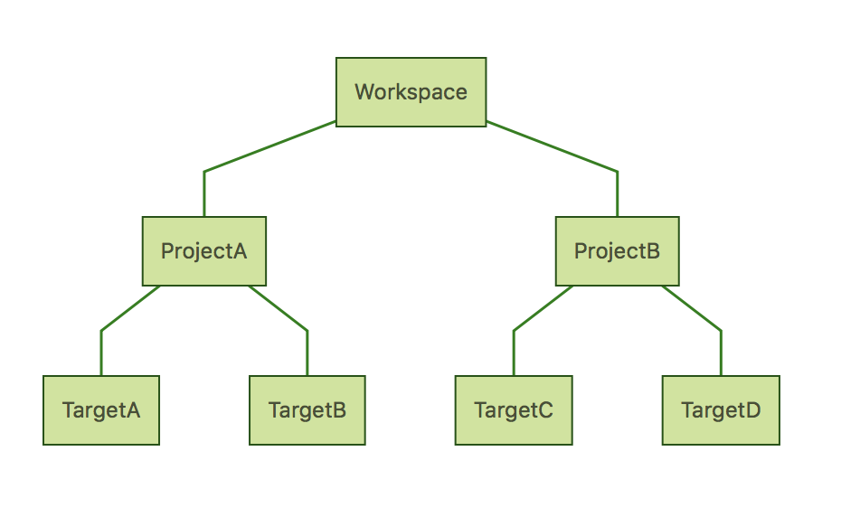
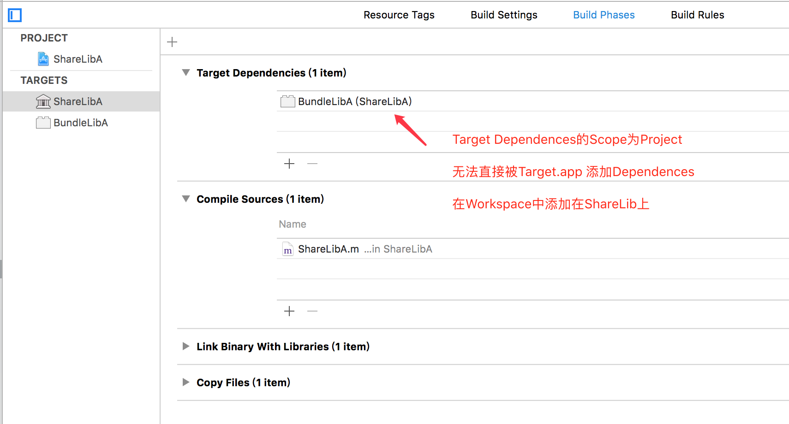
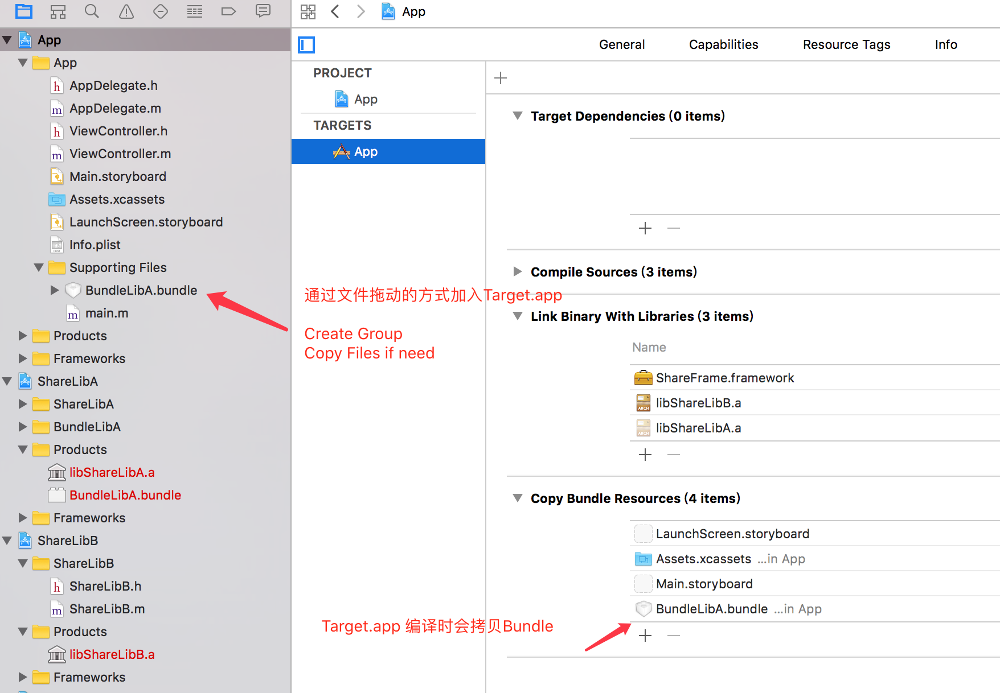
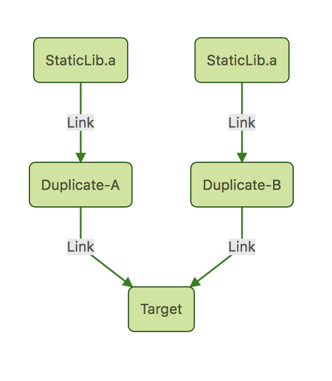
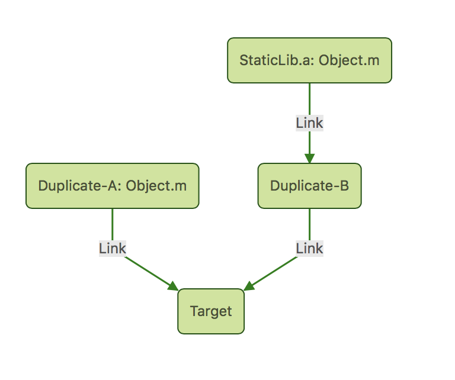
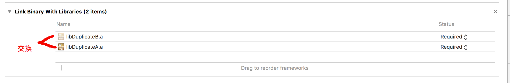

-   [模块化与Compile](#模块化与compile)
    -   [1编译过程](#编译过程)
        -   [（1）Xcode和编译过程的对应关系](#xcode和编译过程的对应关系)
        -   [（2）Xcode头文件(预编译)](#xcode头文件预编译)
        -   [(3) Xcode Symbols(编译，汇编)](#xcode-symbols编译汇编)
        -   [(4) Xcode Link(链接)](#xcode-link链接)
    -   [2 Mach-O文件](#mach-o文件)
        -   [（1）Mach-O文件的来源](#mach-o文件的来源)
        -   [(2) Mach-O的格式](#mach-o的格式)
        -   [(3) Mach-O文件的结构](#mach-o文件的结构)
        -   [(4) Universal Mach-O & Fat Mach-O &
            多架构Framework](#universal-mach-o-fat-mach-o-多架构framework)
    -   [3 Undefined和Duplicate](#undefined和duplicate)
        -   [Link过程中的错误](#link过程中的错误)
            -   [Undefined](#undefined)
            -   [Duplicated](#duplicated)
        -   [符号表会受到的影响](#符号表会受到的影响)
    -   [4 符号表](#符号表)
        -   [查看符号表](#查看符号表)
    -   [5 Target和Link的关系](#target和link的关系)
        -   [Target和Mach-O的Link命令](#target和mach-o的link命令)
            -   [StaticLibrary，Target=lib.a](#staticlibrarytargetlib.a)
            -   [DynamicLibrary，Target=lib.framework](#dynamiclibrarytargetlib.framework)
            -   [Executable，Target=demo.app](#executabletargetdemo.app)
        -   [参数说明](#参数说明)
        -   [区别与总结](#区别与总结)
            -   [Static可以看到.o的原因](#static可以看到.o的原因)
            -   [Duplicated Symbols](#duplicated-symbols)
            -   [通过Dulpicated错误验证](#通过dulpicated错误验证)
        -   [Create != Link](#create-link)
    -   [6 Target和Class进行Load的关系](#target和class进行load的关系)
        -   [不同**Mach-O**如何**Load**](#不同mach-o如何load)
            -   [Static Mach-O](#static-mach-o)
            -   [Dynamic Mach-O](#dynamic-mach-o)
        -   [StaticLib 和 Framework
            的区别](#staticlib-和-framework-的区别)
        -   [Framework 的延迟加载](#framework-的延迟加载)
    -   [7 Target和Resource的关系](#target和resource的关系)
        -   [如何加载资源](#如何加载资源)
            -   [通过class来加载Bundle](#通过class来加载bundle)
            -   [通过Path/URL来加载Bundle](#通过pathurl来加载bundle)
            -   [从Bundle中获取资源](#从bundle中获取资源)
    -   [\#\# 8
        Target和Workspace、Project的关系](#target和workspaceproject的关系)
        -   [Scope的概念](#scope的概念)
        -   [和Scope相关的工程配置](#和scope相关的工程配置)
            -   [Target Dependencies](#target-dependencies)
            -   [Linked Binary With
                Libraries](#linked-binary-with-libraries)
            -   [Embedded Binaries](#embedded-binaries)
        -   [常见的错误观点](#常见的错误观点)
    -   [9 TargetDependencies的正确用法](#targetdependencies的正确用法)
        -   [Target Dependencies](#target-dependencies-1)
            -   [Project Multiple Target](#project-multiple-target)
            -   [为StaticLib准备Bundle](#为staticlib准备bundle)
    -   [\#\# 10
        LinkBinaryWithLibraries和符号表的关系](#linkbinarywithlibraries和符号表的关系)
        -   [Link 的类型](#link-的类型)
        -   [Link Binary 的结果](#link-binary-的结果)
        -   [疑问](#疑问)
    -   [\#\# 11
        StaticLib互相Link不Duplicated的原因](#staticlib互相link不duplicated的原因)
        -   [StaticLib的编译命令](#staticlib的编译命令)
        -   [不会Duplicated的原因](#不会duplicated的原因)
        -   [验证](#验证)
        -   [结论](#结论)
    -   [12 Framework的基本介绍](#framework的基本介绍)
        -   [Framework 的基本使用](#framework-的基本使用)
        -   [**Framework**的头文件系统](#framework的头文件系统)
            -   [**Umbrella**头文件和**modulemap**](#umbrella头文件和modulemap)
    -   [13 多版本和Umbrella Framework](#多版本和umbrella-framework)
        -   [Mac Framework & iOS
            Framework](#mac-framework-ios-framework)
            -   [Framework多版本](#framework多版本)
            -   [Git对比工程配置](#git对比工程配置)
            -   [查看日志对比命令](#查看日志对比命令)
        -   [Umbrella Framework](#umbrella-framework)
    -   [14 静态编译Static Framework](#静态编译static-framework)
        -   [Static Mach-O Framework](#static-mach-o-framework)
        -   [会引发的问题](#会引发的问题)
            -   [Framework无法被Load引发资源读取问题](#framework无法被load引发资源读取问题)
            -   [无用的可执行文件](#无用的可执行文件)
        -   [符号表的问题](#符号表的问题)
            -   [其它**Mach-O Link**到
                **Static.framework**](#其它mach-o-link到-static.framework)
            -   [Static.framework
                Link到其它Mach-O](#static.framework-link到其它mach-o)
    -   [15 特殊的Unique Framework](#特殊的unique-framework)
        -   [Umbrella OR Unique](#umbrella-or-unique)
            -   [Unique Framework的关键点](#unique-framework的关键点)
            -   [Unique Framework的拆解](#unique-framework的拆解)
        -   [Unique Framework
            无法避免的重复类(按照上述方法应该不会出现)](#unique-framework-无法避免的重复类按照上述方法应该不会出现)
    -   [16 Unique Framework制作步骤](#unique-framework制作步骤)
        -   [头文件系统](#头文件系统)
            -   [Alpha头文件-Public](#alpha头文件-public)
        -   [Mach-O的合并](#mach-o的合并)
            -   [选择性 Link 过程](#选择性-link-过程)
            -   [修改**Load**方式](#修改load方式)
        -   [资源文件处理](#资源文件处理)
            -   [Disk路径引入](#disk路径引入)
            -   [伪装成Bundle](#伪装成bundle)
    -   [17 StaticFramework伪装Bundle](#staticframework伪装bundle)
        -   [伪装所需要的操作](#伪装所需要的操作)
        -   [Shell脚本主要指令](#shell脚本主要指令)
        -   [Example Shell](#example-shell)
    -   [18 头文件批量更改](#头文件批量更改)
        -   [头文件的问题](#头文件的问题)
    -   [19 常见的头文件问题](#常见的头文件问题)
        -   [错误追踪](#错误追踪)
            -   ['iostream' file not found](#iostream-file-not-found)
            -   [Include of non-modular header inside framework
                module](#include-of-non-modular-header-inside-framework-module)
        -   [Framework 内部
            Swift和OC互相调用](#framework-内部-swift和oc互相调用)
    -   [20 C++头文件和C文件错误解析](#c头文件和c文件错误解析)
        -   ['iostream' file not found](#iostream-file-not-found-1)
        -   [Compile Source As](#compile-source-as)
        -   [引用文件改为.mm](#引用文件改为.mm)
        -   [头文件引用混乱报错](#头文件引用混乱报错)
        -   [CocoaPods 与 Swift
            使用C模块](#cocoapods-与-swift-使用c模块)
    -   [21 引用非Framework模块Include of non-modular
        header](#引用非framework模块include-of-non-modular-header)
        -   [Include of non-modular header inside framework
            module](#include-of-non-modular-header-inside-framework-module-1)
        -   [处理方法](#处理方法)
            -   [Allow Non-modular Include](#allow-non-modular-include)
            -   [检查头文件引用关系](#检查头文件引用关系)
            -   [产生原因](#产生原因)
    -   [22 常见真机调试崩溃Crash](#常见真机调试崩溃crash)
        -   [模拟器不报错真机报错](#模拟器不报错真机报错)
        -   [未知的 Mach-O header](#未知的-mach-o-header)
        -   [Library not found for
            -lswiftSwiftOnoneSupport](#library-not-found-for--lswiftswiftononesupport)
        -   [Swift 静态编译](#swift-静态编译)
        -   [Unexpected CFBundleExecutable
            Key](#unexpected-cfbundleexecutable-key)
    -   [23 StaticLib混合引用测试](#staticlib混合引用测试)
        -   [两个**Framework/Executable** 引用了共同**Static
            Mach-O**](#两个frameworkexecutable-引用了共同static-mach-o)
        -   [两个Framework/Executable 引用了共同Dynamic
            Mach-O](#两个frameworkexecutable-引用了共同dynamic-mach-o)
        -   [两个Static Lib
            引用共同的Framework](#两个static-lib-引用共同的framework)
    -   [24 常用的工具](#常用的工具)
        -   [Xcode相关命令行](#xcode相关命令行)
            -   [lipo](#lipo)
            -   [nm](#nm)
            -   [otool](#otool)
            -   [defaults](#defaults)
            -   [assetutil](#assetutil)
            -   [actool](#actool)
        -   [Linux通用命令行](#linux通用命令行)
            -   [head](#head)
            -   [od](#od)
    -   [25
        StaticLib和Framework两种方式引入Pods](#staticlib和framework两种方式引入pods)
        -   [CocoaPods的原理](#cocoapods的原理)
        -   [使用Framework引入Pods](#使用framework引入pods)
        -   [CocoaPods 1.2.1版本的BUG](#cocoapods-1.2.1版本的bug)
    -   [26 管理多Project](#管理多project)
        -   [一份Podfile同时处理多个本地Project](#一份podfile同时处理多个本地project)
        -   [Project单独无法编译通过](#project单独无法编译通过)
        -   [Pods之间不共存](#pods之间不共存)
    -   [27 使用FrameworkPod协调多工程](#使用frameworkpod协调多工程)
        -   [提醒](#提醒)
        -   [目的](#目的)
        -   [对现有项目进行Frameworks改造](#对现有项目进行frameworks改造)
        -   [使用Bridge后
            Xcode头文件联想问题](#使用bridge后-xcode头文件联想问题)
        -   [Podfile](#podfile)
        -   [备注](#备注)
    -   [28 Link对Mach-O图解总结](#link对mach-o图解总结)
        -   [Static Lib ---\> App](#static-lib-app)
        -   [Framework(Dynamic) ---\> App](#frameworkdynamic-app)
        -   [Framework(Dynamic) ---\>
            Framework(Dynamic)](#frameworkdynamic-frameworkdynamic)
        -   [Framework(Static) ---\>
            Framework(Dynamic)/App](#frameworkstatic-frameworkdynamicapp)
        -   [Framework(Static) ---\> Framework(Dynamic) ---\>
            App](#frameworkstatic-frameworkdynamic-app)

模块化与Compile
===============

1编译过程
---------

### （1）Xcode和编译过程的对应关系

   中文     预编译      编译         汇编           链接
  ------ ------------ --------- -------------- --------------
   英文   Preprocess   Compile    Assembling        Link
   作用    处理文字    变汇编    转换成机器码   变可执行程序

根据Wiki百科解释，**编译**是将人能读懂的**Source
Code**变成机器能理解的**汇编语言(寄存器指令)**，然后通过**汇编**变成**目标机器的(Machine
Code/Object Code)**，然后通过**Link**变为可执行程序的**01010101....**

### （2）Xcode头文件(预编译)

对于计算机来讲，头文件是不需要的

对于**Xcode**来说仅仅在 **预编译** 和 **编译**
阶段需要头文件来进行静态检查是否存在有不知道的类或者方法

头文件的搜索目录可以通过配置**Build Setting**里的 **Header Search
Paths**
来获取头文件，这个是磁盘目录，可以是电脑上的任意目录，无需添加任何文件进入**Target**


### (3) Xcode Symbols(编译，汇编)

把每一个文件中的可执行代码进行 **编译和汇编** 可以得到 同名的`.o`文件，
其后缀`o`就是指的 **Object Code**

之所以称为**Object**，是因为不同的硬件有不同的架构，如**x86**和**arm64**，例如**iPhone**模拟器是**x86**而**iPhone**真机大部分都是**arm**的，也就是说在此时**Xcode**已经完成了架构的处理

### (4) Xcode Link(链接)

最终**Xcode**经过链接过程将`.o`文件组合起来，得到一个`Mach-O`文件(**相当于一个压缩包**)
并且生成 **符号表**

这个过程中存在两个常见的错误提示 **Undefined symbols** 和 **Duplicated
symbols** 将在后续讲解

`Mach-O`文件是**Macintosh**系统中的一个文件类型，用来描述程序的运行和二进制代码之间的关系

2 Mach-O文件
------------

### （1）Mach-O文件的来源

根据**Wiki**描述`Mach-O`为**Mach
Object**文件格式的缩写，其由卡耐基梅隆大学和**Apple**开发和维护

### (2) Mach-O的格式

`Mach-O`分为多个格式

  `Mach-O`格式                                                       说明
  ------------------------------------------------------------------ ----------------------------------------------------------------
  Executable                                                         可执行程序，可运行的App最终会变成这个
  Bundle                                                             不可以被Link的动态库，运行时可以通过NSBundle基于dlopen方法加载
  StaticLibrary                                                      静态链接,Xcode默认情况下.a库会使用
  DynamicLibrary                                                     动态链接,Xcode默认情况下.framework会使用
  RelocatableObjectFile[]{.Apple-tab-span style="white-space:pre"}   是编译过程中的中间产物，就是.o文件

### (3) Mach-O文件的结构

根据苹果的WWDC视频介绍，任何一个Mach-O的可执行文件(dylib和executable)可以分为三个区域

  Mach-O区域[]{.Apple-tab-span style="white-space:pre"}   权限          作用
  ------------------------------------------------------- ------------- ------------------------------------------------
  TEXT                                                    r-x读和执行   保存mach-o的文件头可执行的code以及constant常量
  DATA                                                    rw-读写       保存用于程序的全局和静态变量
  LINKEDIT                                                r--只读       保存该库meta data，用来表示怎么加载

### (4) Universal Mach-O & Fat Mach-O & 多架构Framework

一个`Mach-O`可以包含多种架构，这种方式被苹果官方称为
`Universal Mach-O`，
俗称`Fat Mach-O Fat-Framework`等等，可以使用`lipo`工具进行组合和拆解

    |---------------|
    |   Fat Header  |
    |---------------|
    |     _TEXT     |   <=== x86 architecture
    |     _DATA     |
    |   _LINKEDIT   |
    |---------------|
    |     _TEXT     |
    |     _DATA     |   <=== arm64 architecture
    |   _LINKEDIT   |
    |---------------|

查看这个`Mach-O`文件包含了哪些架构可以使用

    lipo -info .../../../XXXX
    //Output
    //libStaticLib.a is architecture: x86_64

3 Undefined和Duplicate
----------------------

### Link过程中的错误

在
`Mach-O`文件中`TEXT`和`DATA`部分对每个方法和变量都称之为符号(`Symbol`)，并且让每一个符号和内存地址存在映射关系

#### Undefined

    **Undefined symbols for architecture ....... objc-class-ref in XXX.o** （未定义的符号）

本质原因
当源文件中某行代码想使用某个变量或者方法时，在`Mach-O`中找不到对应的内存地址，所以说认为该符号(`Symbol`)不存在、未定义

可能出现的情况为

1.  与.h对应的.m文件中没有实现对应的方法，且该方法被使用了
2.  程序所依赖的lib.a或者lib.framework中不存在某种架构下x86的二进制文件

#### Duplicated

    **Duplicated symbols for architecture ....... objc-class-ref in XXX.o** （重复的符号）

本质原因
当`Mach-O`想生成某个符号和地址的映射时，发现已经存在该符号和一个地址的映射，如果再次写入该符号(`Symbol`)将存在两个，无法进行区分

可能出现的情况是

1.  -   在两个`.m`文件中存在相同的**Class**

2.  -   在当前工程中的某个`.m`文件中存在和依赖库或者

### 符号表会受到的影响

生成符号表的Link过程会受到`Other Link Flag`和`Strip`设置的影响，不是100%会出现报错，

4 符号表
--------

`Mach-O`文件中最为重要的就是符号表，其标记了虚拟内存地址和可执行方法和变量的映射关系，可以使用
`nm`命令 ，根据介绍 `nm`是Xcode对llvm-nm命令的一个封装.

    NAME
           nm - display name list (symbol table)
    ......
    DESCRIPTION
           As  of  Xcode  8.0 the default nm(1) tool is llvm-nm(1).....

### 查看符号表

通过命令 `nm …/../../libStaticLib.a`
可以查看到静态库的Mach-O文件类似如下显示，可以清晰的看到每个.o文件

    ...../Library/Developer/Xcode/DerivedData/...../libStaticLib.a(StaticLib.o):
    0000000000000000 t -[StaticLibObj init]
    ...........
    ...........
    00000000000001e8 s l_OBJC_METACLASS_RO_$_StaticLibObj
    ...../Library/Developer/Xcode/DerivedData/...../libStaticLib.a(StaticLibObj.o):
    0000000000000000 t -[StaticLibObj init]
    00000000000000a0 t -[StaticLibObj selectorInStaticLibraryObjFix]
                     U _NSLog
                     U _OBJC_CLASS_$_NSObject
    00000000000000d8 S _OBJC_CLASS_$_StaticLibObj
    ...........
    ...........

而通过命令 `nm …/../../DynamicFrame.framework/DynamicFrame`
进行查看可以得到如下符号表，并没有区分具体的`.o`文件

    0000000000000dd0 t -[DynamicFrameObj init]
    0000000000000e70 t -[DynamicFrameObj selectorInDynamicFrameObj]
    0000000000000fa8 S _DynamicFrameVersionNumber
    0000000000000f70 S _DynamicFrameVersionString
                     U _NSLog
    0000000000001158 S _OBJC_CLASS_$_DynamicFrameObj
                     U _OBJC_CLASS_$_NSObject
    0000000000001180 S _OBJC_METACLASS_$_DynamicFrameObj
                     U _OBJC_METACLASS_$_NSObject
                     U ___CFConstantStringClassReference
                     U __objc_empty_cache
                     U _objc_msgSendSuper2
                     U _objc_retain
                     U _objc_storeStrong
                     U dyld_stub_binder

5 Target和Link的关系
--------------------

### Target和Mach-O的Link命令

对于不同的**Target**，例如常见的 **StaticLibrary** 和 **DynamicLibrary**
以及 **Executable** 其`Mach-O`文件使用的Link命令也是不同的

通过**Xcode**的日志查询文件 **Report Navigator**可以看到具体过程

#### StaticLibrary，Target=lib.a

查看在`Run lib.a`的时候调用的命令 **libtool**
完成的链接过程，并且把这一个过程称为 **Create static Library**

    XcodeDefault.xctoolchain/usr/bin/libtool -static .....
    ... -arch_only ..... -syslibroot ...
    ... -filelist ..... XXX.LinkFileList....
    ... -o

#### DynamicLibrary，Target=lib.framework

而在对 **lib.framework** 的时候调用的命令 **clang** 完成了链接过程
并且与**Static**不同，其把过程称为**Link**, 并且加载了一堆 **Xlinker**
指令，

    XcodeDefault.xctoolchain/usr/bin/clang ......
    ... -arch ..... -dynamiclib ... -syslibroot ...
    ... -filelist ..... XXX.LinkFileList....
    ... -dead_strip ... -Xlinker
    ... -o

#### Executable，Target=demo.app

而在对 `demo.app Link`时 同样是调用的命令 **clang** 完成了链接过程，
具体参数与 **DynamicLibrary** 有一些不同

    XcodeDefault.xctoolchain/usr/bin/clang ...... -filelist ..... -Xlinker ....

### 参数说明

具体说明可以使用 **man clang** 来查看，仅列举上文出现的

  参数           备注
  -------------- ---------------------------
  -arch\_only    -arch 生成的架构
  -syslibroot    系统库System Library Root
  -dynamiclib    生成动态库
  -filelist      要执行的File列表
  -o             输出文件
  -dead\_strip   03中提到的Strip过程等级
  -Xlinker       对Link过程中的参数输入

### 区别与总结

#### Static可以看到.o的原因

**Static**可以看到**.o**文件的原因就是使用 **libtool** 命令进行**create**

#### Duplicated Symbols

而**Executable** 和 **DynamicLibrary** 在**Clang**指令的**-Xlinke**r
列表中存在一个重要的指令 -**Xlinker -no\_deduplicate**
代表不能存在重复的符号

但是在**Create
Static**中不存在该输入，而且每个**.o**文件都是分开的，所以说**Static
Create**并不能进行重复符号的检查

#### 通过Dulpicated错误验证

通常情况下，存在如下两个类，而且全部处于同一个**Target**的**Source
Files**里，因为类名相同必然会报错

``` {.objectivec}
//文件1 ModuleBeta.m
#import "ModuleBeta.h"
@implementation ModuleBeta
- (NSString *)description {
    return [NSString stringWithFormat:@"%@ Beta Instance", [super description]];
}
@end
//文件2 ModuleTheta.m
#import "ModuleTheta.h"
@implementation ModuleBeta
- (NSString *)description {
    return [NSString stringWithFormat:@"%@ Beta Instance", [super description]];
}
```

**但是通过对target.a进行Run，仍然可以得到Build
Success，也就是说libtool命令进行Create通过**

### Create != Link

> 也就是说在不同的Target情况，使用的Link指令存在差别，并且静态库被称为Create而不是真正的Link，所以不会做Duplicated的符号检查

6 Target和Class进行Load的关系
-----------------------------

### 不同**Mach-O**如何**Load**

根据苹果的WWDC视频介绍，App在运行时采用**COW(Copy Of Write)**策略
会将需要运行的程序先拷贝一份，然后依次加载其需要dylib

这种机制就造成不同的**Mach-O**会有不同的执行策略

#### Static Mach-O

经过**nm**指令分析，对于 **lib.a** 的 **Static Mach-O**
并不是可运行的二进制文件，而是一组**.o**文件的压缩包，并且不会进行**Duplicated
Symbols**检查

其会随着主程序启动一起启动，原因是其最终进入了主程序的**Mach-O**（会在后续进行详细分析）

#### Dynamic Mach-O

对于**Framework**其本身已经和主程序没有任何区别，理论上只要不存在**Undefined
Symbols** 其是可以单独运行的**Mach-O**文件，并且不存在重复的符号

其会晚于主程序启动，并且其启动的过程是可控，并且和主程序不是一个**Mach-O**(后续会详细分析)

### StaticLib 和 Framework 的区别

**StaticLib**
被称为静态库，**Framework**可以被称为动态库，但是其也可以作为静态库来编译(后续会有分析)除去编译命令不同，**Framework**对比**StaticLib**还具有以下特点

-   自身可以携带头文件，不用像**StaticLib**配置头文件搜索目录
-   自身可以携带资源文件
-   自身可以进行头文件的权限处理，如**Public Project Private**
-   **Framework**之所以好，是因为其把 `HeaderFile` `Resources`
    `ExecutableFile` 放在了一起，为模块化提供了很好的基础

  Function             基于技术
  -------------------- -----------------------------------------
  **Header File**      **LLVM**中的 **modulemap** 技术
  **Resources**        **Apple**的**dlopen**函数可以运行时读取
  **ExecutableFile**   **Apple**的**Mach-O**文件

### Framework 的延迟加载

**Framework**与静态库最大的不同是可以做到延迟加载，根据苹果的**WWDC**视频介绍在**App**启动后，会依次对动态库进行加载，但是也可以通过配置控制在第一次使用到时进行加载

> 添加完**Framework**默认是不延迟加载的，会严重影响App启动速度，设置延迟加载的方式是
> 在**Linked Framework and Libraries**中将右侧的选项至为**Optional**

> 这里有个经验是
> 如果**Target.app**的二进制可执行文件过大，可能会不通过苹果的审核，使用**Framework(Dynamic
> Mach-O)**会减小App的可执行文件体积

7 Target和Resource的关系
------------------------

### 如何加载资源

在传统使用**StaticLib**的时候，需要一个**Bundle**文件来承载资源文件，并且将其拷贝进入主工程

根据本系列文章**02Mach-O文件类型的分析**，**Bundle**是一个
可以被**dlopen()**的动态库
但是**Framework**自身就是动态库，所以拥有**Bundle**的能力

  Bundle加载方法   Bundle   Framework
  ---------------- -------- -----------
  bundleForClass   NO       YES
  bundleWithPath   YES      YES
  bundleWithURL    YES      YES

#### 通过class来加载Bundle

从上文看，使用**Framework**不用考虑**Bundle**查询的问题，只需要对**Framework**内部的**Class**取**class**就可以获得默认的**Bundle**

    //Framework
    NSBundle *bundle = [NSBundle bundleForClass:[self class]];

#### 通过Path/URL来加载Bundle

普通的**Bundle**则需要获取**Bundle**的路径(需要自己确认)，可以用以下函数

    //app资源目录路径
    NSString *resPath = [[NSBundle mainBundle] resourcePath];
    //获取资源目录下a.bundle
    NSString* path = [resPath stringByAppendingPathComponent:@"/StaticLib.bundle"];
    NSBundle *bundle = [NSBundle bundleWithPath:path];

在静态库使用**Bundle**的过程中需要注意：

1.  最终的**bundleWithPath**应该是你的那个**Bundle**在**App**里的路径，如果找不到，可以用模拟器**Build**出来，用**Finder**去看看，是不是路径错了
2.  静态库创建**Bundle**的**Target**需要在**MacOS**的选项卡下，**iOS**没有，然后**BuildSetting------Base
    SDK**改为**iOS**，不然可能引起编译中一些签名问题
3.  静态库的**Bundle**要手动(脚本)的方式拷贝到**Target.app**

#### 从Bundle中获取资源

**Bundle**必须 在**Load**之后
才可以被读取资源,可以用**isLoad**来检查是否已经**Load**

    //从Bundle获取图片
    UIImage *image = [UIImage imageNamed:@"image" inBundle:bundle compatibleWithTraitCollection:nil];
    //从Bundle加载字符串
    NSLocalizedStringFromTableInBundle(<#key#>, <#tbl#>, <#bundle#>, <#comment#>)
    //从Bundle加载Storyboard
    [UIStoryboard storyboardWithName:<#(nonnull NSString *)#> bundle:<#(nullable NSBundle *)#>]
    //从Bundle加载Xib
    [UINib nibWithNibName:<#(nonnull NSString *)#> bundle:<#(nullable NSBundle *)#>]

\#\# 8 Target和Workspace、Project的关系
---------------------------------------

### Scope的概念

**Xcode**的工程中存在**Scope**的概念会影响到**Xcode**的工程配置，主要是以下为主



### 和Scope相关的工程配置

  Setting                                                                   Scope       作用
  ------------------------------------------------------------------------- ----------- ----------------------------------
  Target Dependencies                                                       Project     编译当前Target时先编译另一个
  Linked Binary With Libraries[]{.Apple-tab-span style="white-space:pre"}   WorkSpace   组合符号表，完成Mach-O文件的生成
  Embedded Binaries                                                         WorkSpace   一步完成Link和Copy资源两步操作

#### Target Dependencies

**Target Dependencies**
首先是可视范围仅仅在**Project**之内的**Target**之间，**Target**只能操作**Project**内的对象

真正的作用仅有一项，用于在
编译当前**Target**时，优先编译另外一个**Target**
，这也是为什么可视范围只有**Project**的原因

经过测试**Target Dependencies**
的顺序也会对编译先后产生影响，应该只是产生编译命令时候的配置文件导致的，该特性并不完全可靠

#### Linked Binary With Libraries

**Linked Binary With Libraries**
的**Scope**范围是整个**Workspace**，其可以操作**Workspace**内所有可以被**Link**的对象

所谓可以被**Link**的对象就是 `.a` 和 `.framework` 也就是**Mach-O**为
**DynamicLibrary** 和**StaticLibrary**的
对象，**Link**的结果会决定**Mach-O**文件如何生成(后续详细讨论)

#### Embedded Binaries

我们在上述文章里提到，**Framework**是代码和资源的集合，所以**Xcode**加入了
**Embedded** 这个操作来处理**Framework**，可以一键执行两步动作

1.  把**Framework**加入**Linked Binary With Libraries**
2.  在**Build Phase**里创建 **Embed
    Frameworks**的步骤，进行对**Framework**资源的拷贝

### 常见的错误观点

（1）**Framework**时需要同时添加 **Target Dependencies** 和 **Link
Binary With Libraries**

在苹果的官方文档和**Stack Overflow**中对**Target
Dependencies**的提示多数会搜到这个答案

> 正确答案是 **Framework**只需要**Embedded**

（2） **Target Dependencies** 和 **Linked Binary With Libraries**
会对当前 **Target.app** 的依赖是否会重新编译一个较新版

> 正确答案是 无论采用何种配置，**Target.app** 都会重新编译当前
> **WorkSpace**
> 中所依赖的其它对象，如`.a`或`.framework`，如果工作目录存在缓存则会省去**Compile**的时间

9 TargetDependencies的正确用法
------------------------------

### Target Dependencies

正如上文所说，**Target
Dependencies**是在**Project**内决定编译该**Target**之前需要先编译哪些其它的**Target**

#### Project Multiple Target

常见的操作是在一个**Project**项目包含多个**Target**时，可以仅仅编译一个**Target**就产生多个最新的**Product**文件，例如需求：

1.  **Project**内有3个**Target Playground.app**(主程序)
    **BaseModule.a**(基础模块) **NetModule.a**(网络模块)
2.  其中两个模块在**Playground**更新时上传到公共服务器

<!-- -->
    Project
      ------Playground.app
      ------BaseModule.a
      ------NetModule.a

其中可以将 **BaseModule.a** 和 **NetModule.a** 加入 **Playground.app**的
**Target Dependencies**,那么此时为了不用手动去编译这两个模块

  步骤                                          过程
  --------------------------------------------- ----------------------------------
  Run Playground.app                            触发Build BaseModule和 NetModule
  Build BaseModule.a                            编译
  Build NetModule.a                             编译
  Build Playground.app                          完成Playground编译
  sh script upload BaseModule.a & NetModule.a   执行上传脚本

此时可以保证 `Playground.app`
编译时自动编译两个模块，并且可以通过脚本完成自动上传

#### 为StaticLib准备Bundle

还有一种常见的操作就是通过**Target**为**Static**准备**Bundle**，因为静态库本身无法携带资源，所以需要一个**Bundle
Target**来携带图片等资源

那么在代码的编写过程中，图片资源更新都需要重新编译**Bundle**，可以使用**Target
Dependencies** 以保证资源为最新版

1.  新建一个**Bundle Target**，根据需要修改SDK的类型
2.  添加图片
3.  对**Bundle Target**同一个 **xcodeproj** 下的**Static Lib
    Target**添加**Target Dependences**
4.  在 **Target.app** 的**Project**中拖入
    **Bundle**的**Project**，注意是**Project**套**Project**，不是同一个**Workspace**即可
5.  拖动**Product**内的 **Bundle** 以相对路径进入**Target.app**
    的**Build Phase------Copy Bundle Resources**
6.  检查该 **Target.app** 的 **Copy Bundle Resources**中路径是否是
    **build/Debug-iphoneos/**

步骤3 

步骤4-5 

通过以上设定，就可以在产生以下步骤

  步骤                               过程
  ---------------------------------- -----------------------------------
  Run Target.app                     触发Build StaticLib.a
  Build StaticLib.a                  触发其Target Dependencies
  Build Bundle                       重新编译Bundle
  Build Target.app                   完成Target编译
  Target.app Copy Bundle Resources   从Build路径Copy，此时已经为最新的

\#\# 10 LinkBinaryWithLibraries和符号表的关系
---------------------------------------------

### Link 的类型

根据上文我们知道，可以被**Link**的有 **StaticLib.a**(静态库) 和
**Dynamic.framework**(动态库)
可以进行**Link**，而其本身的**Mach-O**文件符号表也是不同的

  Link                符号表类型
  ------------------- ----------------------
  StaticLib.a         .o文件的压缩包
  Dynamic.framework   可以执行的Mach-O文件

### Link Binary 的结果

在项目复杂的引用关系中会，让人产生疑惑的是代码最终都存在于哪个**Mach-O**文件

我们可以根据需要**Link**的对象，以及**Link**的目标结果整理出一张表，可能性公存在**6**种

  -------------------------------------------------------------------------------------------------------------------------------------------------------------------------------------------
  Link Component      To Module           Explain            Enter   Result Mach-O                   Backup
                                                             OR Not                                  
  ------------------- ------------------- ------------------ ------- ------------------------------- ----------------------------------------------------------------------------------------
  StaticLib.a         StaticLib.a         静态库--\>静态库   Enter   StaticLibrary                   组成新的静态库，包含了两者所有的.o文件，仍是.o文件压缩包

  StaticLib.a         Dynamic.framework   静态库--\>动态库   Enter   DynamicLibrary                  静态库的代码进入了动态库，组成新的动态库

  Dynamic.framework   StaticLib.a         动态库--\>静态库   Not     DynamicLibrary+StaticLibrary    两者都不会产生任何变化，动态库代码不会进入静态库

  Dynamic.framework   Dynamic.framework   动态库--\>动态库   Not     DynamicLibrary+DynamicLibrary   Component的Class会以 U（未定义） 的形式进入 Module

  StaticLib.a         App                 静态库--\>App      Enter   Executable                      静态库的代码进入了App，组成了可执行文件

  Dynamic.framework   App                 动态库--\>App      Not     Executable+DynamicLibrary       动态库以拷贝的形式进入App的Frameworks文件夹(包含了代码和资源)，但是不会进入App的Mach-O
  -------------------------------------------------------------------------------------------------------------------------------------------------------------------------------------------

> 总结来看就是
> *静态库**Mach-O**会进入所有的**静态库/动态库/App的Mach-O**,动态库不会进入任何的**Mach-O**文件，运行**App**也是通过资源拷贝的形式拷贝进去*

### 疑问

**(1) 叉状引用静态库为何不出现重复的符号**

在工程中常见的就是混乱的叉状引用关系

根据以上结论，其中**StaticLibA**（包含A与B的**Mach-O**），而**App**（包含**B**的**Mach-O**）按照上述理论应该会出现**Duplicated
Symbols**的错误

但是在实际执行的过程中并不会出现 原因会在下文分析

**(2) 静态的Framework(不推荐，没有需求不要看了)**
这个本身是个错误的概念, 指的是用一个framework包起来Static
Lib和头文件，！！是一种不被官方支持的方法！！

但是根据一种特殊的需求------------------------------ **Unique
Framework**

**Unique Framework的概念:**

1.  **Unique Framework**是类似**Mac**系统中**Umbrella
    Framework**的概念，但是官方并没有提供支持的方法
2.  和 **Universal Framework**不是一个概念

试将 **.framework**的 **Mach-O Type**改为 **StaticLibrary** 即得到
**Mach-O** 为 **Static** 的**framework**文件，下文后续会详细介绍

\#\# 11 StaticLib互相Link不Duplicated的原因
-------------------------------------------

### StaticLib的编译命令

在上文**Target**和**Link**的关系中我们可以得知，**Static
Lib**在编译后使用的是 **Create Static** 而不是真正的**Link**

    XcodeDefault.xctoolchain/usr/bin/libtool -static .....

得到的符号表，可以通过符号表文章的对比得知，是一堆.o文件的压缩包

    ...../Library/Developer/Xcode/DerivedData/...../libStaticLib.a(StaticLib.o):  <====看这里
    0000000000000000 t -[StaticLibObj init]
    ...........
    ...........
    00000000000001e8 s l_OBJC_METACLASS_RO_$_StaticLibObj
    ...../Library/Developer/Xcode/DerivedData/...../libStaticLib.a(StaticLibObj.o):   <====看这里
    0000000000000000 t -[StaticLibObj init]
    ...........
    ...........
    00000000000000d8 S _OBJC_CLASS_$_StaticLibObj
    ...........

### 不会Duplicated的原因

仔细观察符号表，我们可以发现一些规律

**StaticLib**内部的 **.o** 文件是互相独立的 每一个 **.o** 文件都是从
**0000000000000000** 地址开始计数
当**StaticLib**真正执行**Link**命令成为 **Target.app** 或者
**Dynamic.framework** 时，符号表则变成了一个连续地址的**Mach-O**文件

也就是说 两个 **StaticLib.a** 中存在相同的 **.o**
文件，他们两个也是完全一样的，会在**Link**时的只有一个被**Link**

就像拷贝文件一样，如果存在一个同名的 **.o** 文件，后一个相同的 **.o**
文件就会拷贝失败，只使用了第一个

### 验证

如果存在以下**Link**模型，按照上述理论，**StaticLib.a** 的 **.o** 会在
**A** 和 **B** 中共同存在，在最终进入**App**时，因为互相覆盖不报错



为了验证，我们

1.  将**StaticLib.a**的类 **Object** 文件拷贝进入 **Duplicate-A**
2.  取消掉**StaticLib.a** 对 **A** 的**Link**
3.  更改**Duplicated-A**内 **Object.m** 内方法的**NSLog**日志



再次**Build**，发现执行的是 **StaticLib.a** 中的方法日志

    2017-11-12 20:57:05.908741+0800  Static Lib Obj 0x60c000000fe0 init....
    2017-11-12 20:57:05.908854+0800  Static Lib attached Obj to Dupilcate A 0x60c000000fe0 init....
    2017-11-12 20:57:05.908938+0800  Static Lib Obj 0x604000000b10 init....
    2017-11-12 20:57:05.909010+0800  Static Lib attached Obj to Dupilcate B 0x604000000b10 init....

然后我们更改**App**中 **Link** 顺序，再次**Build**运行，发现执行了
**Duplicated-A**中 **Object.m**的方法



    2017-11-12 20:30:29.373910+0800  Duplicated Static Lib Obj 0x608000018390 init....
    2017-11-12 20:30:29.374015+0800  Static Lib attached Obj to Dupilcate A 0x608000018390 init....
    2017-11-12 20:30:29.374085+0800  Duplicated Static Lib Obj 0x600000017e00 init....
    2017-11-12 20:30:29.374138+0800  Static Lib attached Obj to Dupilcate B 0x600000017e00 init....

### 结论

根据日志分析，**App**会使用第一次**Object.o**文件，而不是后一个

（1）当使用了 **StaticLib.a** 中的**NSLog**时，**Link**顺序为

    ....../usr/bin/clang -arch x86_64 -lDuplicateB -lDuplicateA .......

（2）当使用了 **Duplicate-A** 中的**NSLog**时，**Link**顺序为

    ....../usr/bin/clang -arch x86_64 -lDuplicateA -lDuplicateB .......

12 Framework的基本介绍
----------------------

### Framework 的基本使用

经过上文分析，如果使用了静态库，需要提交给使用者的包含
**头文件(.h)**\*\* 静态库(.a)\*\* **资源文件(.bundle)**
三种，十分麻烦，而如果想要使用Framework，只需要在主工程的 **Target.app
------------ General ------------ Embedded
Binaries**里添加**.framework** 即可，
使用这种方式添加其实是自动执行了以下两步

1.  添加**.framework** 进入 **Linked Framework and Libraries**
2.  在**Build Phase**里添加了一个名为 **Embed Frameworks**的 **Copy
    Files**操作

其中第二步的**Copy Files**也可以自己手动设置，选择 **Destination** 为
**Framework**
然后点击下文的加号添加即可，如果缺少这个则会在真机调试的时候报这个错误

    dyld: Library not loaded:...............
    .....
    Reason: image not found

这是因为
一个**App**最终真机运行时所有**Framework.framework**都必须被**Embedded**进来，不能仅仅依赖最上层的**Framework**

### **Framework**的头文件系统

**Framework**还有一个特性是带有头文件的管理系统

-   头文件存在**Public/Private/Project**的分层系统，仅有**Public**的头文件对外界可见
-   可以通过一个**Umbrella Header**的概念进行一次性公开头文件

#### **Umbrella**头文件和**modulemap**

在C语言中最大的痛点，就是 `#include`
的时候会重复加载代码，所以**LLVM**提出了使用
**import**关键字代替**include**

而如何管理所有的头文件就是利用 **modulemap** 文件，其语法类似**JSON**,
**Apple Framework**会自动生成 **module.modulemap**

    //位于 SharedLib.framework/Modules/module.modulemap
    framework module SharedLib {
      umbrella header "SharedLib.h"  <===指定同名头文件为umbrella header
      export *                <=== 导出所有Module
      module * { export * }   <=== 把每一个头文件都作为一个单独的Module，并导出
    }

13 多版本和Umbrella Framework
-----------------------------

### Mac Framework & iOS Framework

#### Framework多版本

根据[Framework文档](https://developer.apple.com/library/archive/documentation/MacOSX/Conceptual/BPFrameworks/Concepts/VersionInformation.html#//apple_ref/doc/uid/20002255-BCIECADD)的版本章节还提及了Framework有多版本兼容的能力，这个曾经也听人提及过，但是经过实际操作发现结论
在iOS中目前不存在Current目录的软链接，不存在Mac中多版本兼容的能力

#### Git对比工程配置

通过**Git**来对比 **MacFramework.xcodeproj** 和
**iOSFramework.xcodeproj**
的内部**project**文件发现工程配置主要会存三点不同

1.  Target不同，因为Mac和iOS的差别
2.  SDK的不同
3.  Run Search Paths 不同，Mac 的多了一个 /../ 上级目录的路径

#### 查看日志对比命令

通过查看编译命令，可以发现存在以下不同

  阶段                    Mac                             iOS
  ----------------------- ------------------------------- ---------------------------
  Process info.plist      无                              有
  Copy module.modulemap   无                              有
  Sign                    是对Framework Version进行签名   是对Framework本身进行签名

所以说
推测是**Xcode**对于不同平台的**Framework**进行编译时采用的命令不同而导致的

### Umbrella Framework

根据苹果官方指导，着重提及了一点 **Don't Create Umbrella Frameworks**
而且这个文档主要是针对**Mac OS**来讲的，**iOS**中并没有这个概念

没有特殊需求不要创建\*\* Umbrella FrameWork\*\* ，经过分析 所谓
**Umbrella Framework** 完成的需求需要符合以下几点

1.  你的**Target**是提供一个**Framework**给别人，注意是 ！一个！
2.  你的**Target**依赖了多个**Framework**
3.  你的**Target**和所依赖的**Framework**都是由你本人编写，保证不会和任何外部依赖冲突

由于需要提供 一个
**Framework**给外部，防止外部需要加载多个**Framework**的问题，所以根据需求

我们制作出了上文**Link和符号表关系**中提到的**Unique Framework**
会在后文继续讲解，而其前提是对Framework进行静态编译

14 静态编译Static Framework
---------------------------

### Static Mach-O Framework

先说结论，修改**Build Setting------Linking------Match-O
Type**，来决定以什么样的命令处理**Target**

将 **.framework**的 **Match-O Type**改为 **StaticLibrary** 即得到
**Mach-O**为 **StaticLib** 的**framework**文件, 即可执行文件为 **.o**
的压缩包

### 会引发的问题

#### Framework无法被Load引发资源读取问题

因为使用了静态**Mach-O**，就不能使用 **\[self
class\]**来读取自身的**Bundle**，必须用**path**的方式读取，例如

    NSString *path = [[[NSBundle mainBundle] bundlePath] stringByAppendingString:@"/Frameworks/staic.framework"]

#### 无用的可执行文件

根据文章**Link与符号表的关系**，在**Target.app**情况下，

**Static Mach-O Framework**的代码会进入 **Target.app** 但是又因为**Copy
Framework**的原因,**Framework**会被拷贝进入**Frameworks**文件夹

也就是说

  -------------------------------------------------------------------------------------------------------------------------------------
  二进制存在的Mach-O                               来源                                          Mach O类型
  ------------------------------------------------ --------------------------------------------- --------------------------------------
  Target.app/Target                                在Link过程中，Link进入App本身的Mach-O中一份   Executable，连续地址的Mach O

  Target.app/Frameworks/static.framework/statict   Static Framework本身的Mach-O                  Static，.o文件的压缩包，不可以被执行
  -------------------------------------------------------------------------------------------------------------------------------------

其中**Frameworks**下的**Static Mach-O**中 **.o** 压缩包 是一个无用的文件

### 符号表的问题

由于更改了**Mach-O**，那么当前**Product**生成的**framework**中的文件，相当于一个**StaticLib，.o**文件的压缩包

#### 其它**Mach-O Link**到 **Static.framework**

根据测试，其**Mach-O**就是一个普通的静态库，

  Link Component      To Module          Explain            Enter OR Not   Same As To StaticLib
  ------------------- ------------------ ------------------ -------------- ----------------------
  StaticLib.a         Static.framework   静态库--\>静态库   Enter          Same
  Dynamic.framework   Static.framework   动态库--\>静态库   Not            Same

#### Static.framework Link到其它Mach-O

我们发现静态的**Framework**在**Link**到其它**Mach-O**时 和
*单纯的**StaticLib**有差别*

  -----------------------------------------------------------------------------------------------------------------------------------------------------------------------------------
  Link Component     To Module           Explain                          Enter   Result Mach-O                 Backup                                                    Same As
                                                                          OR Not                                                                                          StaticLib
  ------------------ ------------------- -------------------------------- ------- ----------------------------- --------------------------------------------------------- -----------
  Static.framework   Static.framework    静态Framework--\>静态Framework   Not     StaticLibrary+StaticLibrary   因为-framework参数，倒是不会合并.o压缩包                  Different

  Static.framework   StaticLib.a         静态Framework--\>静态库          Not     StaticLibrary+StaticLibrary   也是因为-framework参数                                    Different

  Static.framework   Dynamic.framework   静态Framework--\>动态库          Enter   DynamicLibrary                会进入动态库，但是如果动态库里没有使用到，就会被Strip掉   Same

  Static.framework   App                 静态Framework--\>App             Enter   Executable                    静态库的代码进入了App，组成了可执行文件                   Same
  -----------------------------------------------------------------------------------------------------------------------------------------------------------------------------------

可以发现区别在于

**当Static.framework连接到 静态的Mach-O(包含静态库和静态Framework)
时，并不会和Static.lib 一样把 .o文件进入到目标的Mach-O**

原因在于**Create StaticLib**的过程中命令行的参数不同，所以
在**-framework**参数下的 **.o** 文件并不会进入目标的 **Mach-O**

    // 1. Link StaticLib
    ...XcodeDefault.xctoolchain/usr/bin/libtool -static
    ......
    -lStaticLib                                      <=====使用的 -l 参数
    // 1. Link StaticFramework
    ...XcodeDefault.xctoolchain/usr/bin/libtool -static
    ......
    -framework StaticFrame                             <=====使用的-framework参数

根据**libtool**命令行的解释 **-framework**参数来自 **ld**
命令，其关于**Libraries**中对动态库描述如下

> A static library (aka static archive) is a collection of .o files with
> a table of contents that lists the global symbols in the .o files.
> Exported symbols from the dynamic library are used to resolve
> references.

15 特殊的Unique Framework
-------------------------

### Umbrella OR Unique

根据上文描述，在**Mac OS**中有**Umbrella
Framework**的概念，但是在**iOS**中这个概念不再被苹果提及

本文将整理如何实现同**Umbrella Framework**一样效果的**Unique
Framework**来完成一些特殊的需求

#### Unique Framework的关键点

根据**文章Framework的多版本和Umbrella**介绍，目前StackOverflow上的所有答案均为错误
制作Unique Framework的所有代码必须本人可控，不能依赖第三方库

#### Unique Framework的拆解

根据上文介绍，**Framework**一共可以分为三个部分

  模块         作用                          Unique化方案
  ------------ ----------------------------- ---------------------------------------------------------------
  头文件系统   根据modulemap进行头文件管理   通过Disk Path 和 Search Path引入，并加入Umbrella
  Mach-O       可执行文件                    通过设置依赖的Framework为Static Mach-O，让其加入Unique Mach-O
  资源文件     资源压缩包                    通过Disk Path引入，伪装成Bundle

我们后续文章将会对如下架构进行**Unique Framework**教学


### Unique Framework 无法避免的重复类(按照上述方法应该不会出现)

直接把需要暴露的类拷贝到 **Unique
Framework**中，直接使用，很多人会疑问不会出现 **Duplicated Symbols**
的错误么？ 答案是不会，仅仅会在运行时丢出一个错误

    Class PLBuildVersio is implemented in both  
    .........
    .........
    One of the two will be used. Which one is undefined.

这种处理方法，在苹果的**PhotoLibraryServices.framework** 和
**AssetsLibraryServices.framework** 中 **PLBuildVersio** 就使用到了

虽然比较粗暴，但是也不会有任何问题，唯一需要保证的是，两处的实现一定要一致

16 Unique Framework制作步骤
---------------------------

### 头文件系统

根据设计方案  \*
**Alpha**内的文件需要随同**Unique**向外公开 \*
**Beta**为内部使用，不需要对外公开

那么首选处理**Alpha**和**Beta**的头文件

#### Alpha头文件-Public

由于**Alpha**的头文件需要同**Unique**一样对外**Public**
(不推荐，如果需要**Public**，为何不将代码直接放入**Unique**)

但是有些特殊情况需要兼顾，于是需要做出如下处理

  ----------------------------------------------------------------------------------------------------------
  操作                                                   作用
  ------------------------------------------------------ ---------------------------------------------------
  拖动**Alpha**的需要**Public**的头文件，进入**Unique    使得**Unique Project**与**Alpha
  Project**，**不勾选Copy If Need**                      Project**的头文件在磁盘上是同一个文件

  将**Alpha**头文件在**UniqueProject**工程中也对外公开   让用户使用**UniqueFramework**也可以通过尖括号加载

  将**Alpha**的头文件路径加入 **Unique** 的 **Header     让**Unique Framework**可以引用到
  Search Path**                                          **Alpha**中任何头文件

  将**Alpha**的头文件，加入**Unique** 的 **Umbrella      让用户可以正常使用**Alpha**的公开类
  Framework**                                            
  ----------------------------------------------------------------------------------------------------------

**Alpha的Public的头文件进入Unique Project**


**Alpha的头文件路径加入 Unique 的 Header Search Path**


**对比Alpha和Unique的头文件的不同**


**Beta头文件-Private(多数情况)**

**Beta**的头文件因为不对外做任何暴露，所以不需要任何操作，仅需按照**Framework**的方式在**Unique**的
**.m** 中通过尖括号加载

但是注意仅可以在**.m文件中使用，不可以在.h 对外暴露**

### Mach-O的合并

根据文章**静态编译StaticFramework**的介绍，如果想让可执行文件合并，仅需将
**Alpha** 和 **Beta** 的**Mach-O**类型改为**Static**


#### 选择性 Link 过程

但是值得注意的是在**Link**的过程中，存在对 **.o** 文件的选择性
如果在**Unique**中没有使用过的符号，不会被**Load**进入**Mach-O**

  Alpha的使用                                            是否会被Load
  ------------------------------------------------------ --------------
  Unique Umbrella Header中加载Alpha头文件                No Load
  Unique 普通.h中加载Alpha头文件，声明变量，但不实例化   No Load
  Unique 普通.m中加载Alpha头文件，声明变量，但不实例化   No Load
  Unique 普通.m中加载Alpha头文件，声明变量，进行实例化   Load

所以结论是
如果想暴露**Alpha**的符号给外部使用，必须在**Unique**里进行实例化，才会融合入**Unique
Mach-O**

#### 修改**Load**方式

除了小心翼翼的实例化之外，还可以通过修改 **Other Linker
Flags**来避免漏掉 **OC**的符号

    -ObjC: 在Link 的过程中，加载所有的OC符号

### 资源文件处理

而资源文件的处理则可以分为两种方式

  -------------------------------------------------------------------------------------
  资源处理方法       解释                                        备注
  ------------------ ------------------------------------------- ----------------------
  Disk路径引入式     如同Alpha的头文件一样，加入到Unique         更推荐这种构建Unique
                     Framework的Compile过程                      Framework

  伪装成Bundle       将Sub Framework                             在App引入Static
                     Embed进Unique，并在编译完成后伪装成Bundle   Framework时更省心
  -------------------------------------------------------------------------------------

#### Disk路径引入

直接将 **Sub Framework**的 **Media.xcassets** 文件夹加入**Unique
Project** 不勾选**Copy If Need**

然后检查 **Unique Framework**的 **Build Phase------------Copy Bundle
Resource **是否包含了地盘路径的**xcassets**文件

#### 伪装成Bundle

根据**Mach-O**文件的类型我们可以得知，**Bundle** 和 **Framework**
都是动态库，**Bundle**只是不能被**Link**而已

和**Unique Framework**不同，**App**的 **Embed** 过程会将
**Framework**拷贝进入 **Target.app/Frameworks** 文件夹

在**Framework**采用了**Static
Mach-O**后，我们采用脚本伪装成一个**Bundle**，并且可以删除掉无用的静态**Mach-O**文件
可以参考后续文章

17 StaticFramework伪装Bundle
----------------------------

### 伪装所需要的操作

**Static Framework** 需要伪装成**Bundle**主要是为了避免以下问题

1.  **Static Framework**内的**Mach-O**无用
2.  **Static Framework Debug**时会报错
3.  **Static Framework** 简单删除**Mach-O**会引起无法**Archive** 和
    **安装**等问题

所需要

  -----------------------------------------------------------------------------------------
  操作                      作用
  ------------------------- ---------------------------------------------------------------
  删除Static Framework      因为Static
  Mach-O                    Mach-O会进入动态库和App，原本Framework的.o的压缩包变得无用

  取消代码签名              Bundle本身是不需要签名的

  修改Plist                 将Framework变身成Bundle

  移除Frameworks目录        如果不移除Frameworks目录，会无法Install在设备上，签名验证失败
  -----------------------------------------------------------------------------------------

**在完成伪装后需要通过 \[NSBundle bundleWithURL:\]
来进行加载，不能使用\[self class\]加载**

### Shell脚本主要指令

  -----------------------------------------------------------------------------------------------------------------------
  命令行       作用                                 执行
  ------------ ------------------------------------ ---------------------------------------------------------------------
  defaults     读写Plist文件，将Framework改Bundle   `defaults write “$FRAMEWORK/Info.plist” CFBundlePackageType “BNDL”`
                                                    `defaults delete “$FRAMEWORK/Info.plist” CFBundleExecutable`

  otool        查看Mach-O，判断是否为Static         otool -a \"\$FRAMEWORK\_EXECUTABLE\_PATH

  head         选取第一行                           head -n 1
  -----------------------------------------------------------------------------------------------------------------------

其余的命令可以去参考文章**模块化中的Shell**

### Example Shell

以下是个完整版的包含了

1.  **Static Framework** 改 **Bundle**
2.  删除无用的**Framework** 架构的脚本

<!-- -->
    APP_PATH="${TARGET_BUILD_DIR}/${WRAPPER_NAME}"
    find "$APP_PATH" -name '*.framework' -type d | while read -r FRAMEWORK
    do
    FRAMEWORK_EXECUTABLE_NAME=$(defaults read "$FRAMEWORK/Info.plist" CFBundleExecutable)
    FRAMEWORK_EXECUTABLE_PATH="$FRAMEWORK/$FRAMEWORK_EXECUTABLE_NAME"
    BUNDLE_IN_ROOT="$APP_PATH/${FRAMEWORK_EXECUTABLE_NAME}.bundle"
    if [[ -e "$FRAMEWORK_EXECUTABLE_PATH" ]]; then
      FRAMEWORK_MACH_O="$(otool -a "$FRAMEWORK_EXECUTABLE_PATH" | head -n 1)"
      FRAMEWORK_FAT_ARCH="$(lipo -info "$FRAMEWORK_EXECUTABLE_PATH")"
    else
      FRAMEWORK_MACH_O="NO EXIST"
      FRAMEWORK_FAT_ARCH="NO EXIST"
    fi
    echo "FRAMEWORK_EXECUTABLE_NAME is $FRAMEWORK_EXECUTABLE_NAME"
    echo "FRAMEWORK_EXECUTABLE_PATH is $FRAMEWORK_EXECUTABLE_PATH"
    echo "FRAMEWORK_MACH_O is $FRAMEWORK_MACH_O"
    echo "FRAMEWORK_FAT_ARCH is $FRAMEWORK_FAT_ARCH"
    echo "BUNDLE_IN_ROOT is $BUNDLE_IN_ROOT"
    if [[ "$FRAMEWORK_MACH_O" =~ "Archive :" ]]; then
      echo "Rmove Static-Mach-O is $FRAMEWORK_EXECUTABLE_PATH"
      rm "$FRAMEWORK_EXECUTABLE_PATH"
      defaults write "$FRAMEWORK/Info.plist" CFBundlePackageType "BNDL"
      defaults delete "$FRAMEWORK/Info.plist" CFBundleExecutable
      if [[ -d "$BUNDLE_IN_ROOT" ]]; then
        rm -rf "$BUNDLE_IN_ROOT"
      fi
      mv -f "$FRAMEWORK" "$BUNDLE_IN_ROOT"
    elif [[ "$FRAMEWORK_FAT_ARCH" =~ "Architectures in the fat file" ]]; then
      #statements
      EXTRACTED_ARCHS=()
      for ARCH in $ARCHS
      do
        echo "Extracting $ARCH from $FRAMEWORK_EXECUTABLE_NAME"
        lipo -extract "$ARCH" "$FRAMEWORK_EXECUTABLE_PATH" -o "$FRAMEWORK_EXECUTABLE_PATH-$ARCH"
        EXTRACTED_ARCHS+=("$FRAMEWORK_EXECUTABLE_PATH-$ARCH")
      done
      echo "Merging extracted architectures: ${ARCHS}"
      lipo -o "$FRAMEWORK_EXECUTABLE_PATH-merged" -create "${EXTRACTED_ARCHS[@]}"
      rm "${EXTRACTED_ARCHS[@]}"
      echo "Replacing original executable with thinned version"
      rm "$FRAMEWORK_EXECUTABLE_PATH"
      mv "$FRAMEWORK_EXECUTABLE_PATH-merged" "$FRAMEWORK_EXECUTABLE_PATH"
    fi
    done

18 头文件批量更改
-----------------

### 头文件的问题

在完成了全部工程的**Framework**化之后，存在一个问题就是要改变文件的加载形式

    #import "someheader.h"  =====> #import <framework/someheader.h>

对于比较大的工程，是个很麻烦的事情，所以写了个脚本

1.  **frameworkPath**：编译好的 **.framework** 文件
2.  **projectPath**： 要更改的工程目录

第一个参数为 **framework**的路径 第二个参数为 **project**的路径

    #!/usr/bin/python
    # Prepare Module
    from os import listdir
    from os.path import isfile, join
    from sys import argv
    # Prepare Global Various
    projectPath = "./Project"
    frameworkPath = "./Frameworks"
    frameDict = {}
    duplicateDict = {}
    # Phase One: Create A File:Frameworks Dictionary
    def framework_by_path(path):
        index_begin = path.find(frameworkPath) + len(frameworkPath) + 1
        index_end = path.find('.framework/', index_begin)
        return path[index_begin:index_end]
    def process_duplicate_file(file, framework):
        array = [framework]
        if file in duplicateDict:
            array.extend(duplicateDict[file])
        else:
            frameDict[file] = "Duplicate"
        duplicateDict[file] = array
    def process_head_file(file, framework):
        if file.find(".h") == -1:
            return
        if file in frameDict:
            process_duplicate_file(file, framework)
            return
        frameDict[file] = framework
    def read_file_dict(path):
        for file in listdir(path):
            file_path = join(path, file)
            if isfile(file_path):
                process_head_file(file, framework_by_path(file_path))
            else:
                read_file_dict(file_path)
    # Phase Two: Process Project
    def process_line(line, changed):
        if '#import \"' in line:
            end = line.find('\"', 9)
            file = line[9:end]
            if file in frameDict:
                line = '#import <' + frameDict[file] + '/' + file + '>\n'
                changed.append(line)
        return line
    def process_file(file):
        changed = []
        lines = file.readlines()
        lines_write = []
        for line in lines:
            lines_write.append(process_line(line, changed))
        print("In File ", file, "need Replace", changed)
        return lines_write
    def process_code_file(path):
        if path.find(".m") == -1 and path.find(".h") == -1:
            return
        file_read = open(path, "r+")
        lines = process_file(file_read)
        file_read.close()
        file_write = open(path, "w+")
        file_write.writelines(lines)
        file_write.close()
    def read_project(path):
        for file in listdir(path):
            file_path = join(path, file)
            if isfile(file_path):
                process_code_file(file_path)
            else:
                read_project(file_path)
    if len(argv) == 3:
        frameworkPath = argv[1]
        projectPath = argv[2]
    read_file_dict(frameworkPath)
    read_project(projectPath)

19 常见的头文件问题
-------------------

### 错误追踪

产生任何头文件错误的时候，虽然错误定位会在引入**C++**头文件的文件中，但是具体是通过那种嵌套关系导致的，可以在
**Show the Report Navigator** 中找到详细的引用关系

#### 'iostream' file not found

大部分出现在**OC**和**C++**混编的时候，头文件的引用无序，导致以**Objective-C**进行**Compile**的文件引用了**C++**的头文件

经常出现在，**Framework**中的部分功能是由**C++**提供的，但是在**umbrella**的头文件中加入了**C++**的头文件，外部工程直接引用**umbrellato**头文件报错

详细可以查看后文**C++头文件错误解析**

#### Include of non-modular header inside framework module

在进行**Framework**化的过程中，一旦引用了某些**Framework**其使用者**Project**，就会报错

    HttpHelper.h:10:9: error : include of non-modular header inside framework module ...#import <CommonCrypto/CommonHMAC.h>

一般情况是**Framework**中**umbrella**的头文件中加入了某个的头文件引用了外部模块的头文件
例如上文的 **CommonHMAC.h** 详细分析见**模块外头文件non-modular**

### Framework 内部 Swift和OC互相调用

  ---------------------------------------------------------------------------------------------------
  调用            问题                                    方案
  --------------- --------------------------------------- -------------------------------------------
  OC use Swift    \#import "Framework-Swift.h" 错误       改用
                                                          "\#import\<Framework/Framework-Swift.h\>"

  Swift use OC    Swift如何引用Bridging文件，加载OC代码   将 Bridging文件加入 Umbrella Header
  ---------------------------------------------------------------------------------------------------

由于 **\<Framework/Framework-Swift.h\>**
文件是在**Framework**编译完成后自动生成的，所以使用"双引号"加载该文件必然找不到

而这又会引起另外一个问题
**Umbrella**文件内加载的头文件**Some.h**，**Some.h**内不能加载
**\<Framework/Framework-Swift.h\>**，也就是说使用Swift的OC头文件，不能进入Umbrella

因为**Umbrella**会优先于一切编译进行预编译，然后此时不管"**双引号**"
"**尖括号**"路径下都不存在该文件，所以会报错

20 C++头文件和C文件错误解析
---------------------------

### 'iostream' file not found

大部分出现在OC和C++混编的时候，根据StackOverflow的回答多数提到了三点

1.  更改 Build Setting 里的 C++ Standard Library 或 C++ Language
    Dialect(无效)
2.  更改 Build Setting 里的 Compile Source As 为 Object-C++(有效)
3.  引用文件改为.mm (有效)

其中真正解决问题的是第二和第三种方式，但是它们都没有指出问题的根源

头文件的引用无序，导致以Objective-C进行Compile的文件引用了C++的头文件

### Compile Source As

更改这个选项为 **Object-C++**
是把任何源文件都以C++和Object-C混编的方式进行Compile

但是不推荐使用这个方法，是因为会带来一系列的编译器语法检查问题，例如

    //Object-C 可以通过
    CGPoint *point = malloc(sizeof(CGPoint)*10);
    //Object-C++需要强制转换一次
    CGPoint *point = (CGPoint *)malloc(sizeof(CGPoint)*10);
    //Error信息
    .....Cannot initialize a variable of type 'CGPoint *' with an rvalue of type 'void *'

### 引用文件改为.mm

当时候 `.mm` 作为后缀名时，该文件会自动使用**C++**的**Compile**进行编译

### 头文件引用混乱报错

假设存在以下文件------**Cplus.h------Cplus.mm------OCNormal.h------OCNormal.m**

    //Cplus.h
    #include <iostream>
    //OCNormal.h
    #import "Cplus.h"

正常情况下

1.  Cplus.mm作为Object-C++编译，可以正确引用 Cplus.h 中的 不报错
2.  OCNormal.m作为Object-C编译，引用了OCNormal.h，其中OCNormal.h由于引用了Cplus.h，引入了

所以在以上情况下，**OCNormal**这个**Object-C**文件错误加载了**C++**的头文件，导致
**Cplus.h**中的 报错

经常出现在，**Framework**中的部分功能是由**C++**提供的，但是在**umbrella**的头文件中加入了**C++**的头文件，外部工程直接引用**umbrellato**头文件报错

### CocoaPods 与 Swift 使用C模块

在解决C模块引用的时候查询到 modulemap的知识，很多人用于解决

1 . \> 首先在你的 Framework/Target 下建一个文件夹，可以叫做 CommonCrypto
，并新建一个 module.modulemap 的文件，内容如下：

    module CommonCrypto {
      header "/usr/include/CommonCrypto/CommonCrypto.h"
      export *
    }

> 然后在你的 Target 的 Build Setting 中找到 Swift ComCompiler - Search
> Paths 的 Import Paths ，键值修改为 \${SRCROOT}/CommonCrypto

> 最后到你的 YourFramework.podspec
> 中增加如下的内容，路径请仔细核对，确保能够正确引用：

    s.xcconfig = { 'SWIFT_INCLUDE_PATHS' => '$(PODS_ROOT)/YourFramework/YourTarget/CommonCrypto' }
    s.preserve_paths = 'YourTarget/CommonCrypto/module.modulemap'

2 . \> This is my module map I'm using for CommonCrypto - the
\$(SDKROOT) gets swapped out in a build phase to the correct location
(for iphoneos or iphonesimulator SDKs):

    module CommonCrypto [system] [extern_c] {
        umbrella header "$(SDKROOT)/usr/include/CommonCrypto/CommonCrypto.h"
        export *
    }

21 引用非Framework模块Include of non-modular header
---------------------------------------------------

### Include of non-modular header inside framework module

在进行Framework化的过程中，一旦引用了某些Framework其使用者Project，就会报错

    HttpHelper.h:10:9: error : include of non-modular header inside framework module 'Ware.HttpHelper': '/Applications/Xcode.app/Contents/Developer/Platforms/iPhoneSimulator.platform/Developer/SDKs/iPhoneSimulator10.3.sdk/usr/include/CommonCrypto/CommonHMAC.h'
    [-Werror,-Wnon-modular-include-in-framework-module] #import <CommonCrypto/CommonHMAC.h>

提醒你 在Framework Module中加载了非当前Module的头文件

### 处理方法

处理方法有两种，一种是基于LLVM的配置，一种是手动梳理头文件

#### Allow Non-modular Include

根据StackOverflow的回答可以通过

`Build Setting — Apple LLVM 8.1 Language Modules — Allow Non-modular Includes In Framework Modules`
设置为YES，则可以在Framework中使用模块外的Include，不过这种过于粗暴

#### 检查头文件引用关系

根据下文产生原因的分析，其本质原因类似**C++文件file not
found的加载与编译**，是因为不同语言之间的头文件引用混乱产生的

手工检查头文件引用关系，特别是 Umbrella Header File中 **不要引用Include
了 C/C++ 头文件的OC头文件** 作为子模块放出

#### 产生原因

关注点集中于 \#import 可以发现其 CommonCrypto 模块为一个系统库

与UIKit这样的Framework不同，CommonCrypto 是 C模块 ，也就是说其头文件
CommonHMAC.h 不应该伴随 SomeHeader.h 头文件对外暴露

1.  Target.app 引用了 SharedFrame.framework的Umbrella头文件
    SharedFrame.h
2.  Umbrella头文件中包含了 SomeHeader.h
3.  HttpHelper.h 中暴露了 CommonCrypto 的 CommonHMAC.h
4.  对于 SharedFrame.framework的Scope， 内部二进制包含有 CommonCrypto
    模块的代码，CommonHMAC.h有效
5.  对于 Target.app的Scope， 不确定SharedFrame.h内部引用 HttpHelper.h
    是否包含CommonCrypto 模块的代码
6.  Target.app 判定 为模块外Header File报错

修改方法:

**在 SharedFrame.h 中删除 \#import , 仅在 Target.app
的.m文件中使用时加载**

22 常见真机调试崩溃Crash
------------------------

### 模拟器不报错真机报错

有些情况下，由于**Xcode**的工作机制，会给人对**Embedded**配置带来一些困扰，比如在同一个**Workspace**中同时存在

    Playground.workspace
      -----Playground.xcodeproj
      -----Alpha.xcodeproj
      -----Beta.xcodeproj
      -----SharedLib.xcodeproj

如果此时我在 Playground.app的Target中仅仅配置 Alpha.framework 和
Beta.framework 在使用模拟器运行时不会出错，但是真机运行会报错

    dyld: Library not loaded: @rpath/SharedLib.framework/SharedLib

模拟器不报错原因是由于：

1.  在模拟器的情况下存在一个Build目录
2.  Xcode会将 Playground.app自身用到的Framework和
    Framework所用到的Framework都Build一遍，放入这个工作目录
3.  所以模拟器在启动后的动态加载SharedLib.framework的过程中，可以找到SharedLib.framework

例如

    /Users/XXXXX/Library/Developer/Xcode/DerivedData/Playground-gcaboylfavdygfdrsxaefouaxqcy
    /Build/Products/Debug-iphonesimulator/SharedLib.framework

而真机报错的原因在于

1.  真机不存在一个公用的Build目录
2.  真机使用的是 Playgorund.app 的包目录内的Framework
3.  根据**Framework的配置原理
    Playground.app**需要一步拷贝Framework的过程
4.  没有Embed SharedLib.framework，则不会拷贝至App的包目录
5.  由于framework是运行后加载，Build成功后，运行中找不到所需文件，抛出运行时错误

包目录一般存在于

    /Users/XXXXX/Library/Developer/Xcode/DerivedData/Playground-gcaboylfavdygfdrsxaefouaxqcy
    /Build/Products/Debug-iphoneos/Playground.app/Frameworks

### 未知的 Mach-O header

会出现在两种情况，需要检查那个**Static
Framework**的**Mach-O**文件在伪装成**Bundle**时没有删除

1.  Debug时的日志输出
2.  Archive时无法导出

<!-- -->
    1. unknown file type, first eight bytes: 0x21 0x3C 0x61 0x72 0x63 0x68 0x3E 0x0A
    2. Found an unexpected Mach-O header code: 0x72613c21

其中 0x72613c21 是 x86 架构下的 Static
Framework的文件头4个字节，可以使用命令行查看

    od -H -A n -N 8 static.framework/static

### Library not found for -lswiftSwiftOnoneSupport

这个错误代表着工程里没有Swift的基本库，一般在加入Swift代码时会Xcode会帮你自动添加，但是如果使用了
Static Framework，就不会执行这一步

    Library not found for -lswiftSwiftOnoneSupport for architecture arm64

解决方案： Target.app 里随便新建一个Swift文件，并且写一个函数

### Swift 静态编译

在Xcode 9.1 之前， Swift是不支持编译成 Static
Mach-O问文件的，改用更高的版本即可

    CompileSwiftSources normal armv7 com.apple.xcode.tools.swift.compiler
    CompileSwift normal armv7

### Unexpected CFBundleExecutable Key

这个问题很常见，就是plist里的key值和实际的Bundle不符合，在伪装Bundle里有
defaults delete "../Info.plist" CFBundleExecutable
来删除，出现说明脚本有问题

    ERROR ITMS-90535: "Unexpected CFBundleExecutable Key. 
    The bundle at 'Payload/StaticFramework.bundle' does not contain a bundle executable. 
    If this bundle intentionally does not contain an executable, 
    consider removing the CFBundleExecutable key from its Info.plist and using a CFBundlePackageType of BNDL.
    If this bundle is part of a third-party framework, 
    consider contacting the developer of the framework for an update to address this issue."

23 StaticLib混合引用测试
------------------------

### 两个**Framework/Executable** 引用了共同**Static Mach-O**

这里包含了Static Framework 和 Static Lib 两种含义


可能会带来以下问题

  问题       原因
  ---------- -------------------------------------------------------
  体积增大   静态的Static Mach-O 重复进入了Framework 和 Executable
  类名重复   静态Static Mach-O 的类，在运行时同时存在于两个符号表

    Class SharedLib is implemented in both......One of the two will be used. Which one is undefined.

### 两个Framework/Executable 引用了共同Dynamic Mach-O

如果将 **SharedLib.a** 更改为默认的**Dynamic Mach-O
SharedLib.framework**，就不会出现以上的问题

原因是由于 **Dynamic
Framework**不会加入自己所依赖的**Framework**的符号表，仅仅会把类名以
**Undefined** 形式加入

但是需要在最终的 **Target.app**中同样将 **SharedLib.framework**
加入才能正常使用**Target.app**

> 注意： 这里使用的词是正常使用，即使不添加**SharedLib.framework**
> 也可以让**Target.app Build Success** 但是真机会抛出 运行时找不到错误

### 两个Static Lib 引用共同的Framework

两个Static Lib引用共同的Framework的也不会有任何问题，原因在于

**Static Mach-O 仅仅是 .o 文件的集合，而Framework已经是 Final
File了，不会再进入一个 .o 集合**

但是需要在最终的 Target.app中加入 Framework 加入才能正常使用Target.app

24 常用的工具
-------------

### Xcode相关命令行

#### lipo

最常见的命令行，用于合并和拆封
**Framework**，在**Framework脚本伪装Bundle** 文章中用来摘除多余架构

    //抽出架构
    lipo -extract "$ARCH" "$FRAMEWORK_EXECUTABLE_PATH" -o "$FRAMEWORK_EXECUTABLE_PATH-$ARCH"
    //合并多个架构Framework 为一个
    lipo -o "$FRAMEWORK_EXECUTABLE" -create "$FRAMEWORK_EXECUTABLE-ARM64" "$FRAMEWORK_EXECUTABLE-X86"

#### nm

最常用的查看符号表的指令，在文章 **Xcode和符号表**
中用于查看不同Mach-O的的符号表差异

    nm "$MACH-O-FILE"

其中除了压缩包和符号表的不同，指的注意的是该符号是否具有地址和类型

    0000000000000000 t -[StaticLibObj init]
    00000000000000a0 t -[StaticLibObj selectorInStaticLibraryObjFix]
                     U _NSLog
                     U _OBJC_CLASS_$_NSObject
    00000000000000d8 S _OBJC_CLASS_$_StaticLibObj

  类型   是否具有地址   备注
  ------ -------------- ------------------
  t      有             
  U      无             代表未定义的符号
  S      有             
  s      有             

#### otool

用于查看 Mach-O文件的构造，在**Framework脚本伪装Bundle**
文章中用来判断是否是Static Mach-O，其指令

    otool -a "$FRAMEWORK_EXECUTABLE_PATH" | head -n 1

可以利用其输出的不同，来进行准确的判断

  Mach-O    输出
  --------- -----------------------------------
  Static    Archive : ....Base.framework/Base
  Dynamic   无输出

-a 参数的描述

    -a     Display the archive header, if the file is an archive

#### defaults

用于读写**Plist**，其实**Bundle**和**Framework**的**plist**文件差别不大，在**Framework**脚本伪装**Bundle**
文章中用来修改有区别的字段

    //读取所有字段
    defaults read "$FRAMEWORK/Info.plist"
    //修改 CFBundlePackageType 为 "BNDL"
    defaults write "$FRAMEWORK/Info.plist" CFBundlePackageType "BNDL"
    //删除 CFBundleExecutable 字段
    defaults delete "$FRAMEWORK/Info.plist" CFBundleExecutable

#### assetutil

用于查看资源文件 Assets.car 包含的文件，在 **UniqueFramework的制作**
可以配合 nm 命令检查 资源 和 符号表 的最终结果

    //以Json的格式打印出所有资源
    assetutil -I "..../../Assets.car"

#### actool

在**Xcode Build**的过程中，用来把 **.xcasseets** 文件夹压缩成
**Asset.car** 文件的工具,
在**UniqueFramework**的制作过程中，也可以尝试自己脚本来处理资源

以下是把 **Media1 和 Media2** 一起压缩成 某个**Framework**里的
**Assets.car**的命令

    /Applications/Xcode.app/Contents/Developer/usr/bin/actool
    --output-format human-readable-text
    --notices --warnings
    --export-dependency-info "....assetcatalog_dependencies"
    --output-partial-info-plist "..../assetcatalog_generated_info.plist"
    --compress-pngs
    --enable-on-demand-resources NO
    --filter-for-device-model iPhone7,2
    --filter-for-device-os-version 11.0
    --sticker-pack-identifier-prefix "com.XXX.sticker-pack"
    --target-device iphone --target-device ipad
    --minimum-deployment-target 9.0 --platform iphoneos
    --product-type com.apple.product-type.framework
    --compile "/Debug-iphoneos/Some.framework" ".../Resource/Media1.xcassets" ".../Resource/Media2.xcassets"

### Linux通用命令行

#### head

用来取出命令行输出的头部，在**Framework脚本伪装Bundle** 文中配合
**otool**来验证判断，不然输出太多

    head -n 1

#### od

按二进制取出读取文件的, 原本想用二进制文件的头部判断 Static Framework

因为误以为 Static Framework的头部是一样，后来发现会受到架构的影响

    od -H -A n -N 8 static.framework/static
    #-H, -X      Output hexadecimal ints.  Equivalent
    #-A base     Specify the input address base.  base may be one of d, o, x or n, which specify decimal, octal, hexadecimal addresses
    #-N length   Dump at most length bytes of input

其中 H代表输出十六进制， A n 代表以十六进制显示地址， N代表要读取的长度

25 StaticLib和Framework两种方式引入Pods
---------------------------------------

### CocoaPods的原理

CocoaPods的原理就是通过脚本完成以下工作，假设存在 Playground.xcodeproj
的 Project

1.  对所有库的头文件创建软连接，并且放入Pods目录
2.  创建 Pods.xcodeproj 把所有的静态库打包在一起，形成一个虚拟的
    lib-pods.a 的 Target
3.  然后创建一个WorkSpace加入 Playground.xcodeproj 和 Pods.xcodeproj
4.  配置 Playground.xcodeproj 的 Header Search Paths
    引入所有Pod目录下库的头文件软连接
5.  配置 Playground.xcodeproj 的 Linked Binary With Libraries
    加入lib-pods.a
6.  配置 Playground.xcodeproj 的 Build Phase 添加一系列脚本,类似 XX Pods
    XXX

### 使用Framework引入Pods

正常的情况下，**Pods**都是通过**Static
Lib**来加载，根据**CocoaPods**官网可以使用指令 **use\_frameworks!**

> 让Cocoapods以Framewrok的形式加入工程

    use_frameworks!
    platform :ios, '8.0'
    ........

### CocoaPods 1.2.1版本的BUG

CocoPods的1.2.1版本无法将Static
Lib的工程作为target，使用Pods，会报错如下,GitHub上说已修正

    [!] Unable to find host target(s) for SharedLib. Please add the host targets for the embedded targets to the Podfile.
    Certain kinds of targets require a host target. A host target is a "parent" target which embeds a "child" target. These are example types of targets that need a host target:
    - Framework
    - App Extension
    - Watch OS 1 Extension
    - Messages Extension (except when used with a Messages Application)

26 管理多Project
----------------

### 一份Podfile同时处理多个本地Project

根据CocoaPods官网给出的编写指南，我们可以使用一个Podfile文件来管理不同的Project

    platform :ios, '8.0'
    workspace 'Playground'
    target 'SharedLib' do
      project '../SharedLib/SharedLib'
      pod 'Masonry'
    end
    target 'Playground' do
      project 'Playground'
      pod 'AFNetworking', '~> 3.0'
      pod 'Masonry'
    end

在这种情况下 **SharedLib.xcodeproj**
所在的目录不会存在任何和Pods相关的文件，但是**Prject**本身被**Pod**执行了
**4-6** 步骤 ，此时打开 **Playground.xcworkspace**
可以得到正确的引用关系，但是会带来一些其它的问题

### Project单独无法编译通过

由于 Podfile 执行完毕，其对 SharedLib.xcodeproj
产生了更改，会导致其单独打开编译无法通过，报错信息

    ld: library not found for -lPods-SharedLib.a

可以看到原因是由于 **-lPods-SharedLib.a 被Pods加入 Link Libraries**
但是其存在于 Playground.xcworkspace 下 Pod.xcodeproj 的
Product目录中，单独打开 SharedLib.xcodeproj
在可视范围内找不到该库，导致无法进行正确的Link

### Pods之间不共存

假设存在另外一个工程 Playsecond.xcodeproj 也想通过同样的方法引用
SharedLib.xcodeproj , 即使让SharedLib.xcodeproj
存在两个Target用于不同的引用

  ---------------------------------------------------------------------------------------
  Target         Podfile              PODS\_ROOT                     被Pods添加的虚拟库
  -------------- -------------------- ------------------------------ --------------------
  SharedLibA.a   Playground/Podfile   SharedLib/../Playground/Pods   lPods-SharedLibA.a

  SharedLibB.a   Playsecond/Podfile   SharedLib/../Playsecond/Pods   lPods-SharedLibB.a
  ---------------------------------------------------------------------------------------

即使在这种情况下，也会出现Pods不共存的情况，现象为

1.  在 Playground 下执行 pod update ， Playground.xcworkspace 里编译通过
2.  在 Playsecond 下执行 pod update ， Playsecond.xcworkspace 里编译通过
3.  回到 Playground 下，Playground.xcworkspace 编译不通过， 提示如下错误
4.  进行步骤1 之后，会发现 Playsecond.xcworkspace
    编译不通过，提示相同错误

<!-- -->
    The sandbox is not in sync with the Podfile.lock. Run 'pod install' or update your CocoaPods installation.

提示pod和 Podfile.lock 原因猜测
是因为每次Pod完成后会做一次Hash，如果当前工程的Hash值和Podfile.lock对不上，就会要求Update
Pods的文件结构

由于 Playground.xcworkspace 和 Playsecond.xcodeproj 都会对
SharedLib.xcodeproj
进行更改，导致Hash值产生变化，所以会导致需要重新Update

27 使用FrameworkPod协调多工程
-----------------------------

### 提醒

因为Pods对Project的更改具有入侵性，为了防止这个入侵，可以 准备一个
Pods-Bridge.xcodeproj 用来引入Cocoapods

这个解决方案感觉有点取巧。。。希望模块化有经验的人士可以在Github的issue给予指导

### 目的

可以使用Pods管理的第三方库为了方便引用
不能需要对每个Project都配置一个Podfile
每个Project在脱离了Podsfile的管理时也可以单独编译通过
而不会因为Podfile产生的脚本Not Found在Build时报错

### 对现有项目进行Frameworks改造

需要使用到Pods的模块，仅需通过Framework的形式引入Cocoapods生成的第三方库即可，步骤如下

1.  新建 Pods-Bridge.xcodeproj
2.  为 Pods-Bridge.xcodeproj 准备Podfile
3.  为 Pods-Bridge.xcodeproj 进行 pod install
4.  新建自己的 workspace AppGroup.xcworkspace
5.  将自己的 SharedLib.xcodeproj 和 pod install生成Pods.xcodeproj
    拖入AppGroup.xcworkspace
6.  配置SharedLib.xcodeproj 的 Framework Search Path为 Podfile中的
    EXPORT\_DEST\_DIR

完成以上操作后，在整个AppGroup.xcworkspace
中的任何Project都可以以Framework的形式引入 Cocoapods管理的第三方库

### 使用Bridge后 Xcode头文件联想问题

可以在 **Build Settings------------ Framework Search Path**
输入编译目录，则会再**Framework**编译后正常联想

    $(TARGET_BUILD_DIR)

### Podfile

    # 这里标记使用Framework
    use_frameworks!
    #设定Workspace
    workspace 'Playground'
    # 该工程仅用于生成Pod.xcodeproj
    target 'Pods-Bridge' do
      project "Pods-Bridge/Pods-Bridge.xcodeproj"
      #Net
      pod 'Masonry', '1.0.2'
    end
    # 加入脚本 将Pods生成的Frameworks
    # 1. 拷贝到指定目录 EXPORT_DEST_DIR
    # 2. 拷贝到 CODESIGNING_FOLDER_PATH的根目录 保证模拟器可以正常运行
    EXPORT_PHASE_NAME = "Frameworks Export"
    EXPORT_DEST_DIR = "$SRCROOT/../../Frameworks/"
    EXPORT_ASSIGN_DEST = "cp -r $CODESIGNING_FOLDER_PATH #{EXPORT_DEST_DIR}"
    EXPORT_BUILD_ROOT = "cp -r $CODESIGNING_FOLDER_PATH $CODESIGNING_FOLDER_PATH/../.."
    post_install do |installer|
      installer.pods_project.targets.each do |target|
        # add build phase
        phase = target.shell_script_build_phases.select{ |bp| bp.name == EXPORT_PHASE_NAME }.first ||
          target.new_shell_script_build_phase(EXPORT_PHASE_NAME)
        phase.shell_path = "/bin/sh"
        phase.shell_script = "#{EXPORT_BUILD_ROOT}\n#{EXPORT_ASSIGN_DEST}"
        phase.show_env_vars_in_log = '0'
      end
    end

### 备注

> 如果仅有一个App的情况，Pods-Bridge.xcodeproj可以是App的工程
> App.xcodeproj,那么上文的 AppGroup.xcworkspace 和由 Podfile生成的
> Pods-Bridge.xcworkspace就是一个Workspace

28 Link对Mach-O图解总结
-----------------------

### Static Lib ---\> App


### Framework(Dynamic) ---\> App


### Framework(Dynamic) ---\> Framework(Dynamic)


### Framework(Static) ---\> Framework(Dynamic)/App


### Framework(Static) ---\> Framework(Dynamic) ---\> App


