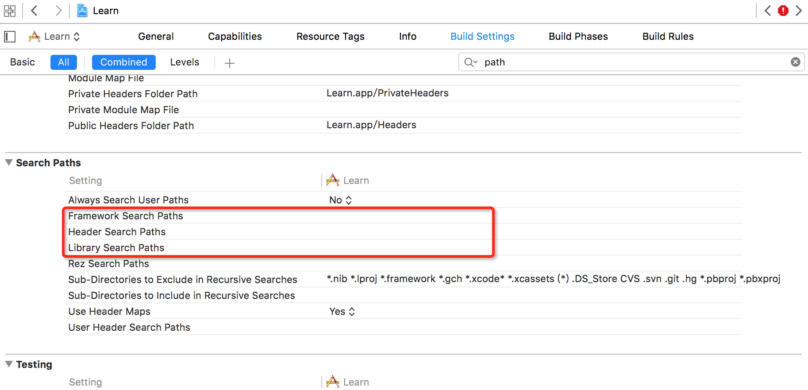

-   [模块化与Compile](#模块化与compile)
    -   [1编译过程](#编译过程)
        -   [（1）Xcode和编译过程的对应关系](#xcode和编译过程的对应关系)
        -   [（2）Xcode头文件(预编译)](#xcode头文件预编译)
        -   [(3) Xcode Symbols(编译，汇编)](#xcode-symbols编译汇编)
        -   [(4) Xcode Link(链接)](#xcode-link链接)
    -   [2 Mach-O文件](#mach-o文件)

模块化与Compile
===============

1编译过程
---------

### （1）Xcode和编译过程的对应关系

  中文   预编译       编译      汇编           链接
  ------ ------------ --------- -------------- --------------
  英文   Preprocess   Compile   Assembling     Link
  作用   处理文字     变汇编    转换成机器码   变可执行程序

根据Wiki百科解释，**编译**是将人能读懂的**Source
Code**变成机器能理解的**汇编语言(寄存器指令)**，然后通过**汇编**变成**目标机器的(Machine
Code/Object Code)**，然后通过**Link**变为可执行程序的**01010101....**

### （2）Xcode头文件(预编译)

对于计算机来讲，头文件是不需要的

对于**Xcode**来说仅仅在 **预编译** 和 **编译**
阶段需要头文件来进行静态检查是否存在有不知道的类或者方法

头文件的搜索目录可以通过配置**Build Setting**里的 **Header Search
Paths**
来获取头文件，这个是磁盘目录，可以是电脑上的任意目录，无需添加任何文件进入**Target**

### (3) Xcode Symbols(编译，汇编)

把每一个文件中的可执行代码进行 **编译和汇编** 可以得到 同名的`.o`文件，
其后缀`o`就是指的 **Object Code**

之所以称为**Object**，是因为不同的硬件有不同的架构，如**x86**和**arm64**，例如**iPhone**模拟器是**x86**而**iPhone**真机大部分都是**arm**的，也就是说在此时**Xcode**已经完成了架构的处理

### (4) Xcode Link(链接)

最终**Xcode**经过链接过程将`.o`文件组合起来，得到一个`Mach-O`文件(**相当于一个压缩包**)
并且生成 **符号表**

这个过程中存在两个常见的错误提示 **Undefined symbols** 和 **Duplicated
symbols** 将在后续讲解

`Mach-O`文件是**Macintosh**系统中的一个文件类型，用来描述程序的运行和二进制代码之间的关系

2 Mach-O文件
------------
