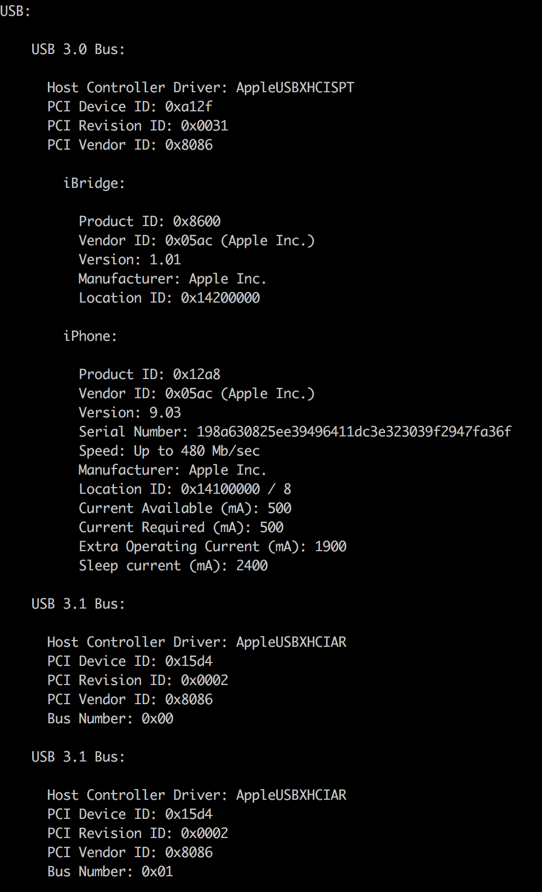

我希望能将网络抓包这一流程尽可能简化，首先调试定位是否是 Apple 服务器没有发送 Push，最好能一键完成操作。用脚本一步步来实现。

### 第一步，连上测试 iPhone 之后，自动获取 uuid


我们可以在 **terminal** 用` system profiler` 命令来获取连接 **mac** 的 **usb** 设备：


```
system_profiler SPUSBDataType
```

**system_profiler** 是一个用来获取当前系统软硬件配置信息的命令，可以通过 `man system_profiler` 查看详细使用方法。上述命令执行结果如下：



可以清楚看到通过 **usb** 连接的 **iPhone udid** 数据（**Serial Number**），我们用 **sed** 提取出目标信息即可：


```
system_profiler SPUSBDataType | sed -n -E 's/Serial Number: (.+)/\1/1p'
```

我只提取了第一个匹配结果，因为我一般只会通过 usb 连一个 iOS 设备。


### 第二步，创建虚拟网卡以便抓包


我们只需要将上面提取的设备 **udid** 作为参数传人创建网卡命令：


```
system_profiler SPUSBDataType | sed -n -E 's/Serial Number: (.+)/\1/1p' | xargs rvictl -s
```

执行完上述命令，应该能看到如下输出：


```
Starting device 198a630825ee39496411dc3e323039f2947fa16f [SUCCEEDED] with interface rvi0
```

### 第三步，启动 tcpdump 监控虚拟网卡

同理，我们只需要等 **rvictl** 命令执行完毕之后，启动 **tcpdump** 即可。从第二步的输出里知道虚拟网卡的 **id** 为 **rvi0**，所以我们将命令修改如下：


```
system_profiler SPUSBDataType | sed -n -E 's/Serial Number: (.+)/\1/1p' | xargs rvictl -s | sudo tcpdump -i rvi0

```

首次 `sudo tcpdump` 的时候会需要输入管理员密码，如果一切正常，那么会看到如下输出：


```
tcpdump: WARNING: rvi0: That device doesn't support promiscuous mode
(BIOCPROMISC: Operation not supported on socket)
tcpdump: verbose output suppressed, use -v or -vv for full protocol decode
listening on rvi0, link-type PKTAP (Apple DLT_PKTAP), capture size 262144 bytes
```

### 第四步，调整参数


虽然我们已经启动了抓包流程，但我们的目标是调试 **push**，所以我们只对 **APN** 过来的网络包感兴趣，接下来要对 **tcpdump** 增加包的 **filter**，设置一些简单参数。

这里需要一点对 **iOS APN** 相关的了解，据我分析 **APN** 的数据通道情况是：在 **iOS 9** 之前，**Apple** 有一个专门的长链接通道来推送应用的 **push**，而且端口号固定在 **5223**。从 **iOS 9** 开始，**Apple** 开始采用 **HTTP 2.0**，新建了一个综合用处的 **HTTP 2.0** 长链接通道，这个综合通道应该不止会推送 **Push**，所以抓包的时候会看到包的数量多于之前的 **5223** 通道。现状是：**Apple** 在新版系统里同时用了两个通道，所以 **APN** 有时候走 **5223**，有时候又是走 **HTTP 2.0**，策略不明。
简单分析之后，目标明确，我们只需要对端口做限制即可。**HTTP 2.0** 毫无疑问会用 **HTTPS**，端口是走 **443**，所以我们最后的命令调整如下：


```
system_profiler SPUSBDataType | sed -n -E 's/Serial Number: (.+)/\1/1p' | xargs rvictl -s | sudo tcpdump -i rvi0 src port 5223 or https
```

### 第五步，快捷启动


我们不可能每次都敲一边上面这一长串命令，为了操作方便，我们可以给命令加个 alias，编辑 **.bash_profile**：


```
vim ~/.bash_profile
```

加入命令别名：


```
alias apn="system_profiler SPUSBDataType | sed -n -E 's/Serial Number: (.+)/\1/1p' | xargs rvictl -s | sudo tcpdump -i rvi0 src port 5223 or https"

```

启用配置


```
source ~/.bash_profile
```

### 第六步，验收成果

下次测试同学再来调试 Push 收不到的问题，插上 USB 之后，我只需要：
1 按 F2 启动 Terminal（我 Mac 系统通过 BetterTouchTool 设置的快捷键）
2 输入 apn 回车
Bingo，接下来就可以喝口咖啡，安安静静看包了。


