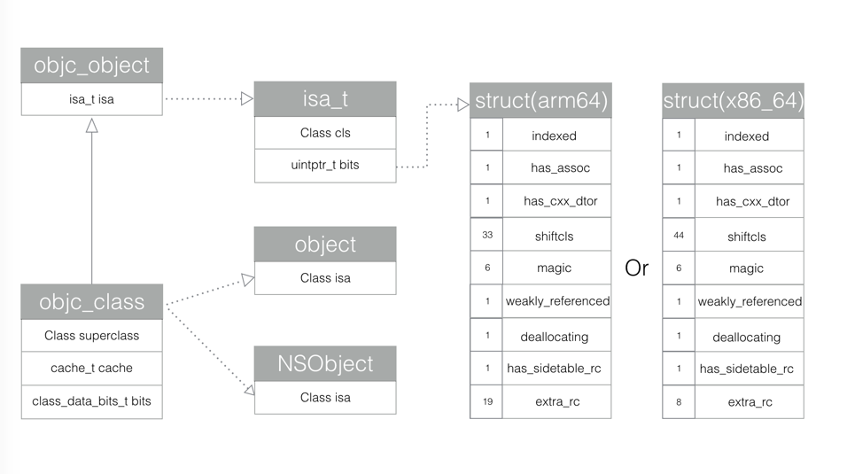

## 1. 通过 Objective-C 源代码

一般情况开发者只需要编写 **OC** 代码即可，**Runtime** 系统自动在幕后把我们写的源代码在编译阶段转换成运行时代码，在运行时确定对应的数据结构和调用具体哪个方法。

## 2. 通过 Foundation 框架的 NSObject 类定义的方法


在**OC**的世界中，除了**NSProxy**类以外，所有的类都是**NSObject**的子类。在**Foundation**框架下，**NSObject**和**NSProxy**两个基类，定义了类层次结构中该类下方所有类的公共接口和行为。**NSProxy**是专门用于实现代理对象的类，这个类暂时本篇文章不提。这两个类都遵循了**NSObject**协议。在**NSObject**协议中，声明了所有**OC**对象的公共方法。
在**NSObject**协议中，有以下**5**个方法，是可以从**Runtime**中获取信息，让对象进行自我检查。


```
- (Class)class OBJC_SWIFT_UNAVAILABLE("use 'anObject.dynamicType' instead");
- (BOOL)isKindOfClass:(Class)aClass;
- (BOOL)isMemberOfClass:(Class)aClass;
- (BOOL)conformsToProtocol:(Protocol *)aProtocol;
- (BOOL)respondsToSelector:(SEL)aSelector;
```

`-class`方法返回对象的类；

`-isKindOfClass:` 和 `-isMemberOfClass:` 方法检查对象是否存在于指定的类的继承体系中(是否是其子类或者父类或者当前类的成员变量)；

`-respondsToSelector:` 检查对象能否响应指定的消息；

`-conformsToProtocol:`检查对象是否实现了指定协议类的方法；


在**NSObject**的类中还定义了一个方法


```
- (IMP)methodForSelector:(SEL)aSelector;
```

这个方法会返回指定方法实现的地址**IMP**。
以上这些方法会在本篇文章中详细分析具体实现。


## 3. 通过对 Runtime 库函数的直接调用


关于库函数可以在[Objective-C Runtime Reference](https://developer.apple.com/library/mac/documentation/Cocoa/Reference/ObjCRuntimeRef/index.html)中查看 **Runtime** 函数的详细文档。

关于这一点，其实还有一个小插曲。当我们导入了**objc/Runtime.h**和**objc/message.h**两个头文件之后，我们查找到了**Runtime**的函数之后，代码打完，发现没有代码提示了，那些函数里面的参数和描述都没有了。对于熟悉**Runtime**的开发者来说，这并没有什么难的，因为参数早已铭记于胸。但是对于新手来说，这是相当不友好的。而且，如果是从**iOS6**开始开发的同学，依稀可能能感受到，关于**Runtime**的具体实现的官方文档越来越少了？可能还怀疑是不是错觉。其实从**Xcode5**开始，苹果就不建议我们手动调用**Runtime**的**API**，也同样希望我们不要知道具体底层实现。所以**IDE**上面默认代了一个参数，禁止了**Runtime**的代码提示，源码和文档方面也删除了一些解释。
具体设置如下:



如果发现导入了两个库文件之后，仍然没有代码提示，就需要把这里的设置改成**NO**，即可。


## 二. NSObject起源


由上面一章节，我们知道了与**Runtime**交互有3种方式，前两种方式都与**NSObject**有关，那我们就从**NSObject**基类开始说起。


**NSObject**的定义如下


```
typedef struct objc_class *Class;

@interface NSObject <NSObject> {
    Class isa  OBJC_ISA_AVAILABILITY;
}
```

在**Objc2.0**之前，**objc_class**源码如下：


```
struct objc_class {
    Class isa  OBJC_ISA_AVAILABILITY;

#if !__OBJC2__
    Class super_class                                        OBJC2_UNAVAILABLE;
    const char *name                                         OBJC2_UNAVAILABLE;
    long version                                             OBJC2_UNAVAILABLE;
    long info                                                OBJC2_UNAVAILABLE;
    long instance_size                                       OBJC2_UNAVAILABLE;
    struct objc_ivar_list *ivars                             OBJC2_UNAVAILABLE;
    struct objc_method_list **methodLists                    OBJC2_UNAVAILABLE;
    struct objc_cache *cache                                 OBJC2_UNAVAILABLE;
    struct objc_protocol_list *protocols                     OBJC2_UNAVAILABLE;
#endif

} OBJC2_UNAVAILABLE;
```

在这里可以看到，在一个类中，有超类的指针，类名，版本的信息。
`ivars`是`objc_ivar_list`成员变量列表的指针；`methodLists`是指向`objc_method_list`指针的指针。`*methodLists`是指向方法列表的指针。这里如果动态修改`*methodLists`的值来添加成员方法，这也是**Category**实现的原理，同样解释了**Category**不能添加属性的原因。


然后在2006年苹果发布**Objc 2.0**之后，**objc_class**的定义就变成下面这个样子了。


```
typedef struct objc_class *Class;
typedef struct objc_object *id;

@interface Object { 
    Class isa; 
}

@interface NSObject <NSObject> {
    Class isa  OBJC_ISA_AVAILABILITY;
}

struct objc_object {
private:
    isa_t isa;
}

struct objc_class : objc_object {
    // Class ISA;
    Class superclass;
    cache_t cache;             // formerly cache pointer and vtable
    class_data_bits_t bits;    // class_rw_t * plus custom rr/alloc flags
}

union isa_t 
{
    isa_t() { }
    isa_t(uintptr_t value) : bits(value) { }
    Class cls;
    uintptr_t bits;
}
```




